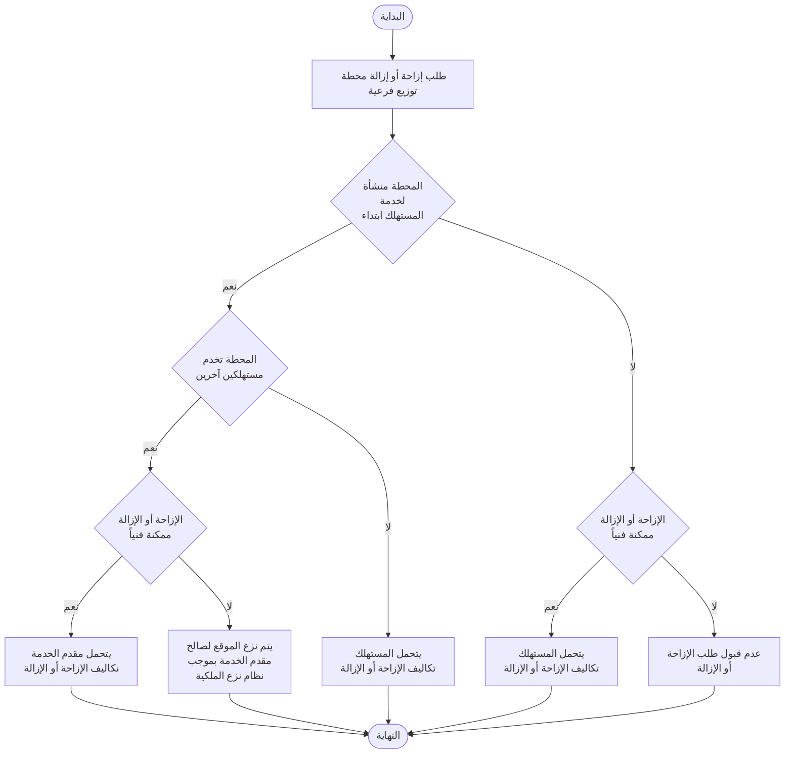

الهيئة السعودية لتنظيم الكهرباء
Saudi Electricity Regulatory Authority
SERA

# دليل تقديم الخدمة الكهربائية
الإصدار التاسع 1446 هـ

الهيئة السعودية لتنظيم الكهرباء
Saudi Electricity Regulatory Authority
SERA

### مرجعية هذه الوثيقة
في حال وجود أي استفسارات أو ملاحظات فيرجى التواصل عبر البريد الإلكتروني (SR@SERA.GOV.SA)

### دورة تحديث هذه الوثيقة
يتم تحديث هذا الدليل حسب ما تقتضيه الحاجة.

### لغة الوثيقة
تم إعداد هذه الوثيقة باللغة العربية واللغة الإنجليزية.

<table>
  <thead>
    <tr>
        <th>جدول ضبط النسخ</th>
        <th></th>
    </tr>
  </thead>
  <tbody>
    <tr>
        <td>دليل تقديم الخدمة الكهربائية</td>
        <td>الإصدار التاسع</td>
    </tr>
  </tbody>
</table>

حقوق النسخ والنشر محفوظة للهيئة السعودية لتنظيم الكهرباء

1
دليل تقديم الخدمة الكهربائية

الهيئة السعودية لتنظيم الكهرباء
Saudi Electricity Regulatory Authority
SERA

# جدول المحتويات

<table>
  <thead>
    <tr>
        <th>الفصل</th>
        <th>العنوان</th>
        <th>رقم الصفحة</th>
    </tr>
  </thead>
  <tbody>
    <tr>
        <td></td>
        <td>الهدف</td>
        <td>5</td>
    </tr>
    <tr>
        <td></td>
        <td>النطاق</td>
        <td>5</td>
    </tr>
    <tr>
        <td>الأول</td>
        <td>التعريفات والمصطلحات</td>
        <td>6</td>
    </tr>
    <tr>
        <td>الثاني</td>
        <td>أحكام عامة</td>
        <td>10</td>
    </tr>
    <tr>
        <td>الثالث</td>
        <td>ضوابط وإجراءات إيصال الخدمة الكهربائية</td>
        <td>12</td>
    </tr>
    <tr>
        <td></td>
        <td>قواعد عامة</td>
        <td>13</td>
    </tr>
    <tr>
        <td></td>
        <td>ضوابط إيصال الخدمة الكهربائية للمخططات</td>
        <td>13</td>
    </tr>
    <tr>
        <td></td>
        <td>ضوابط إيصال الخدمة الكهربائية للقرى والهجر</td>
        <td>15</td>
    </tr>
    <tr>
        <td></td>
        <td>المنشآت السكنية التي لا يوجد لها صكوك شرعية أو مستندات ملكية تجيزها الدولة</td>
        <td>15</td>
    </tr>
    <tr>
        <td></td>
        <td>تحديد أحمال طالب الخدمة</td>
        <td>15</td>
    </tr>
    <tr>
        <td></td>
        <td>تحديد عدد العدادات لطالب الخدمة</td>
        <td>16</td>
    </tr>
    <tr>
        <td></td>
        <td>العدادات الفرعية</td>
        <td>17</td>
    </tr>
    <tr>
        <td></td>
        <td>اشتراطات إيصال الخدمة الكهربائية الجديدة</td>
        <td>18</td>
    </tr>
    <tr>
        <td></td>
        <td>ضوابط إيصال الخدمة الكهربائية حسب الأحمال</td>
        <td>18</td>
    </tr>
    <tr>
        <td></td>
        <td>إيصال الخدمة الكهربائية للأحمال الصغيرة</td>
        <td>22</td>
    </tr>
    <tr>
        <td></td>
        <td>إيصال الخدمة الكهربائية المؤقتة</td>
        <td>22</td>
    </tr>
    <tr>
        <td>الرابع</td>
        <td>ضوابط وإجراءات التعديل على الخدمة الكهربائية</td>
        <td>23</td>
    </tr>
    <tr>
        <td></td>
        <td>إضافة أحمال جديدة</td>
        <td>24</td>
    </tr>
    <tr>
        <td></td>
        <td>تقوية الأحمال</td>
        <td>24</td>
    </tr>
    <tr>
        <td></td>
        <td>تخفيض الأحمال</td>
        <td>24</td>
    </tr>
    <tr>
        <td></td>
        <td>تجميع الأحمال</td>
        <td>25</td>
    </tr>
    <tr>
        <td></td>
        <td>تجزئة الأحمال</td>
        <td>25</td>
    </tr>
    <tr>
        <td></td>
        <td>تغيير عداد بالقدرة نفسها</td>
        <td>25</td>
    </tr>
    <tr>
        <td></td>
        <td>نقل العدادات</td>
        <td>25</td>
    </tr>
    <tr>
        <td></td>
        <td>تغيير جهد الخدمة الكهربائية</td>
        <td>26</td>
    </tr>
    <tr>
        <td>الخامس</td>
        <td>ضوابط فصل الخدمة الكهربائية وإعادتها وإلغائها</td>
        <td>27</td>
    </tr>
    <tr>
        <td></td>
        <td>فصل الخدمة الكهربائية وإعادتها بسبب عدم السداد</td>
        <td>28</td>
    </tr>
    <tr>
        <td></td>
        <td>فصل الخدمة الكهربائية لأسباب أخرى لا تتعلق بالسداد</td>
        <td>29</td>
    </tr>
    <tr>
        <td></td>
        <td>فصل الخدمة الكهربائية عن الأماكن ذات الطبيعة الحساسة</td>
        <td>31</td>
    </tr>
    <tr>
        <td></td>
        <td>إلغاء الخدمة الكهربائية</td>
        <td>31</td>
    </tr>
    <tr>
        <td></td>
        <td>إبقاء العداد لحين الانتهاء من أعمال الترميم أو إعادة البناء</td>
        <td>32</td>
    </tr>
    <tr>
        <td>السادس</td>
        <td>ضوابط تطبيق تعريفة الاستهلاك</td>
        <td>33</td>
    </tr>
  </tbody>
</table>

2 | دليل تقديم الخدمة الكهربائية

![SERA Logo]
الهيئة السعودية لتنظيم الكهرباء
Saudi Electricity Regulatory Authority
SERA

<table>
  <tbody>
    <tr>
        <td>الفصل</td>
        <td>العنوان</td>
        <td>رقم الصفحة</td>
    </tr>
    <tr>
        <td></td>
        <td>التعريفة السكنية</td>
        <td>34</td>
    </tr>
    <tr>
        <td></td>
        <td>التعريفة التجارية</td>
        <td>34</td>
    </tr>
    <tr>
        <td></td>
        <td>التعريفة الحكومية</td>
        <td>34</td>
    </tr>
    <tr>
        <td></td>
        <td>التعريفة الصناعية</td>
        <td>35</td>
    </tr>
    <tr>
        <td></td>
        <td>التعريفة الزراعية</td>
        <td>35</td>
    </tr>
    <tr>
        <td></td>
        <td>التعريفات الأخرى</td>
        <td>35</td>
    </tr>
    <tr>
        <td>السابع</td>
        <td>ضوابط حساب الاستهلاك والفوترة</td>
        <td>37</td>
    </tr>
    <tr>
        <td></td>
        <td>مسؤولية مقدم الخدمة في ضمان دقة حساب الاستهلاك</td>
        <td>38</td>
    </tr>
    <tr>
        <td></td>
        <td>تحديد فئة الاستهلاك</td>
        <td>38</td>
    </tr>
    <tr>
        <td></td>
        <td>تأمين الاستهلاك للخدمة الكهربائية المؤقتة</td>
        <td>39</td>
    </tr>
    <tr>
        <td></td>
        <td>حساب الاستهلاك وإصدار وتوزيع الفواتير</td>
        <td>39</td>
    </tr>
    <tr>
        <td></td>
        <td>عوائق قراءة العدادات</td>
        <td>40</td>
    </tr>
    <tr>
        <td></td>
        <td>تجميع وتجزئة الاستهلاك</td>
        <td>41</td>
    </tr>
    <tr>
        <td></td>
        <td>حساب استهلاك العدادات الفرعية</td>
        <td>41</td>
    </tr>
    <tr>
        <td></td>
        <td>التعامل مع الأخطاء في حساب الاستهلاك والفوترة</td>
        <td>42</td>
    </tr>
    <tr>
        <td></td>
        <td>تقصير مقدم الخدمة في قراءة العدادات وتحصيل مقابل الاستهلاك</td>
        <td>43</td>
    </tr>
    <tr>
        <td></td>
        <td>الأعطال نتيجة التوصيلات غير النظامية أو العبث بالعداد</td>
        <td>43</td>
    </tr>
    <tr>
        <td></td>
        <td>معالجة شكوى المستهلك من عدم صحة فاتورة الاستهلاك</td>
        <td>43</td>
    </tr>
    <tr>
        <td>الثامن</td>
        <td>ضوابط إزاحة الشبكات الكهربائية</td>
        <td>45</td>
    </tr>
    <tr>
        <td></td>
        <td>قواعد عامة</td>
        <td>46</td>
    </tr>
    <tr>
        <td></td>
        <td>مسافات حيز الخلوص</td>
        <td>46</td>
    </tr>
    <tr>
        <td></td>
        <td>الحالات التي تستدعي الإزاحة</td>
        <td>46</td>
    </tr>
    <tr>
        <td></td>
        <td>تعذر الإزاحة</td>
        <td>46</td>
    </tr>
    <tr>
        <td></td>
        <td>الإزاحة حسب الطلب</td>
        <td>47</td>
    </tr>
    <tr>
        <td></td>
        <td>المستندات اللازمة لدراسة طلب الإزاحة</td>
        <td>47</td>
    </tr>
    <tr>
        <td></td>
        <td>مدة تنفيذ إزاحة شبكة التوزيع</td>
        <td>47</td>
    </tr>
    <tr>
        <td></td>
        <td>سجلات طلبات الإزاحة</td>
        <td>47</td>
    </tr>
  </tbody>
</table>

3 | دليل تقديم الخدمة الكهربائية

الهيئة السعودية لتنظيم الكهرباء
Saudi Electricity Regulatory Authority
SERA

<table>
  <thead>
    <tr>
        <th>الفصل</th>
        <th>العنوان</th>
        <th>رقم الصفحة</th>
        <th></th>
    </tr>
  </thead>
  <tbody>
    <tr>
        <td>التاسع</td>
        <td>قواعد وإجراءات خدمة ذوي الاحتياجات الماسة للكهرباء</td>
        <td>48</td>
        <td></td>
    </tr>
    <tr>
        <td rowspan="5"></td>
        <td>تعريف المستهلك من ذوي الاحتياجات الماسة للكهرباء</td>
        <td>49</td>
        <td></td>
    </tr>
    <tr>
        <td>قواعد عامة لخدمة المستهلكين من ذوي الاحتياجات الماسة للكهرباء</td>
        <td>49</td>
        <td></td>
    </tr>
    <tr>
        <td>الإجراءات المطلوب اتخاذها من قبل مقدم الخدمة لخدمة المستهلكين من ذوي الاحتياجات الماسة للكهرباء</td>
        <td>49</td>
        <td></td>
    </tr>
    <tr>
        <td>ضمان استمرارية الخدمة الكهربائية للمستهلكين من ذوي الاحتياجات الماسة للكهرباء</td>
        <td>50</td>
        <td></td>
    </tr>
    <tr>
        <td>معالجة تعثر المستهلكين من ذوي الاحتياجات الماسة للكهرباء في سداد فواتير الاستهلاك</td>
        <td>50</td>
        <td></td>
    </tr>
    <tr>
        <td>العاشر</td>
        <td>ضوابط وإجراءات الدفع المسبق لمقابل استهلاك الخدمة الكهربائية</td>
        <td>51</td>
        <td></td>
    </tr>
    <tr>
        <td rowspan="2"></td>
        <td>ضوابط تنظيم خدمة الدفع المسبق لمقابل الاستهلاك</td>
        <td>52</td>
        <td></td>
    </tr>
    <tr>
        <td>ضوابط فصل الخدمة الكهربائية وإعادتها بسبب نفاد رصيد الدفع المسبق</td>
        <td>53</td>
        <td></td>
    </tr>
    <tr>
        <td>الحادي عشر</td>
        <td>ضوابط تقديم الخدمة الكهربائية عن طريق التوليد المتنقل</td>
        <td>54</td>
        <td></td>
    </tr>
    <tr>
        <td></td>
        <td>الخاتمة</td>
        <td>57</td>
        <td></td>
    </tr>
    <tr>
        <td>الملاحق</td>
        <td colspan="2"></td>
        <td>58</td>
    </tr>
    <tr>
        <td></td>
        <td>تعريفة الاستهلاك المعتمدة</td>
        <td>59</td>
        <td></td>
    </tr>
    <tr>
        <td></td>
        <td>مقابل إيصال الخدمة الكهربائية</td>
        <td>61</td>
        <td></td>
    </tr>
    <tr>
        <td></td>
        <td>الجداول الإرشادية لحساب الأحمال</td>
        <td>64</td>
        <td></td>
    </tr>
    <tr>
        <td></td>
        <td>المقابل المالي للخدمات</td>
        <td>71</td>
        <td></td>
    </tr>
    <tr>
        <td></td>
        <td>اشتراطات تقديم الخدمة الكهربائية</td>
        <td>73</td>
        <td></td>
    </tr>
    <tr>
        <td></td>
        <td>وسائل تبليغ وإشعار المستهلكين</td>
        <td>77</td>
        <td></td>
    </tr>
    <tr>
        <td></td>
        <td>مخططات توضيحية</td>
        <td>79</td>
        <td></td>
    </tr>
    <tr>
        <td></td>
        <td>تصنيف منشآت المستهلكين حسب نوع الاستخدام</td>
        <td>82</td>
        <td></td>
    </tr>
    <tr>
        <td></td>
        <td>فحص العدادات ومعايرتها</td>
        <td>84</td>
        <td></td>
    </tr>
    <tr>
        <td></td>
        <td>حيز الخلوص وإزاحة الشبكة</td>
        <td>86</td>
        <td></td>
    </tr>
    <tr>
        <td></td>
        <td>نموذج اتفاقية إيصال الخدمة الكهربائية على جهد التوزيع المنخفض</td>
        <td>88</td>
        <td></td>
    </tr>
    <tr>
        <td></td>
        <td>نموذج اتفاقية استهلاك الخدمة الكهربائية</td>
        <td>94</td>
        <td></td>
    </tr>
  </tbody>
</table>

4 | دليل تقديم الخدمة الكهربائية

الهيئة السعودية لتنظيم الكهرباء
Saudi Electricity Regulatory Authority
SERA

### الهدف:
الهدف من هذا الدليل هو تنظيم العلاقة بين المستهلك ومقدم الخدمة الكهربائية وضبط الإجراءات المتعلقة بتقديم الخدمة للمستفيدين بكافة فئاتهم بشكل يحقق الموازنة الدقيقة بين مصالح كل من المستهلك ومقدم الخدمة على حد سواء.

### النطاق:
ينظم هذا الدليل عملية تقديم الخدمة الكهربائية في مراحلها المختلفة ويضبط العلاقة بين مقدم الخدمة الكهربائية والمستفيد منها أو المتأثر بها.

5 | دليل تقديم الخدمة الكهربائية

الهيئة السعودية لتنظيم الكهرباء
Saudi Electricity Regulatory Authority
SERA

# الفصل الأول
# التعريفات والمصطلحات

## المادة (1): التعريفات والمصطلحات:
1-1 يكون للألفاظ والعبارات المعرّفة في اللائحة التنفيذية لنظام الكهرباء المتعلقة بمهمات الهيئة المعاني نفسها في هذا الدليل ما لم يتطلب السياق خلاف ذلك.
2-1 يقصد بالاختصارات الآتية المعاني الموضحة أمام كل منها عند استخدامها في هذا الدليل:
- ك.ف: كيلو فولت.
- ك.و.س: كيلو واط ساعة.
- ف.أ: فولت أمبير.
- ك.ف.أ: كيلو فولت أمبير.
- م.ف.أ: ميجا فولت أمبير.
3-1 يقصد بالألفاظ والعبارات الآتية المعاني الموضحة أمام كل منها عند استخدامها في هذا الدليل ما لم يتطلب السياق خلاف ذلك:
**الوزارة:** وزارة الطاقة.
**الهيئة:** الهيئة السعودية لتنظيم الكهرباء.
**مجلس إدارة الهيئة:** مجلس إدارة الهيئة السعودية لتنظيم الكهرباء.
**الدليل:** دليل تقديم الخدمة الكهربائية.
**نقطة الالتقاء:** هي النقطة التي تلتقي بها شبكة مقدم الخدمة مع شبكة طالب الخدمة، وتكون على الحدود الخارجية لملكية طالب الخدمة.
**شبكة التوزيع:** تتكون من الكابلات الأرضية أو الخطوط الهوائية على جهود التوزيع، والمحطات والمعدات والعدادات المرتبطة بها.
**شبكة النقل:** تتكون من الكابلات الأرضية أو الخطوط الهوائية على جهود النقل، والمحطات والمعدات والعدادات المرتبطة بها.
**المناطق المخططة:** المناطق الواقعة ضمن مرحلة التنمية العمرانية الحالية وفقاً لقرار مجلس الوزراء رقم (157) والتاريخ 1428/5/11 هـ، الخاص بقواعد تحديد النطاق العمراني، التي يتم اعتماد مخططات إنشائها من قبل الأمانات أو البلديات أو من الجهة المختصة.
**المناطق غير المخططة:** المناطق التي لا تدخل ضمن المناطق المخططة.
**نطاق الشبكة:** المنطقة المحيطة بمسافة لا تزيد عن ألف (1000) متر من شبكة الجهد المتوسط القائمة حسب المسارات المعتمدة.
**الجهد القياسي:** الجهد المحدد لنقل الطاقة الكهربائية وتوزيعها حسب ما هو معتمد في كودي النقل والتوزيع.
**الجهد السائد:** الجهد القياسي المستخدم من قبل مقدم الخدمة في موقع طلب إيصال الخدمة الكهربائية.
**الخدمة المؤقتة:** إيصال الخدمة الكهربائية لفترة محدودة لأغراض الإنشاء أو المناسبات.
**المنشأة:** المبنى أو المرفق المستقل بذاته المرخص من الجهة المختصة.
**الوحدة المستقلة:** إحدى المكونات الداخلية المستقلة للمنشأة وفق أحكام المادة (8) من هذا الدليل.

6
دليل تقديم الخدمة الكهربائية

الهيئة السعودية لتنظيم الكهرباء
Saudi Electricity Regulatory Authority
SERA

**عداد الخدمة:** العداد الذي يحسب استهلاك الأحمال المشتركة التي تخدم أكثر من مستهلك بمرفق واحد مثل إنارة السور، والسلالم، والسطح، والحديقة، ومضخة الماء، والمسبح، والمصعد، وغرفة الحارس، والملاحق، والممرات الداخلية بالمجمعات السكنية والتجارية.
**مقدم الخدمة:** كل شخص يحمل رخصة سارية المفعول صادرة من الهيئة تصرح له بالقيام بأي نشاط كهربائي.
**طالب الخدمة:** الشخص الطبيعي أو الاعتباري الذي يتقدم بطلب إيصال الخدمة الكهربائية للمنشأة أو الوحدة المستقلة التي يملكها أو يرتبط بها بعلاقة عقدية، أو لإجراء أي تعديل على الخدمة بعد الإيصال.
**المستهلك:** كل شخص يُزوّد بالخدمة الكهربائية لاستهلاكه الخاص.
**اتفاقية الإيصال:** هي اتفاقية يتم توقيعها بين مقدم الخدمة وطالبها، تحدد شروط إيصال الخدمة الكهربائية.
**اتفاقية الاستهلاك:** اتفاقية يتم توقيعها بين مقدم الخدمة والمستهلك، تحدد شروط تقديم الخدمة الكهربائية.
**تعريفة الاستهلاك:** المقابل المالي المعتمد للاستهلاك الشهري (هللة/ك.و.س) حسب ما هو موضح في الملحق رقم (1) وما يطرأ عليه من تعديلات.
**مقابل الإيصال:** المقابل المالي المعتمد لإيصال الخدمة الكهربائية لطالب الخدمة، حسب ما هو موضح في الملحق رقم (2) وما يطرأ عليه من تعديلات.
**كود التوزيع:** الكود الذي يضعه المرخص له بالتوزيع بموافقة الهيئة لتشغيل منظومة التوزيع وصيانتها، ويغطي العناصر الفنية الأساسية ذات الصلة بالتوصيل والتشغيل والاستخدام لمنظومة التوزيع وجميع التركيبات ذات الصلة المطلوبة لتشغيل منظومة التوزيع.
**كود النقل:** الكود الذي يضعه المرخص له بالنقل بموافقة الهيئة لتشغيل منظومة النقل وصيانتها، ويغطي العناصر الفنية الأساسية ذات الصلة بالقياس والتوصيل بمنظومة النقل وتشغيلها واستخدامها وجميع الأجهزة ذات الصلة المطلوبة لتشغيل منظومة النقل، ويشمل كذلك متطلبات المعلومات المتعلقة بالتخطيط.
**محطة النقل:** المحطة التي تقوم بتحويل جهد النقل إلى جهد نقل آخر أو إلى الجهد المتوسط.
**محطة التوزيع الرئيسة:** المحطة التي تقوم بتحويل الجهد المتوسط إلى جهد متوسط آخر.
**محطة التوزيع الفرعية:** المحطة التي تقوم بتحويل الجهد المتوسط إلى الجهد المنخفض.
**محطة التحويل:** إما محطة النقل أو محطة التوزيع الرئيسة بحسب الحال.
**محطة طالب الخدمة:** المحطة التي تقوم بتحويل جهد الربط بالشبكة إلى الجهد المطلوب من قبل طالب الخدمة والتي تخدم ابتداءً أحمال طالب الخدمة وتقع ضمن حرم ممتلكاته.
**مسافة حيز الخلوص:** المسافة الفاصلة بين الموصلات والأرض أو المباني أو المنشآت الأخرى، وتمثل الحد الأدنى لمتطلبات السلامة عند إنشاء شبكات النقل والتوزيع.
**نظام نزع الملكية:** نظام نزع ملكية العقارات للمنفعة العامة ووضع اليد المؤقت على العقار الصادر بالمرسوم الملكي ذي الرقم (م/15) والتاريخ 1424/03/11هـ، وما قد يطرأ عليه من تعديلات.
**نظام حماية المرافق العامة:** الصادر بالمرسوم الملكي رقم م/62 بتاريخ 20 / 12 / 1405هـ
**لائحة ضبط وإثبات مخالفات أحكام نظام الكهرباء والفصل فيها:** لائحة صادرة بقرار مجلس إدارة الهيئة رقم (02/45 - 1) وتاريخ 1445/03/19 هـ، الموافق 2023/10/04م.
**ضوابط تحديد تكاليف الإصلاح وتقدير التعويضات عن المنفعة التي فقدها المرفق أو الغير بسبب مخالفة العبث في عداد قياس الخدمة الكهربائية أو أي من ملحقاته:** ضوابط صادرة بقرار مجلس إدارة الهيئة رقم (02/45 - 2) وتاريخ 1445/03/19هـ، الموافق 2023/10/04م.
**يوم عمل:** هو أي يوم تكون فيه مكاتب مقدم الخدمة في المملكة مفتوحة رسمياً لأداء الأعمال.

7 | دليل تقديم الخدمة الكهربائية

![SERA Logo]
الهيئة السعودية لتنظيم الكهرباء
Saudi Electricity Regulatory Authority
SERA

**المعايير المضمونة:** حدود مستوى الخدمات الكهربائية التي يتوجب على مقدم الخدمة الالتزام بها، وفي حال كانت الخدمات أقل من ذلك الحد، فعلى مقدم الخدمة دفع مبلغ مالي للمستهلك المتأثر حسب دليل المعايير المضمونة المعتمد من مجلس إدارة الهيئة.

**الحمل الموصل:** هو إجمالي أحمال كافة الأجهزة الكهربائية الممكن تواجدها في المنشأة، ويحسب بالفولت أمبير (ف.أ)، وفقاً لقيم القدرة الاسمية لتلك الأجهزة، ويمكن حسابه بالأحمال المساحية حسب مسطحات البناء للوحدة الواحدة للمنشآت السكنية والتجارية وفق الجداول الإرشادية لحساب الأحمال حسب ما هو موضح في الملحق رقم (3).

**معامل الطلب:** هو نسبة الحد الأقصى للطلب على الطاقة الكهربائية خلال فترة محددة إلى الحمل الموصل خلال تلك الفترة، وتحدد قيمته حسب طبيعة استخدام المنشأة.

**حمل الطلب:** هو أقصى طلب للحمل خلال فترة زمنية معينة، ويحسب بالفولت أمبير (ف.أ)، ويتم ذلك بضرب الحمل الموصل في معامل الطلب.

**حمل الطلب المتزامن:** هو الحمل التخطيطي الأقصى (المتزامن) لمجموعة (وحدات/منشآت)، ويتم حسابه بضرب إجمالي حمل الطلب في معامل التزامن.

**معامل التزامن:** هو النسبة بين حمل الطلب المتزامن لمجموعة (وحدات/منشآت) يتم تغذيتها من النقطة نفسها وفي الوقت نفسه إلى مجموع أحمال الطلب غير المتزامنة لتلك المجموعة.

**السعة الآمنة للمحطة:** هي سعة المحطة التشغيلية حسب معايير التخطيط المعتمدة وفقاً لمتطلبات كودي النقل والتوزيع.

8
دليل تقديم الخدمة الكهربائية

الهيئة السعودية لتنظيم الكهرباء
Saudi Electricity Regulatory Authority
SERA

# الفصل الثاني
## أحكام عامة

### المادة (2): أحكام عامة:
1-2 الهيئة هي المرجع النهائي في تفسير أي نص أو بند وارد في هذا الدليل، أو حين وقوع تعارض -حقيقي أو مظنون- بينه وبين أي وثائق تنظيمية أخرى.
2-2 يجب على مقدم الخدمة الالتزام بكافة الأنظمة واللوائح والقواعد النافذة والتقيد بالمعايير والأكواد الفنية المعتمدة وتعديلاتها، وتكون الهيئة هي المرجع النهائي في إلزامية التعديلات على الشبكات بأثر رجعي.
3-2 لا يجوز لمقدم الخدمة وضع شبكته أو جزء منها داخل حدود ملكية عامة أو خاصة إلا بعد استيفاء المتطلبات والمستندات النظامية، وعلى مقدم الخدمة الالتزام بكل ما يصدر عن الجهة المرخصة له بإنشاء الشبكة.
4-2 يلتزم مقدم الخدمة بضمان كافة حقوق طالب الخدمة والمستهلك الواردة في هذا الدليل والأنظمة واللوائح ذات العلاقة، ومن ذلك حقه في الحصول على الخدمة وعلى توفير المعلومات عن اشتراكه فيها وفقاً لأحكام هذا الدليل.
5-2 يلتزم طالب الخدمة والمستهلك بأداء الواجبات المتعلقة بهما وفقاً لأحكام هذا الدليل والأنظمة واللوائح ذات العلاقة وألا يضر بمصالح مقدم الخدمة ويلتزم بأداء المستحقات المالية التي عليه وألا يتعدى على مرافق مقدم الخدمة أو على أي جزء من شبكته.
6-2 يحق لمقدم الخدمة إزالة أسباب الضرر الواقع على شبكته في حال تعذر إلزام المتسبب في الضرر بذلك، وتحميل المتسبب التكاليف المتعلقة بذلك وفقاً لأحكام نظام الكهرباء ونظام حماية المرافق العامة واللوائح ذات العلاقة بين النظامين.
7-2 يجب على مقدم الخدمة تخصيص موظفين مؤهلين لمعالجة شكاوى المستهلكين في كل مكتب خدمة، يسند إليهم مهمة تلقي الشكاوى والعمل على إيجاد الحلول لها، على أن يكون عدد الموظفين متناسباً مع عدد المستهلكين التابعين للمكتب.
8-2 يجب على مقدم الخدمة وضع لوحة في مكان بارز في مكاتب الخدمات تبين إجراءات معالجة شكاوى المستهلكين، وأن لطالب الخدمة أو المستهلك الحق في رفع شكواه للهيئة في حال عدم قناعته بنتيجة معالجة مقدم الخدمة لشكواه.
9-2 عند وجود شكوى أو نزاع في أي موضوع يتعلق بهذا الدليل أو تنفيذه أو أي جانب يتعلق بتقديم الخدمة الكهربائية، فيحق لطالب الخدمة أو المستهلك تقديم شكوى، وفقاً لإجراءات معالجة شكاوى المستهلكين المعتمدة من الهيئة، الموضحة على موقع الهيئة الرسمي على شبكة الإنترنت (www.sera.gov.sa).

9 دليل تقديم الخدمة الكهربائية

SERA logo and header with Arabic text "هيئة تنظيم الكهرباء والإنتاج المزدوج" (Saudi Electricity Regulatory Authority)

# الفصل الثالث

## ضوابط وإجراءات إيصال الخدمة الكهربائية

* قواعد عامة
* ضوابط إيصال الخدمة الكهربائية للمخططات
* ضوابط إيصال الخدمة الكهربائية للقرى والهجر
* المنشآت السكنية التي لا يوجد لها صكوك شرعية أو مستندات ملكية تجيزها الدولة
* تحديد أحمال طالب الخدمة
* تحديد عدد العدادات لطالب الخدمة
* التعديلات الفرعية
* اشتراطات إيصال الخدمة الكهربائية الجديدة
* ضوابط إيصال الخدمة الكهربائية حسب الأحمال
* إيصال الخدمة الكهربائية للأحمال الصغيرة
* إيصال الخدمة الكهربائية المؤقتة

## مقدمة:

يتناول هذا الفصل ضوابط وإجراءات إيصال الخدمة الكهربائية للمخططات والقرى والهجر والإيصال الخدمة الكهربائية الدائمة أو المؤقتة للمنشآت، كما يتناول هذا الفصل أسس تحديد الأحمال وعدد العدادات واشتراطات إيصال الخدمة الكهربائية، بالإضافة إلى ضوابط إيصال الخدمة الكهربائية حسب الأحمال.

## المادة (3): قواعد عامة:

### 1-3 نوعية تخطيط شبكة التوزيع:

يتم تنفيذ الشبكة الكهربائية حسب نظام التخطيط المطبق في المنطقة (حلقياً أو شعاعياً).

### 1-1-3

إذا كان موقع طالب الخدمة في منطقة نظام التخطيط المطبق فيها حلقياً، فإن مقدم الخدمة يكون مسؤولاً عن توصيل الخدمة لطالبها وفق النظام الحلقي.

### 2-1-3

إذا كان موقع طالب الخدمة في منطقة نظام التخطيط المطبق فيها شعاعياً وترغب طالب الخدمة في توصيل منشأته وفق النظام الحلقي فإنه يتحمل تكاليف المصدر الآخر.

### 2-3 التغذية إلى أكثر من نقطة بسبب تباعد أحمال المنشأة:

إذا رغب طالب الخدمة بالتغذية إلى أكثر من نقطة في منشأته بسبب تباعد الأحمال، فعندئذ مقدم الخدمة يتحمل تكاليف التمديدات والمعدات الإضافية اللازمة لتغذية نقطة الطلب الأولى فقط، ويتحمل طالب الخدمة تكاليف التمديدات والمعدات الإضافية للنقاط الأخرى، ويعتبر الموقع الأقرب لمصدر التغذية هو الموقع الأساسي لمصدر التغذية، ويتم استيعاب العدادات في قائورة واحدة إذا كانت المنشأة عبارة عن وحدة واحدة.

دليل تقديم الخدمة الكهربائية | 10

هيئة تنظيم الكهرباء والإنتاج المزدوج
Saudi Electricity Regulatory Authority

SERA

## 3-3 التغذية من أكثر من مصدر لغرض تعزيز الموثوقية:

إذا رغب طالب الخدمة بتغذية منشأته من أكثر من مصدر من شبكة مفدم الخدمة فتنطبق عليه أحكام المادة (11) من هذا الدليل على جميع مصادر التغذية التي يوافق عليها المتراجع للمنشأة.

أ- عدم اعتبار حمل مصدر التغذية الآخر عند تحديد حمل الطلب المتزامن للمنشأة.

ب- لا يتحمل طالب الخدمة إنشاء المحطة الواردة في الفقرة (7-3-11) في حال تجاوز حمل مصدر التغذية الآخر (25 م ف أ).

2-3-3 يلزم طالب الخدمة توفير المعدات اللازمة التي تضمن عدم استخدام مصدر التغذية الأساسي ومصدر التغذية الآخر في وقت واحد.

## المادة (4): ضوابط إيصال الخدمة الكهربائية للمخططات:

على طالب الخدمة، سواء كانت جهة حكومية أو مستثمر/مستثمرين محددين، أن يقوم بالتنسيق مع مقدم الخدمة، وفقاً للضوابط الآتية:

### 1-4
يقدم طالب الخدمة دراسة تفصيلية لأحمال المخطط من مكتب هندسي معتمد، وعلى مقدم الخدمة الرد على الدراسة خلال عشرين (20) يوم عمل.

### 2-4
يقوم مقدم الخدمة بالاتفاق مع طالب الخدمة بتعيين المواقع والمسافات اللازمة لإيواء محطات التوزيع الفرعية، بموجب حق الالتقاء دون أي مقابل، وعند انتقاء غرض الاستخدام تعود تلك المواقع إلى مالكيها.

### 3-4
يقوم طالب الخدمة بتوفيق تقنيه بتوريد وتنفيذ شبكات الجهد المتوسط ومحطات التوزيع الفرعية داخل حدود المخطط حسب موصفات مقدم الخدمة وتحت إشرافه وبواسطة مقاول معتمد لديه، ويتحمل طالب الخدمة المقابل المالي للأعمال المرتبطة بالمخطط بموجب شبكات التوزيع لمقدم الخدمة حسب الجدول رقم (4) من الملحق رقم (2).

### 4-4
يقوم مقدم الخدمة بالاتفاق مع طالب الخدمة بتعيين المواقع والمسافات اللازمة لإيواء محطات التوزيع الرئيسية والنقل ومحطات التوزيع الفرعية إذا تطلب إيصال الخدمة للمخطط، ويتم إيراجها لصالح مقدم الخدمة بموجب نظام نوع الملكية.

### 5-4
إذا كان المخطط يقع داخل نطاق المخطط فيتحمل مقدم الخدمة تكاليف إنشاء خط ربط المخطط، كما يتحمل تكاليف توريد وتنفيذ محطة النقل أو محطة التوزيع الرئيسية وتشغيلها وصيانتها.

### 6-4
إذا كان المخطط يقع في المناطق غير المخطط بها، فتكون تكاليف إنشاء خط ربط المخطط ووفق الآتي:

#### 1-6-4
إذا كانت المسافة بين بداية المخطط وأقرب محطة توزيع (حسب المسارات المعتمدة) لا تتجاوز (10) كم على الجهد (138) ك.ف أو (30) كم على الجهد (33) ك.ف، فيتحمل مقدم الخدمة تكاليف إنشاء محطة نقل أو محطة توزيع رئيسية وربطها مع شبكة، ويتحمل طالب الخدمة تكاليف ربط المخطط بمحطة التوزيع الرئيسية الجديدة.

#### 2-6-4
إذا كانت المسافة بين بداية المخطط وأقرب محطة توزيع (حسب المسارات المعتمدة) تتجاوز (10) كم على الجهد (138) ك.ف أو (30) كم على الجهد (33) ك.ف، فيتحمل طالب الخدمة تكاليف إنشاء محطة نقل أو محطة التوزيع الرئيسية في المخطط وربطها مع شبكة مقدم الخدمة بالإضافة إلى مقابل الإيصال على جهة النقل/التوزيع حسب جهة الربط كما هو موضح في الجداول رقم (2) ورقم (3) من الملحق رقم (2).

دليل تقديم الخدمة الكهربائية
11

الهيئة السعودية لتنظيم الكهرباء
Saudi Electricity Regulatory Authority
SERA

7-4 جميع الشبكات والمحطات المنشأة بتمويل من طالب الخدمة تؤول ملكيتها لمقدم الخدمة ويتحمل مسؤولية تشغيلها وصيانتها، ويحق لمقدم الخدمة استخدامها لتغذية أي مستهلك آخر خارج المخطط مع ضمان إعطاء المخطط الأولوية في الاستفادة مستقبلاً من الشبكة التي أُنشئت بتمويل من طالب الخدمة.
8-4 لا يتم إطلاق الخدمة الكهربائية للمخطط إلا بعد استكمال الشروط المشار إليها أعلاه.
9-4 مع مراعاة ما ورد في الفقرات (4-1 إلى 4-8) أعلاه، إذا كان طالب الخدمة سيقوم ببناء منشآت لكامل المخطط أو جزء منه فيتم التعامل معه وفقاً لإجمالي حمل الطلب المتزامن لتلك المنشآت حسب المادة (11) من هذا الدليل، وفي حال تعدد طالبي الخدمة لإقامة منشآت في أجزاء من المخطط بعد عمليات بيع الأراضي، فيكون كل طالب خدمة مسؤولاً عن متطلبات ضوابط الايصال وفقاً لإجمالي حمل الطلب المتزامن للجزء الخاص به.
10-4 مع مراعاة ما ورد في الفقرات (4-1 إلى 4-9) أعلاه، إذا تم تأجير أجزاء من المخطط، فيتم التعامل مع طلبات كل مستأجر بشكل مستقل حسب المادة (11) من هذا الدليل، وفي حال تجاوز مجموع الأحمال التزامنية في المخطط (25 م.ف.أ)، ولا يتوفر مصادر كافية لتغذية الطلبات المستقبلية للمستأجرين من شبكة مقدم الخدمة، فيتحمل مالك المخطط تكاليف محطة النقل وربطها بشبكة مقدم الخدمة، إضافة إلى مقابل الإيصال على جهد النقل كما هو موضح في جدول رقم (3) ملحق رقم (2).

### المادة (5): ضوابط إيصال الخدمة الكهربائية للقرى والهجر:
يقوم مقدم الخدمة بإيصال الخدمة الكهربائية لطالبي الخدمة في جميع القرى والهجر من شبكته العامة حسب الشروط الآتية:
1-5 أن تكون القرية أو الهجرة معتمدة من وزارة الداخلية.
2-5 أن تكون القرية أو الهجرة معتمدة ضمن خطة كهربة القرى والهجر التي يقدمها مقدم الخدمة وتعتمدها الوزارة لتلك السنة.

### المادة (6): المنشآت السكنية التي لا يوجد لها صكوك شرعية أو مستندات ملكية تجيزها الدولة:
المنشآت السكنية التي لا يوجد لها صكوك شرعية أو مستندات ملكية تجيزها الدولة، يتم التعامل معها وفق الأوامر والقرارات التي تصدر بهذا الخصوص، وأي تحديثات قد تطرأ عليها.

### المادة (7): تحديد أحمال طالب الخدمة:
يتم حساب الأحمال لكل وحدة أو منشأة سكنية أو تجارية عن طريق المساحة المشيدة للمبنى في ضوء الجداول الإرشادية لحساب الأحمال الموضحة في الملحق رقم (3)، مع مراعاة ما يأتي:
#### 1-7 حساب أحمال المباني في الحالات الخاصة:
المباني الواقعة ضمن جداول المساحات ويوجد بها أحمال خاصة مثل أحمال التكييف المركزي والتجهيزات الكهربائية للمسابح أو المصاعد فإنه يتم تحديد هذه الأحمال وإضافتها للأحمال المذكورة في الجداول الإرشادية لحساب الأحمال، وعلى ضوء ذلك يتم تحديد إجمالي حمل طالب الخدمة.
#### 2-7 حساب أحمال المباني ذات الأسقف العالية (أعلى من 3.5م):
تعتبر الأحمال المقدرة في الجداول الإرشادية لحساب الأحمال خاصة بالمباني ذات الأسقف القياسية (ارتفاع 3-3.5 متر)، أما في حالة زيادة أسقف المباني عن الارتفاع القياسي فإن هذه المباني تحتاج إلى أحمال إضافية تتمثل في أحمال التكييف، ويمكن حساب تلك الأحمال بإضافة (30 ف.أ) لكل متر

12
دليل تقديم الخدمة الكهربائية

الهيئة السعودية لتنظيم الكهرباء
Saudi Electricity Regulatory Authority
SERA

مكعب (1 م3) من الحجم الزائد عن الارتفاع القياسي وإضافة هذا الحمل إلى الحمل المذكور في الجداول الإرشادية لحساب الأحمال الإرشادية، وعلى ضوء ذلك يتم تحديد إجمالي حمل طالب الخدمة.

### 3-7 الأحمال التي لا تنطبق عليها الجداول الإرشادية لحساب الأحمال:
يتم حساب الأحمال للمنشآت التي لا تنطبق عليها الجداول الإرشادية لحساب الأحمال بموجب دراسة يقدمها طالب الخدمة تكون معتمدة من مكتب هندسي مرخص من الجهة المختصة، ولمقدم الخدمة الحق في مراجعتها وفق معايير التخطيط المعتمدة لديه، وتشمل هذه المنشآت -دون حصر- ما يأتي:
أ- المباني ذات المساحات التي تقع خارج نطاق الجدول.
ب- الأحمال الصناعية والورش.
ج- محطات تعبئة الوقود.
د- المزارع.
هـ- المستودعات.
و- المستشفيات.

### 4-7 حساب الأحمال للمشاريع التي تتكون من عدة وحدات أو منشآت:
يتم اعتبار أحمال عدة منشآت كطلب واحد إذا كانت المنشآت في صك واحد -ولو برخص بناء متعددة-، أو برخصة بناء واحدة -ولو كانت بعدة صكوك-، أو كانت ضمن مشروع تطويري لمالك واحد، ويتم حساب الأحمال لهذه المشاريع باعتبار حمل الطلب المتزامن المقدم من طالب الخدمة، ولمقدم الخدمة الحق في مراجعتها وفقاً لآلية حساب الأحمال المعتمدة لديه.

## المادة (8): تحديد عدد العدادات لطالب الخدمة:
مع مراعاة ضوابط إيصال الخدمة الكهربائية حسب الأحمال المنصوص عليها في المادة (11) من هذا الفصل، فإنه عند إيصال الخدمة الكهربائية يقوم مقدم الخدمة بتزويد كل وحدة مستقلة بعداد منفصل ويعامل كل عداد كاشتراك مستقل حتى وإن كانت الوحدة ضمن مجموعة وحدات باسم مالك واحد كالشقق، والفلل بالمجمعات السكنية، والمحلات التجارية ونحوها، ويتم تحديد عدد العدادات لطالب الخدمة وفقاً لما يأتي:

### 1-8 المنشآت السكنية:
1-1-8 المنشآت السكنية تعتبر وحدة سكنية واحدة وتزود بعداد واحد، ولكن إذا ثبت أنها مكونة من عدة وحدات مستقلة بناء على رخصة البناء، وبعد الكشف على الطبيعة من قبل مقدم الخدمة، فيمكن تزويد كل وحدة مستقلة بعداد كاستهلاك مستقل، وفي حال تبين أن عدد الوحدات على الطبيعة يختلف عن عددها الوارد في رخصة البناء فعلى طالب الخدمة تعديل رخصة البناء بما يتوافق مع الطبيعة أو يتم الأخذ بعدد الوحدات الأقل.
2-1-8 يتم اعتبار الوحدة السكنية مستقلة إذا توفر فيها ما يأتي:
أ- غرفة ومطبخ ودورة مياه.
ب- مدخل مستقل عن الوحدات الأخرى.
ج- وجود درج مستقل (منفصل وليس من داخل الصالة) وذلك في حالة تعدد الأدوار.

### 2-8 المنشآت التجارية:
1-2-8 المحلات التجارية والمكاتب المستخدمة من قبل جهة واحدة يتم تزويدها بعدادات حسب رخصة البناء حتى وإن كانت مفتوحة على بعضها البعض ودون فواصل، ويتم تجميع استهلاكها في فاتورة واحدة لحين فصلها على الطبيعة.

13 دليل تقديم الخدمة الكهربائية

الهيئة السعودية لتنظيم الكهرباء
Saudi Electricity Regulatory Authority
SERA

8-2-2 الوحدة التي يركب لها أكثر من عداد لأسباب فنية ويتم استخدامها من قبل مستهلك واحد فإنه يتم تجميع أحمالها ومحاسبتها على إجمالي هذه الأحمال كما تصدر فاتورة واحدة مجمعة لاستهلاك العدادات.
8-2-3 المنشأة التجارية التي يوجد بها أكثر من نشاط في مكان واحد مفتوح تعتبر وحدة تجارية واحدة وتزود بعداد واحد فقط، أما إذا كانت تضم محلات تجارية منفصلة لا ترتبط ببعض ولديها تراخيص مستقلة ولا تشترك في خدمات الكهرباء مثل التكييف والإنارة فيزود كل محل بعداد مستقل.

## 3-8 الملاحق:
هي ما يُبنى بتصريح من البلدية على مساحة من الأرض أو على أسطح المباني كإضافة إلى المرافق السكنية أو التجارية، ولا تعتبر وحدة سكنية مستقلة قائمة بذاتها وإنما تابعة لوحدة أو عدة وحدات وبالتالي لا تزود بعداد مستقل. ولكن إذا صرحت البلدية نصاً في رخصة البناء أو في خطاب مستقل بأن هذا الملحق عبارة عن وحدة سكنية وتنطبق عليه شروط الوحدة السكنية فيزود بعداد مستقل.

## 4-8 الشاليهات أو الاستراحات:
يتم تركيب عداد مستقل لأي شاليه مستقل أو استراحة مستقلة أو ضمن مجموعة شاليهات أو استراحات وفقاً للآتي:
أ- أن تتوفر في الشاليه أو الاستراحة شروط الوحدة السكنية المستقلة.
ب- وجود رخصة بناء محدد فيها عدد الشاليهات أو الاستراحات.

## 5-8 الوحدات السكنية الصغيرة (التي تشتهر باسم الاستوديوهات):
يتم تركيب عداد مستقل لأي استوديو حسب رخصة البناء، وهو ما يحتوي على غرفة نوم ودورة مياه ومطبخ.

## 6-8 عداد الخدمة:
يتم تركيب عداد خدمة للمرافق السكنية والتجارية المملوكة أو المؤجرة لأكثر من شخص حسب الشروط الآتية:
1-6-8 وجود أحمال مشتركة لوحدات مستقلة لكل منها مدخل مستقل ومنفصل بناءً على رخصة البناء والكشف على الطبيعة.
2-6-8 لا يجوز تركيب أكثر من عداد خدمة للمرفق الواحد إلا إذا دعت الحاجة الفنية لذلك على أن تُضم في فاتورة واحدة.

## 7-8 تحديد عدد العدادات لجزء من المنشأة:
في حال تقدم طالب الخدمة بطلب تغذية جزء من منشأته فإنه يتم تأمين عدادات للجزء المطلوب إيصال الخدمة له وفقاً للشروط الآتية:
1-7-8 مطابقة الجزء المنفذ لرخصة البناء.
2-7-8 ألا يترتب على ذلك إخلال بالالتزام بتأمين موقع للمحول في حال تجاوزت كامل أحمال منشأته المطابق لرخصة البناء (166 ك.ف.أ) وفقاً لأحكام الفقرة (11-1-7).
3-7-8 معاملة الوحدات المطلوب إيصال الخدمة لها من حيث التجميع من عدمه ـ بغرض حساب مقابل الإيصال ـ وفقاً للفقرتين (11-1-6) و (14-1).

14
دليل تقديم الخدمة الكهربائية

الهيئة السعودية لتنظيم الكهرباء
SERA
Saudi Electricity Regulatory Authority

### المادة (9): العدادات الفرعية:
كل وحدة مستقلة يُركب لها عداد مستقل حسب ضوابط إيصال الخدمة الكهربائية وبالتالي تصدر لها فاتورة مستقلة، أما المجمعات والعمائر التي تتم تغذيتها من عداد رئيس ولا يمكن تجزئته إلى عدادات مستقلة لأسباب فنية، فإنه يمكن إصدار فواتير مستقلة للعدادات الفرعية التي يقوم طالب الخدمة أو المستهلك بتركيبها وذلك بموجب اتفاق بين طالب الخدمة أو المستهلك ومقدم الخدمة يتضمن مسؤولية كل طرف حسب الإجراءات والشروط في اتفاقية الإيصال.

1-9 شروط التطبيق:
أ- إذا كان الطلب يتعلق بسكن موظفي جهة حكومية أو غيرها فيشترط تقديم خطاب رسمي من قبل الجهة التي يتبع لها السكن يتضمن الموافقة على دخول موظفي مقدم الخدمة وسياراته ومعداته وآلياته على مدار الساعة، وفصل الخدمة الكهربائية عن المستهلكين في حالة عدم السداد.
ب- وجود رخصة بناء موضح بها عدد الوحدات (السكنية أو التجارية)، وفي حالة المباني القديمة يثبت عدد الوحدات بخطاب من البلدية.
ج- يجب أن تكون العدادات المركبة في مواقع مناسبة تمكّن من قراءتها، وفصل الخدمة الكهربائية عنها.
د- توقيع اتفاقية الإيصال بين مقدم الخدمة والمالك، واتفاقية استهلاك بين مقدم الخدمة والمستهلك.
هـ- فحص جميع العدادات الفرعية من قبل مقدم الخدمة على حساب المالك للتأكد من مطابقتها لمعايير عدادات مقدم الخدمة.

2-9 يكون طالب الخدمة مسؤولاً عن صيانة العدادات الفرعية إذا كانت غير مملوكة لمقدم الخدمة، ويمكن لمقدم الخدمة أن يتولى مسؤولية صيانة العدادات الفرعية بموجب اتفاقية خاصة مع طالب الخدمة.

### المادة (10): اشتراطات إيصال الخدمة الكهربائية الجديدة:
1-10 يتم إيصال الخدمة الكهربائية للمنشآت الجديدة في حالة توفر الاشتراطات الواردة في الجدول رقم (1) من الملحق رقم (5).
2-10 على مقدم الخدمة أن يقوم بإيصال الخدمة الكهربائية على الجهد المنخفض إلى طالب الخدمة خلال عشرين (20) يوم عمل من تاريخ سداد مقابل الإيصال، في حال عدم وجود عوائق لأسباب لا تعود لمقدم الخدمة.
3-10 لمقدم الخدمة الحق في عدم توصيل خدمة جديدة لطالب الخدمة في حال وجود مديونية سابقة عليه.
4-10 يلتزم طالب الخدمة بسداد مقابل الإيصال خلال تسعين (90) يوماً من تاريخ إشعاره بالسداد من قبل مقدم الخدمة، وفي حال عدم السداد خلال هذه المدة، يحق لمقدم الخدمة إعادة تقييم الدراسة وحساب التكاليف.
5-10 يتم تركيب العدادات على نقطة الالتقاء -ما لم يتم الاتفاق بين طالب الخدمة ومقدمها على خلاف ذلك- وفقاً للاشتراطات الواردة في الجدول رقم (5) من الملحق رقم (5) من الدليل.

### المادة (11): ضوابط إيصال الخدمة الكهربائية حسب الأحمال:
تعتمد ضوابط إيصال الخدمة الكهربائية على حمل الطلب المتزامن، وفقاً للتصنيف الآتي:
* الأحمال التي لا تتجاوز (4 م.ف.أ).
* الأحمال التي تزيد عن (4 م.ف.أ) ولا تتجاوز (25 م.ف.أ).
* الأحمال التي تزيد عن (25 م.ف.أ).
وفيما يلي تفصيل الضوابط تبعاً للتصنيف أعلاه:

#### 1-11 ضوابط إيصال الخدمة الكهربائية للأحمال التي لا تتجاوز (4 م.ف.أ):
1-1-11 يتم إيصال الخدمة الكهربائية للأحمال التي لا تتجاوز (4 م.ف.أ) على جهد التوزيع المنخفض.

15
دليل تقديم الخدمة الكهربائية

![SERA Logo]
الهيئة السعودية لتنظيم الكهرباء
Saudi Electricity Regulatory Authority
**SERA**

2-1-11 يتحمل طالب الخدمة المقابل المالي للإيصال على جهد التوزيع المنخفض حسب سعة القاطع كما هو موضح في الجدول رقم (1) من الملحق رقم (2).

3-1-11 إضافة إلى المقابل المالي للإيصال الوارد في الفقرة (11-1-2) أعلاه، إذا كانت المنشأة المطلوب إيصال الخدمة الكهربائية لها تقع خارج المناطق المخططة وخارج نطاق الشبكة، فيتحمل طالب الخدمة تكاليف الربط بالشبكة حسب أحد الخيارين الآتيين:
أ- أن يتحمل جزءاً من تكاليف إنشاء الخط خارج نطاق الشبكة حسب ما هو موضح في الجدول رقم (1) من الملحق رقم (4)، ويتحمل مقدم الخدمة تكاليف الخط داخل نطاق الشبكة والتكاليف المتبقية للخط خارج نطاق الشبكة.
ب- أن يشارك مع طالبي خدمة آخرين في تحمل كامل تكاليف إنشاء شبكة الجهد المتوسط من أقرب مصدر تغذية.

4-1-11 الإضافات خارج نطاق الشبكة الواردة في الفقرة (11-1-3) الممولة جزئياً أو كلياً من طالبي الخدمة لا تعتبر ضمن نطاق الشبكة إلا بعد مرور ثلاث (3) سنوات ميلادية على تشغيلها ودخولها إلى الخدمة.

5-1-11 يتحمل مقدم الخدمة تكاليف توريد وتركيب المحولات وشبكة الجهد المنخفض والقواطع وملحقاتها، ويتحمل طالب الخدمة مسؤولية تنفيذ وتشغيل وصيانة الشبكة الخاصة به (والتي تكون بعد نقاط الالتقاء حسب الفقرة (10-5) من هذا الدليل) على أن يقوم طالب الخدمة -في حال كونه جهة حكومية- توقيع اتفاقية حدود التشغيل والصيانة مع مقدم الخدمة.

6-1-11 إذا كانت المنشأة تضم ست (6) وحدات سكنية فأقل، فإنها تعامل كوحدات مستقلة عند حساب مقابل الإيصال، أما المنشآت التي تضم أكثر من ست (6) وحدات سكنية أو تضم أي وحدة أخرى غير سكنية (كمحل أو مكتب تجاري) وتتم تغذيتها من نقطة تغذية واحدة فتعامل كوحدة واحدة لغرض حساب مقابل الإيصال، مع مراعاة عدم حساب عداد الخدمة ضمن عدد الوحدات.

7-1-11 يقوم طالب الخدمة بتوفير موقع لمحطة توزيع فرعية داخل حدود منشأته وذلك لإيواء المحولات والمعدات الكهربائية اللازمة إذا زادت الأحمال المقابلة لكامل المساحة المشيدة للمنشأة (حسب رخصة البناء) عن (166 ك.ف.أ) بغض النظر عن أحمال القواطع المركبة من قبل مقدم الخدمة، ويلزم أن يكون موقع محطة التوزيع الفرعية محققاً للآتي:
أ. أن يكون على شارع معتمد.
ب. ألا تزيد مساحته عن عشرين (20) م2 للمحول الواحد.
ج. أن يكون مطابقاً للرسومات والمواصفات المعتمدة لدى مقدم الخدمة.
د. أن يتم الحصول على موافقة البلدية على الموقع.
على أن يراعي مقدم الخدمة تغذية المنشأة من الشبكة القائمة دون الحاجة لمحطة توزيع عند توفر الامكانية الفنية لذلك وفق ضوابط فنية محددة يُعدّها مقدم الخدمة وتُعتمد من الهيئة.

8-1-11 في حال استفادة مقدم الخدمة من السعة الفائضة في محطة التوزيع الفرعية الواردة في الفقرة (11-1-7) أعلاه لخدمة مستهلكين آخرين، فإنه يدفع لمالك المنشأة مقابلاً مالياً وفقاً للقيمة المحددة في الجدول رقم (2) من الملحق رقم (4)، ولا يستحق المالك أو من في حكمه هذا المقابل إذا كان جهة حكومية.

9-1-11 في حالة طلب الإيصال على جهد توزيع منخفض من غير الجهود القياسية لدى مقدم الخدمة، أو على جهد التوزيع المتوسط، فعندئذ تطبق ضوابط الإيصال الواردة في الفقرة (11-2) الآتية.

**2-11 ضوابط إيصال الخدمة الكهربائية للأحمال التي تزيد عن (4 م.ف.أ) ولا تتجاوز (25 م.ف.أ):**
1-2-11 يتم إيصال الخدمة الكهربائية للأحمال التي تزيد عن (4 م.ف.أ) ولا تتجاوز (25 م.ف.أ) على جهد التوزيع المتوسط.

16 | دليل تقديم الخدمة الكهربائية

![SERA Logo]
الهيئة السعودية لتنظيم الكهرباء
Saudi Electricity Regulatory Authority
SERA

2-2-11 لطالب الخدمة الحق بتجزئة الأحمال على جهد التوزيع المنخفض لغرض قياس الاستهلاك بما لا يتعارض مع القواعد والقرارات الخاصة بتعريفة الاستهلاك، ويتحمل طالب الخدمة تكاليف عدادات قياس الاستهلاك بعد الاتفاق مع مقدم الخدمة حسب أحد الخيارين الآتيين:
أ- قيام مقدم الخدمة بتوريد وتركيب العدادات ويتحمل طالب الخدمة المقابل المالي لكل عداد كما هو موضح في الجدول رقم (2) من الملحق رقم (2).
ب- أن يقوم طالب الخدمة بتوريد وتركيب العدادات حسب مواصفات مقدم الخدمة وتحت إشرافه.
3-2-11 يتحمل طالب الخدمة المقابل المالي لتنفيذ أعمال الإيصال على جهد التوزيع المتوسط كما هو موضح في الجدول رقم (2) من الملحق رقم (2).
4-2-11 يتحمل طالب الخدمة التكاليف الفعلية للربط بأقرب نقطة مناسبة بالشبكة (يحددها مقدم الخدمة) ابتداءً بمفتاح محطة التغذية، وتكون ملكية كابلات وخطوط الربط بالشبكة لمقدم الخدمة ويتحمل مسؤولية تشغيلها وصيانتها.
5-2-11 يقوم طالب الخدمة بإنشاء محطة التحويل الخاصة به (محطة طالب الخدمة) ويتحمل مسؤولية تشغيلها وصيانتها. بالإضافة إلى مسؤولية تنفيذ وتشغيل وصيانة الشبكة الخاصة به، على أن يقوم طالب الخدمة بتوقيع اتفاقية حدود التشغيل والصيانة مع مقدم الخدمة.
6-2-11 استثناءً من أحكام الفقرة (11-2-5) أعلاه، يقوم مقدم الخدمة بتشغيل وصيانة محطة التحويل الخاصة بطالب الخدمة إذا تحققت الشروط الآتية:
1-6-2-11 مطابقة محطة التحويل للمواصفات القياسية لشبكة مقدم الخدمة.
2-6-2-11 وجود محطة التحويل على الحدود الخارجية للمنشأة وتمكين مقدم الخدمة من الوصول إليها بحرية.
3-6-2-11 تحويل ملكية معدات المحطة إلى مقدم الخدمة، وفي حال رغب طالب الخدمة الاحتفاظ بملكية المحطة فإنه يدفع لمقدم الخدمة مقابلاً مالياً سنوياً قدره (2.5%) من القيمة الرأسمالية الإجمالية للمحطة، على أن يتم تعديل هذه النسبة حسب معدل التضخم السنوي بعد الحصول على موافقة الهيئة.
7-2-11 يجوز لمقدم الخدمة المشاركة مع طالب الخدمة في تكاليف محطة طالب الخدمة وخطوط الربط بالشبكة بنسبة السعات الإضافية التي يرغب مقدم الخدمة في إضافتها حتى تمكنه من خدمة مستهلكين آخرين.
8-2-11 في حالة طلب الإيصال على جهد التوزيع المتوسط غير الجهود القياسية لدى مقدم الخدمة أو تطلبت الحاجة الفنية التوصيل على أحد جهود النقل، فعندئذٍ تطبق ضوابط الإيصال الواردة في الفقرة (11-3) الآتية.

### <mark>3-11 ضوابط إيصال الخدمة الكهربائية للأحمال التي تزيد عن (25 م.ف.أ):</mark>
1-3-11 يتم إيصال الخدمة الكهربائية للأحمال التي تزيد عن (25 م.ف.أ) ولا تتجاوز (120 م.ف.أ) على جهد النقل العالي.
2-3-11 يتم إيصال الخدمة الكهربائية للأحمال التي تزيد عن (120 م.ف.أ) على جهد النقل العالي أو جهد النقل الفائق.
3-3-11 استثناءً من الفقرة (11-3-1) أعلاه، يجوز لمقدم الخدمة ايصال الخدمة الكهربائية لطالب الخدمة على جهد التوزيع المتوسط من إحدى محطاته حسب الضوابط الآتية:
1-3-3-11 ألا يترتب على هذا الإجراء التأثير على موثوقية الخدمة الكهربائية، أو تأخير تزويد الخدمة للمستهلكين الذين تقل أحمالهم عن (25 م.ف.أ) في نفس المنطقة.

17
دليل تقديم الخدمة الكهربائية

![SERA Logo]
الهيئة السعودية لتنظيم الكهرباء
Saudi Electricity Regulatory Authority
SERA

2-3-3-11 يشارك طالب الخدمة في تكاليف المحطة التي سيتم تغذيته منها، بناءً على تكاليفها الفعلية عند إنشائها -شاملة القيمة الدفترية لأرض المحطة-، وبنسبة تكافئ نسبة حمل الطلب المتزامن إلى السعة الآمنة للمحطة.

4-3-11 يتحمل طالب الخدمة المقابل المالي لتنفيذ أعمال الإيصال على جهد النقل كما هو موضح في الجدول رقم (3) من الملحق رقم (2).

5-3-11 يتحمل طالب الخدمة التكاليف الفعلية للربط بأقرب نقطة مناسبة بالشبكة (يحددها مقدم الخدمة) ابتداءً بمفتاح محطة/نقطة التغذية، وفي حال اعتراض طالب الخدمة على نقطة الارتباط بالشبكة التي حددها مقدم الخدمة تقوم الهيئة بالبت في الموضوع، وتكون ملكية كابلات وخطوط الربط بالشبكة لمقدم الخدمة ويتحمل مسؤولية تشغيلها وصيانتها.

6-3-11 لطالب الخدمة الحق بتجزئة الأحمال على جهود التوزيع لغرض قياس الاستهلاك بما لا يتعارض مع القواعد والقرارات الخاصة بتعريفة الاستهلاك. ويتحمل طالب الخدمة تكاليف عدادات قياس الاستهلاك بعد الاتفاق مع مقدم الخدمة حسب أحد الخيارين الآتيين:
أ- قيام مقدم الخدمة بتوريد وتركيب العدادات ويتحمل طالب الخدمة المقابل المالي لكل عداد كما هو موضح في الجدول رقم (3) من الملحق رقم (2).
ب- أن يقوم طالب الخدمة بتوريد وتركيب العدادات حسب مواصفات مقدم الخدمة وتحت إشرافه.

7-3-11 يقوم طالب الخدمة بإنشاء محطة التحويل الخاصة به (محطة طالب الخدمة) ويتحمل مسؤولية تشغيلها وصيانتها، بالإضافة إلى مسؤولية تنفيذ وتشغيل وصيانة الشبكة الخاصة به، على أن يقوم طالب الخدمة بتوقيع اتفاقية حدود التشغيل والصيانة مع مقدم الخدمة.

8-3-11 استثناءً من أحكام الفقرة (11-3-7) أعلاه، يقوم مقدم الخدمة بتشغيل وصيانة محطة التحويل الخاصة بطالب الخدمة إذا تحققت الشروط الآتية:
1-8-3-11 تجزئة أحمال طالب الخدمة على جهود التوزيع لغرض قياس الاستهلاك.
2-8-3-11 مطابقة محطة التحويل للمواصفات القياسية لشبكة مقدم الخدمة.
3-8-3-11 تمكين مقدم الخدمة من الوصول إلى محطة التحويل بِحُرّية.
4-8-3-11 تحويل ملكية معدات المحطة إلى مقدم الخدمة، وفي حال رغب طالب الخدمة الاحتفاظ بملكية المحطة فإنه يدفع لمقدم الخدمة مقابلاً مالياً سنوياً قدره (2.5%) من القيمة الرأسمالية الإجمالية للمحطة، على أن يتم تعديل هذه النسبة حسب معدل التضخم السنوي بعد الحصول على موافقة الهيئة.

9-3-11 يجوز لمقدم الخدمة المشاركة مع طالب الخدمة في تكاليف محطة التحويل الواردة في الفقرة (11-3-7) وخطوط ربطها بالشبكة الواردة في الفقرة (11-3-5) والمقابل المالي لتنفيذ أعمال الإيصال على جهد النقل الوارد في الفقرة (11-3-4) بنسبة السعات التي يرغب مقدم الخدمة في إضافتها حتى تمكنه من خدمة مستهلكين آخرين، إلى السعة الآمنة للمحطة، على أن تستوفي محطة التحويل الاشتراطات الواردة في الفقرة (11-3-8) ويتم نقل ملكيتها لمقدم الخدمة ويتحمل مسؤولية تشغيلها وصيانتها.

10-3-11 يجوز لأكثر من طالب خدمة المشاركة في تكاليف محطة التحويل الواردة في الفقرة (11-3-7) وخطوط ربطها بالشبكة الواردة في الفقرة (11-3-5) والمقابل المالي لتنفيذ أعمال الإيصال على جهد النقل الوارد في الفقرة (11-3-4)، على أن تستوفي محطة التحويل الاشتراطات الواردة في الفقرة (11-3-8) ويتم نقل ملكيتها لمقدم الخدمة ويتحمل مسؤولية تشغيلها وصيانتها.

18
دليل تقديم الخدمة الكهربائية

الهيئة السعودية لتنظيم الكهرباء
Saudi Electricity Regulatory Authority
SERA

## المادة (12): إيصال الخدمة الكهربائية للأحمال الصغيرة2:
1-12 يتم إيصال الخدمة الكهربائية إلى المواقع (الوحدات) الصغيرة والثابتة التي لا تزيد أحمالها عن (4 ك.ف.أ) من أقرب مصدر تغذية متاح تابع لمقدم الخدمة، وفي حال وجود عوائق فنية تمنع مقدم الخدمة من تركيب عداد، فإنه يمكن التوصيل دون الحاجة لتركيب عداد، وتتم محاسبة الاستهلاك حينئذ وفقاً للفقرة (36-3-3) من الدليل، مع مراعاة الاشتراطات الواردة في الجدول رقم (1) من الملحق رقم (5).
2-12 مقابل إيصال الخدمة الكهربائية للأحمال الصغيرة:
يتم حساب مقابل إيصال الخدمة الكهربائية للأحمال الصغيرة حسب سعة القاطع المقرر تركيبه.

## المادة (13): إيصال الخدمة الكهربائية المؤقتة:
### 1.13 إيصال الخدمة الكهربائية المؤقتة لأغراض الإنشاء:
هي إيصال الخدمة الكهربائية بعداد لفترة محدودة من الوقت لمواقع تحت الإنشاء، ويراعى أثناء إعداد التصميم الفني للإيصال المؤقت إمكانية الاستفادة من الكابل أو الخط الرئيس مستقبلاً بهدف تقليل الأعمال التي يتعين على مقدم الخدمة تنفيذها وتقليل الأعباء المالية على طالب الخدمة.
#### 1-1-13 اشتراطات إيصال الخدمة الكهربائية المؤقتة لأغراض الإنشاء:
يتم إيصال الخدمة الكهربائية المؤقتة لأغراض الإنشاء، في حال توفر الاشتراطات الواردة في الجدول رقم (2) من الملحق رقم (5)، ويكون الإيصال خلال عشرين (20) يوم عمل من تاريخ سداد مقابل الإيصال في حال كان الإيصال على الجهد المنخفض.
#### 2-1-13 مقابل إيصال الخدمة الكهربائية المؤقتة لأغراض الإنشاء:
يتم تحصيل التكلفة الفعلية فقط من طالب الخدمة عند إيصال الخدمة الكهربائية المؤقتة، على ألا تشمل قيمة تمديد الكابل والخط والمعدات إذا كان يمكن استخدامها للإيصال الدائم مستقبلاً لطالب الخدمة نفسه أو لطالبي خدمة آخرين من الموقع نفسه.
### 1.14 إيصال الخدمة الكهربائية المؤقتة للمناسبات:
هي إيصال الخدمة الكهربائية بعداد أو بدونه لفترة محددة تستخدم للمناسبات مثل (مناسبات الأفراح - المهرجانات - المناسبات الموسمية).
#### اشتراطات إيصال الخدمة الكهربائية المؤقتة للمناسبات:
يقوم مقدم الخدمة بتقديم الخدمة الكهربائية المؤقتة للمناسبات، في حال توفر الاشتراطات الواردة في الجدول رقم (2) من الملحق رقم (5)، وفي حال عدم توفر الإمكانية الفنية للتغذية من الشبكة القائمة، فيمكن لمقدم الخدمة توفير وحدات توليد متنقلة.
#### 1-2-13 مقابل إيصال الخدمة الكهربائية المؤقتة للمناسبات:
يكون مقابل إيصال الخدمة الكهربائية المؤقتة للمناسبات وفقاً للقيمة المحددة في الجدول رقم (2) من الملحق رقم (4).

2 وتشمل على سبيل المثال: لوحات الإعلانات الصغيرة، كبائن الهاتف، مكائن البيع الذاتي، مكائن الصرف الآلي أو غير ذلك

19 | دليل تقديم الخدمة الكهربائية

الهيئة السعودية لتنظيم الكهرباء
Saudi Electricity Regulatory Authority
SERA

# الفصل الرابع
## ضوابط وإجراءات التعديل على الخدمة الكهربائية

* إضافة أحمال جديدة
* تقوية الأحمال
* تخفيض الأحمال
* تجميع الأحمال
* تجزئة الأحمال
* تغيير عداد بالقدرة نفسها
* نقل العدادات
* تغيير جهد الخدمة الكهربائية

### مقدمة:
يتناول هذا الفصل ضوابط وإجراءات التعديل على الخدمة الكهربائية كطلبات إضافة أحمال جديدة، أو طلبات التقوية، أو التخفيض، أو التجميع، أو التجزئة للأحمال الموصلة بالإضافة لطلبات نقل، أو تغيير العدادات، أو طلبات تغيير جهد الخدمة الكهربائية.

### المادة (14): إضافة أحمال جديدة:
هي إيصال الخدمة الكهربائية للمسطحات الإنشائية المضافة برخصة من البلدية كوحدات مستقلة في حال توفر الاشتراطات الواردة في الجدول رقم (3) من الملحق رقم (5)، مع مراعاة أحكام الفقرة (11-1-7) من الفصل الثالث للحالات التي تتجاوز فيها مجموع الأحمال السابقة والأحمال الجديدة المطلوب إضافتها للمنشأة (166 ك.ف.أ).

#### 1-14 ضوابط الإيصال لطلبات الإضافة:
1-1-14 إذا تم إيصال الخدمة الكهربائية لطالب الخدمة ثم تقدم بطلب إضافة أحمال جديدة خلال مدة لا تزيد عن خمس (5) سنوات ميلادية من تاريخ آخر إضافة، فيتم تطبيق ضوابط الإيصال على أساس أنه طلب إيصال موحد، أما في حالة إضافة أحمال جديدة بعد مضي المدة المذكورة أعلاه، فيعامل كطلب إيصال جديد.
2-1-14 مع مراعاة المدة المذكورة في الفقرة (14-1-1) أعلاه، في حال ترتب على طلب الإضافة الانتقال إلى فئة أحمال أعلى فيتحمل طالب الخدمة قيمة الشبكات والمعدات المنفذة مسبقاً على حساب مقدم الخدمة، والتي لا يزال طالب الخدمة يستخدمها، وذلك حسب تكلفتها الأصلية عند إنشائها.

### المادة (15): تقوية الأحمال:
هي زيادة القدرة المخصصة لوحدة قائمة بناءً على احتياج طالب الخدمة نظراً لزيادة الأحمال الفعلية للمنشأة أو إضافة إنشاءات لا تنطبق عليها شروط الوحدات المستقلة في حال توفر الاشتراطات الواردة

20
دليل تقديم الخدمة الكهربائية

الهيئة السعودية لتنظيم الكهرباء
Saudi Electricity Regulatory Authority
SERA

في الجدول رقم (3) من الملحق رقم (5)، مع مراعاة أحكام الفقرة (11-1-7) من الفصل الثالث للحالات التي تتجاوز فيها مجموع أحمال المنشأة بعد التقوية (166 ك.ف.أ).
### 1-15 مقابل الإيصال لطلبات التقوية:
إذا تقدم طالب الخدمة بطلب تقوية أحمال فتتم المحاسبة على أساس الحمل الجديد مخصوماً منه مقابل الإيصال للحمل القديم في حال توفر الاشتراطات الواردة في الجدول رقم (3) من الملحق رقم (5)، مع مراعاة أحكام الفقرة (11-1-6) من الفصل الثالث والفقرة (14-1) من هذا الفصل، ويتم حساب المدة من آخر إجراء تم على العدادات المطلوب تقوية أحمالها.

### المادة (16): تخفيض الأحمال:
هي تخفيض القدرة المخصصة لوحدة قائمة بناءً على احتياج طالب الخدمة نظراً للتخفيض في الأحمال الفعلية للمنشأة أو تطبيق وسائل ترشيد أو إزاحة الأحمال وذلك بعد توفر الاشتراطات الواردة في الجدول رقم (3) من الملحق رقم (5).
### 1-16 محاسبة طلبات تخفيض الأحمال:
إذا تم توصيل الخدمة الكهربائية لطالب الخدمة ثم تقدم بطلب تخفيض أحمال المنشأة فيتم تعديل الخدمة حسب الحمل الجديد دون دفع مقابل إيصال جديد وتتم المحاسبة بالتكاليف الفعلية المترتبة على عملية التخفيض مع عدم استعادة صاحب الطلب أي مقابل إيصال سبق أن دفعه.

### المادة (17): تجميع الأحمال:
هي تجميع عدة عدادات في عداد واحد سواءً اقترن بتقوية أو لم يقترن في حالة توفر الاشتراطات الواردة في الجدول رقم (3) من الملحق رقم (5).
### 1-17 مقابل الإيصال لطلبات التجميع:
* 1-1-17 إذا تقدم طالب الخدمة بطلب تجميع أحمال سابقة دون أن يترتب عليها زيادة في الأحمال فتتم المحاسبة بالتكاليف الفعلية المترتبة على عملية التجميع فقط.
* 2-1-17 إذا تقدم طالب الخدمة بطلب تجميع أحمال سابقة وترتب على ذلك زيادة في الأحمال، فتتم المحاسبة على أساس الحمل الجديد مخصوماً منه مقابل الإيصال للحمل القديم مع مراعاة أحكام الفقرة (11-1-7) من الفصل الثالث، والفقرة (14-1-2) من هذا الفصل في حال ترتب على تجميع الأحمال الانتقال لفئة أحمال أعلى.

### المادة (18): تجزئة الأحمال:
هي تقسيم القدرة الكهربائية الحالية المخصصة لوحدة قائمة باستخدام نظام المساحات المعتمد على عدة وحدات مستحدثة في حالة توفر الاشتراطات الواردة في الجدول رقم (3) من الملحق رقم (5).
### 1-18 مقابل الإيصال لطلبات التجزئة:
* 1-1-18 إذا تقدم طالب الخدمة بطلب تجزئة أحمال سابقة دون أن يترتب عليها زيادة في الأحمال فتتم المحاسبة بالتكاليف الفعلية المترتبة على عملية التجزئة فقط.
* 2-1-18 إذا تقدم طالب الخدمة بطلب تجزئة أحمال وترتب على ذلك زيادة في الأحمال، فتتم المحاسبة وفقاً للفقرة (14-1) من هذا الفصل مع مراعاة أحكام الفقرتين (11-1-6) و (11-1-7) من الفصل الثالث.

21 دليل تقديم الخدمة الكهربائية

الهيئة السعودية لتنظيم الكهرباء
Saudi Electricity Regulatory Authority
SERA

### المادة (19): تغيير عداد بالقدرة نفسها:
يتم تبديل العداد المركب بعداد جديد بالقدرة نفسها ويحاسب طالب الخدمة بالتكلفة الفعلية إذا كان ذلك بناءً على طلبه والعداد الأول سليم فنياً بموجب فحصه، أما إذا كان العداد غير سليم لسبب لا يعود لطالب الخدمة فيتم تغييره على حساب مقدم الخدمة.

### المادة (20): نقل العدادات:
#### 1-20 نقل العداد من موقع إلى آخر في العقار نفسه:
يجوز نقل العداد من موقع إلى آخر في العقار نفسه بناءً على طلب المالك وذلك بعد موافقة مقدم الخدمة وقيام المالك بتجهيز الموقع الجديد وإخراج كابلاته إليه وسداد التكاليف الفعلية للنقل.

#### 2-20 نقل العداد من داخل المبنى إلى خارجه:
العداد المركب داخل المبنى ويوجد عائق يمنع قراءته بانتظام بسبب لا يعود للمالك، يُنقل إلى خارج المبنى على حساب مقدم الخدمة وذلك بعد قيام المالك بتجهيز موقع بديل وإخراج كابلاته إلى الموقع المحدد، أما إذا كان العائق لسبب يعود إلى المالك، فإنه يقوم بتجهيز الموقع البديل ويخرج كابلاته إليه، ويتحمل المالك التكاليف الفعلية للنقل.

#### 3-20 نقل العداد من عقار إلى عقار آخر:
لا يجوز نقل العداد من عقار إلى عقار آخر حتى وإن كان المالك واحداً.

### المادة (21): تغيير جهد الخدمة الكهربائية:
هو تغيير جهد الخدمة الكهربائية لطالب الخدمة من جهد توزيع منخفض أو متوسط إلى جهد توزيع منخفض أو متوسط آخر قياسي.

#### 1-21 مقابل تغيير جهد الخدمة الكهربائية:
1-1-21 إذا تقدم طالب الخدمة بطلب تغيير جهد منشأته من الجهد المنخفض القديم (220/127) فولت إلى الجهد المنخفض الجديد (400/230) فولت، فيتم تلبية طلبه -حال توفر الإمكانية الفنية- بتركيب قاطع بالسعة المكافئة، ولا يتحمل طالب الخدمة أي تكاليف، وذلك بشرط موافقة جميع المستهلكين المستفيدين من المحول على تغيير الجهد.

2-1-21 إذا تقدم طالب الخدمة بطلب تغيير جهد منشأته إلى جهد قياسي غير المذكور في الفقرة رقم (1-1-21) أعلاه فيتم تلبية طلبه، ويتحمل طالب الخدمة التكلفة الفعلية.

22 | دليل تقديم الخدمة الكهربائية

![SERA Logo]
الهيئة السعودية لتنظيم الكهرباء
Saudi Electricity Regulatory Authority
SERA

# الفصل الخامس
# ضوابط فصل الخدمة الكهربائية وإعادتها وإلغائها

* فصل الخدمة الكهربائية وإعادتها بسبب عدم السداد
* فصل الخدمة الكهربائية لأسباب أخرى لا تتعلق بالسداد
* فصل الخدمة الكهربائية عن الأماكن ذات الطبيعة الحساسة
* إلغاء الخدمة الكهربائية
* إبقاء العداد لحين الانتهاء من أعمال الترميم أو إعادة البناء

### مقدمة:
يتناول هذا الفصل الحالات والضوابط التي تجيز لمقدم الخدمة المرخص له بالتوزيع والبيع بالتجزئة فصل الخدمة الكهربائية عن أي مستهلك، والإجراءات اللازم اتخاذها أثناء ذلك، كما يتطرق هذا الفصل لضوابط الإزالة النهائية، والإزالة المؤقتة للخدمة الكهربائية، بالإضافة إلى ضوابط إبقاء الخدمة لحين الانتهاء من أعمال البناء أو الترميم.

### المادة (22): فصل الخدمة الكهربائية وإعادتها بسبب عدم السداد:
#### 1-22 فصل الخدمة الكهربائية بسبب عدم السداد:
في حال إصدار فاتورة استهلاك متضمنة مبالغ فواتير استهلاك ثلاثة (3) أشهر متتالية غير مسددة، أو كان مبلغ الفاتورة يتجاوز ألف (1000) ريال، فإن لمقدم الخدمة فصل الخدمة الكهربائية بسبب عدم سداد تلك الفاتورة بعد مضي ستين (60) يوماً من تاريخ إصدارها، وذلك بعد إشعار المستهلك بتاريخ الفصل حسب المدد الآتية في حال عدم سداده:
أ- بعد ثلاثين (30) يوماً من تاريخ إصدار تلك الفاتورة (الإشعار الأول).
ب- بعد خمسة وأربعين (45) يوماً من تاريخ إصدار تلك الفاتورة (الإشعار الثاني).
ج- قبل أربعة (4) أيام من تاريخ الفصل (الإشعار النهائي).
على أن يقوم مقدم الخدمة بفصل الخدمة الكهربائية في اليوم المحدد للفصل في الإشعار مع مراعاة الفقرة (22-2) من هذا الدليل، وأن تكون الإشعارات المذكورة أعلاه من خلال وسائل تبليغ وإشعار المستهلكين الواردة في الملحق رقم (6).

#### 2-22 الأوقات والحالات التي يحظر فيها فصل الخدمة الكهربائية لعدم السداد:
يحظر على مقدم الخدمة فصل الخدمة الكهربائية عن أي مستهلك متعثر في السداد خلال الأوقات والحالات الآتية:
د- فترة الاختبارات الدراسية لمدارس التعليم العام، وذلك بالنسبة لفئة الاستهلاك السكني.
هـ- بعد الساعة الثانية عشرة ظهراً.
و- خارج أوقات العمل الرسمي لمقدم الخدمة.
ز- شهر رمضان المبارك لفئة الاستهلاك السكني.

23 | دليل تقديم الخدمة الكهربائية

![SERA Logo]
الهيئة السعودية لتنظيم الكهرباء
Saudi Electricity Regulatory Authority
SERA

ح- إذا كان هناك شكوى رسمية ذات علاقة بالفاتورة، ولم يتم الفصل فيها.
ط- إذا كان هناك أي شخص في منشأة المستهلك ينطبق عليه تعريف ذوي الاحتياجات الماسة للكهرباء وفقاً "لقواعد وإجراءات خدمة ذوي الاحتياجات الماسة للكهرباء" المفصلة في الفصل التاسع من هذا الدليل.
ي- إذا كانت المديونية على المستهلك لدى مقدم الخدمة غير متعلقة باستهلاك الكهرباء من العداد محل الموضوع بما لا يتعارض مع أحكام الفقرة (22-4) من هذا الفصل.

### 3-22 إعادة الخدمة الكهربائية بعد السداد:
يقوم مقدم الخدمة بإعادة الخدمة الكهربائية خلال مدة أقصاها ساعتين وذلك بعد تأكده من زوال أسباب فصل الخدمة الكهربائية، ويتحمل المستهلك مقابل إعادة الخدمة الكهربائية حسب ما هو موضح في الجدول رقم (2) من الملحق رقم (4).

### 4-22 مغادرة المستهلك للمنشأة المفصول عنها الخدمة الكهربائية لعدم السداد:
1-4-22 في حال مغادرة المستهلك المنشأة المفصول عنها الخدمة الكهربائية بسبب عدم سداد فاتورة الاستهلاك، وانتقاله إلى منشأة أخرى فيتم ترحيل مديونية استهلاك المنشأة المفصول عنها الخدمة إلى استهلاك المنشأة الجديدة وفقاً للضوابط الآتية:
أ- وجود اتفاقية استهلاك موقعة مع المستهلك نفسه للمنشأة المفصول عنها الخدمة والمنشأة الجديدة.
ب- عدم ربط الاستهلاك السكني بباقي فئات الاستهلاك أو أي مديونيات أخرى لا تتعلق بالاستهلاك.
ج- الالتزام بضوابط فصل الخدمة الكهربائية لعدم السداد الواردة في الفقرة (22-1) من هذا الفصل.
2-4-22 تتم إعادة الخدمة الكهربائية للمنشأة المفصول عنها الخدمة عند ربط استهلاكها مع استهلاك المنشأة الجديدة التي انتقل إليها المستهلك نفسه.

## المادة (23): فصل الخدمة الكهربائية لأسباب أخرى لا تتعلق بالسداد:
مع مراعاة أحكام الفصل التاسع والمادة الرابعة والعشرين من هذا الفصل، يجوز لمقدم الخدمة فصل الخدمة الكهربائية عن أي مستهلك لأسباب أخرى لا تتعلق بالسداد في الحالات الآتية:

### 1-23 فصل الخدمة الكهربائية بناءً على طلب من الجهات الرسمية المختصة:
يقوم مقدم الخدمة بفصل الخدمة الكهربائية عن أي مستهلك بموجب قرار قاضي التنفيذ، أو طلب من الحاكم الإداري، وفقاً للإجراءات الآتية:
أ- وجود خطاب من الجهة الرسمية المختصة يطلب من مقدم الخدمة فصل الخدمة الكهربائية عن المستهلك موضحاً فيه سبب فصل الخدمة، واسم المستهلك ورقم الحساب أو رقم الاشتراك.
ب- يحق لمقدم الخدمة استيفاء مقابل فصل وإعادة الخدمة الكهربائية حسب ما هو موضح في الجدول رقم (2) من الملحق رقم (4).
ج- ما لم تقتض الحالة أو يتضمن الخطاب فصل الخدمة الكهربائية عن المستهلك فوراً، يقوم مقدم الخدمة بتوجيه خطاب للمستهلك موضحاً فيه أسباب فصل الخدمة كما وردت من الجهة الرسمية المختصة لفصل الخدمة وإعطائه مهلة خمسة (5) أيام عمل من تاريخ الخطاب المرسل له قبل فصل الخدمة ما لم يحضر خطاب من الجهة الرسمية المختصة بعدم فصل الخدمة عنه.
د- تتم إعادة الخدمة الكهربائية بناءً على خطاب من الجهة الرسمية المختصة الطالبة لفصل الخدمة.

### 2-23 فصل الخدمة الكهربائية في حالات الطوارئ:
يجوز لمقدم الخدمة فصل الخدمة الكهربائية مؤقتاً لأي حالة طارئة لغرض ضمان سلامة الشبكة، أو لأغراض إعادة الخدمة الكهربائية المقطوعة عن مستهلكين آخرين مرتبطين بالشبكة وفقاً لأحكام كود التوزيع، وفي هذه الحالة يقوم مقدم الخدمة في أقرب فرصة ممكنة بإبلاغ المستهلك قبل الشروع في

24
دليل تقديم الخدمة الكهربائية

الهيئة السعودية لتنظيم الكهرباء
Saudi Electricity Regulatory Authority
SERA

فصل الخدمة عنه من خلال وسائل التبليغ الواردة في الملحق رقم (6)، على أن يتضمن البلاغ الوقت المتوقع لإعادة الخدمة مرة أخرى.

### 3-23 فصل الخدمة الكهربائية تجنباً للأخطار أو الأضرار المحتملة:
يجب على مقدم الخدمة فصل الخدمة الكهربائية عن أي منشأة في الحالات الآتية:
1-3-23 إذا كانت المنشأة لا تفي بمتطلبات السلامة حسب إشعار رسمي من المديرية العامة للدفاع المدني.
2-3-23 إذا كان استمرار الخدمة الكهربائية يشكل خطراً على حياة الأفراد أو يعرضهم لإصابات أو يلحق أضراراً بالممتلكات، ويجب على مقدم الخدمة العمل بشكل عاجل لإزالة أسباب الخطر.
ولا يجوز لمقدم الخدمة تحصيل مقابل مالي لفصل الخدمة وإعادتها في الحالتين المذكورتين أعلاه.

### 4-23 فصل الخدمة الكهربائية بسبب أعمال الصيانة الدورية المخطط لها أو للإيصال لطلب جديد:
يجوز لمقدم الخدمة فصل الخدمة الكهربائية مؤقتاً عن أي مستهلك لأغراض الصيانة الدورية المخطط لها، أو إيصال طلب جديد لخدمة كهربائية لمنشآت أخرى، وفي هذه الحالة يقوم مقدم الخدمة بإشعار كافة المستهلكين المتأثرين بالانقطاعات المخطط لها حسب الفترة المحددة في كود التوزيع وهي خمسة (5) أيام وذلك من خلال وسائل تبليغ وإشعار المستهلكين الواردة في الملحق رقم (6)، على أن يُضمّن الإشعار الموعد التقريبي لإعادة الخدمة.

### 5-23 فصل الخدمة الكهربائية بسبب العبث في العداد أو التوصيلات:
لا يحق لمقدم الخدمة فصل الخدمة الكهربائية عن المنسوب له المخالفة؛ بسبب المبالغ المالية المترتبة على المخالفة في حال اعتراضه عليها، كما يقوم بتعليق تلك المبالغ إلى حين صدور قرار من لجنة المخالفات المشكلة بموجب نظام الكهرباء، مع تمكين المستهلك من سداد فواتير الاستهلاك الشهري بشكل اعتيادي ودون إخلال بالمادة (22) من هذا الدليل بفصل الخدمة في حالة عدم سداد فواتير الاستهلاك.

### 6-23 فصل الخدمة الكهربائية بسبب عدم التمكن من قراءة العداد:
يجوز لمقدم الخدمة فصل الخدمة الكهربائية عن أي مستهلك في حالة وجود عائق يمنع مقدم الخدمة من أخذ القراءة في وقتها المحدد بسبب يعود إلى المستهلك، على أن يتم فصل الخدمة في هذه الحالة وفقاً للإجراءات الآتية:
أ- يقوم مقدم الخدمة بإنذار المستهلك من خلال وسائل تبليغ وإشعار المستهلكين الواردة في الملحق رقم (6)، وذلك قبل بدء إجراءات فصل الخدمة بمدة لا تقل عن ستين (60) يوماً (لا يتم حساب الإجازات الرسمية للدولة ضمن هذه المدة).
ب- في حال عدم إزالة العائق قبل انقضاء فترة الإنذار المشار إليها أعلاه فعلى مقدم الخدمة توجيه إنذار نهائي للمستهلك بفصل الخدمة قبل أربعة (4) أيام من التاريخ المحدد للفصل من خلال وسائل تبليغ وإشعار المستهلكين الواردة في الملحق رقم (6)، لإبلاغه والتأكد من وصول الإنذار، كما يجوز إضافة أي وسيلة أخرى للتبليغ.
ج- وفي حال انقضاء فترة الإنذار وعدم إزالة العائق، يجوز لمقدم الخدمة فصل الخدمة الكهربائية في اليوم المحدد للفصل في إشعار الإنذار مع الالتزام بأحكام الفقرة (2-22) من هذا الفصل.

### 7-23 فصل الخدمة الكهربائية بسبب سوء التمديدات الكهربائية أو زيادة الأحمال:
يقوم مقدم الخدمة بفصل الخدمة الكهربائية عن منشأة المستهلك إذا ثبت له أن التمديدات الكهربائية الموصلة إلى معداته تمثل خطراً على السلامة أو بسبب زيادة الأحمال عما هو مصرح له وذلك بعد اتخاذ الإجراءات الآتية:
أ- يقوم مقدم الخدمة بإنذار المستهلك من خلال وسائل تبليغ وإشعار المستهلكين الواردة في الملحق رقم (6)، وذلك قبل بدء إجراءات فصل الخدمة بمدة لا تقل عن ثلاثين (30) يوماً ما لم تقتض متطلبات

25 | دليل تقديم الخدمة الكهربائية

الهيئة السعودية لتنظيم الكهرباء
Saudi Electricity Regulatory Authority
SERA

سلامة الأفراد أو الممتلكات خلاف ذلك (لا يتم حساب الإجازات الرسمية للدولة ضمن هذه المدة)، ويوضح للمستهلك في الإنذار بأن عليه تصحيح وضع التمديدات الكهربائية أو تخفيض الأحمال الكهربائية أو التقدم بطلب تقوية العداد.

ب- في حال عدم تصحيح المستهلك الوضع بعد انقضاء نصف الفترة المشار إليها في الفقرة (أ) أعلاه، فعلى مقدم الخدمة توجيه إنذار نهائي للمستهلك قبل أربعة عشر (14) يوماً من التاريخ المحدد للفصل، على أن يتم توجيه الإنذار النهائي من خلال وسائل تبليغ وإشعار المستهلكين الواردة في الملحق رقم (6)، كما تجوز إضافة أي وسيلة أخرى للتبليغ.

ج- في حال انقضاء فترة الإنذار وعدم تصحيح الوضع، يحق لمقدم الخدمة فصل الخدمة الكهربائية في اليوم المحدد للفصل في إشعار الإنذار مع الالتزام بأحكام الفقرة (2-22) من هذا الفصل.

### المادة (24): فصل الخدمة الكهربائية عن الأماكن ذات الطبيعة الحساسة:
1-24 يقصد بالأماكن ذات الطبيعة الحساسة الأماكن الآتية:
* أ - المستشفيات ومستودعات اللقاحات وبنوك الدم.
* ب - محطات ضخ مياه الشرب، ومحطات ضخ ومعالجة مياه الصرف الصحي الرئيسة للمدن.
* ج - محطات الاستقبال والإرسال والمقسمات الرئيسية للاتصالات السلكية واللاسلكية للجهات المرخص لها بتزويد هذه الخدمة ومحطات الإذاعة والتلفزيون الرسمية.
* د - المباني الهامة كمراكز العمليات ومراكز الطوارئ (لمختلف القطاعات)، والمطارات، والسجون، وغيرها من الأماكن التي تحددها الجهات الحكومية المعنية.

2-24 في حال عدم سداد أي مستهلك من هذه الفئة لفاتورة الاستهلاك فعلى مقدم الخدمة إرسال خطاب يتضمن مطالبته بالسداد خلال ثلاثين (30) يوماً من تاريخ الخطاب مع توثيق استلام الخطاب من قبل المعنيين لدى المستهلك.

3-24 في حال عدم السداد بعد انقضاء المدة المحددة في خطاب المطالبة يحال الموضوع لمجلس إدارة الهيئة لاتخاذ اللازم.

### المادة (25): إلغاء الخدمة الكهربائية:
يقوم مقدم الخدمة بناءً على طلب المالك وبعد التأكد من عدم وجود مستهلكين بإلغاء الخدمة وإزالة العداد نهائياً أو بشكل مؤقت، وباستثناء ما يرد في المادة (26) من هذا الفصل، لا يجوز لطالب الخدمة حجز العداد وحفظه إلى حين الانتهاء من إحداث تغييرات في العقار، كما لا يجوز له نقل العداد من عقار إلى آخر، ويتم ذلك حسب الآتي:

1-25 الإزالة النهائية:
إذا تقدم المالك بطلب إزالة العداد نتيجة هدم عقاره، يقوم مقدم الخدمة بإزالة العداد نهائياً حسب الإجراءات الآتية:
* 1-1-25 التأكد من عدم وجود أي مستهلك آخر من العداد.
* 2-1-25 تقديم تصريح بالهدم.
* 3-1-25 تصفية أي مستحقات وإلغاء الاشتراك.
* 4-1-25 في حالة تقدم المالك بطلب إيصال جديد للموقع نفسه فإنه يعامل كطالب خدمة جديد ويترتب عليه دفع مقابل الإيصال.
* 5-1-25 إذا ترتب على الهدم إزالة محطة توزيع فرعية فيتم التعامل مع الحالة وفق المخطط رقم (2)، الموضح في الملحق رقم (7).

26
دليل تقديم الخدمة الكهربائية

![SERA Logo]
الهيئة السعودية لتنظيم الكهرباء
Saudi Electricity Regulatory Authority
SERA

2-25 الإزالة المؤقتة:
إذا تقدم المالك بطلب إزالة العداد ثم إعادته لغرض إعادة البناء أو الترميم يتم إتباع الإجراءات الآتية:
1-2-25 التأكد من عدم وجود أي مستهلك آخر من العداد.
2-2-25 تقديم تصريح الهدم وإعادة البناء أو الترميم.
3-2-25 تصفية فاتورة الاستهلاك.
4-2-25 تسديد تكاليف الإزالة والتركيب الفعلية كاملة إذا كانت المواد المسترجعة لا يمكن إعادة استخدامها مرة أخرى عند إعادة التركيب.

### المادة (26): إبقاء العداد لحين الانتهاء من أعمال الترميم أو إعادة البناء:
يمكن إبقاء العداد لدى المالك سواءً في مكانه أو نقله إلى مكان آخر في العقار نفسه لحين الانتهاء من إعادة البناء أو الترميم، بشرط أن يلتزم المالك بالمحافظة على معدات مقدم الخدمة أثناء البناء أو الترميم، ويتحمل مسؤولية أي تلف يلحق بها، وأن يقوم المالك في حالة النقل بتجهيز مكان مناسب حسب ما يراه مقدم الخدمة، وأن يتحمل المالك التكاليف الفعلية للنقل.

27 دليل تقديم الخدمة الكهربائية

الهيئة السعودية لتنظيم الكهرباء
Saudi Electricity Regulatory Authority
SERA

# الفصل السادس
# ضوابط تطبيق تعريفة الاستهلاك

* التعريفة السكنية
* التعريفة التجارية
* التعريفة الحكومية
* التعريفة الصناعية
* التعريفة الزراعية
* التعريفات الأخرى

### مقدمة:
يتناول هذا الفصل ضوابط تطبيق تعريفة الاستهلاك حسب النشاط الفعلي للمنشأة المستفيدة من الخدمة الكهربائية، ويوضح الملحق رقم (8) تصنيف منشآت المستهلكين حسب نوع الاستخدام وفقاً للأحكام الواردة في هذا الفصل.

### المادة (27): التعريفة السكنية:
تُطبق التعريفة السكنية على المنشآت ذات الطابع السكني وتشمل بلا حصر الآتي:
1-27 الشقق، والفلل، والقصور، والبيوت، والملاحق السكنية، وعدادات الخدمات للعمائر السكنية وما شابهها.
2-27 المنشآت السكنية الخاصة بالمصانع سواء داخل حرم المصنع أو خارجه.
3-27 المنشآت السكنية الخاصة بالمستشفيات، أو المستوصفات (المجمعات الطبية)، أو نحوها سواء داخل حرم تلك المنشآت أو خارجها.
4-27 المساكن السكنية التابعة للحكومة التي يسدد استهلاكها الساكنون أنفسهم.
5-27 المنشآت السكنية الخاصة بالشركات المملوكة بالكامل للحكومة.
6-27 المنشآت السكنية التابعة للجمعيات والمساجد الخيرية.
7-27 الاستراحات والمنتجعات المعدة للاستخدام الشخصي.

### المادة (28): التعريفة التجارية:
تُطبق التعريفة التجارية على المنشآت ذات الطابع التجاري وتشمل بلا حصر الآتي:
1-28 الفنادق، والشقق المفروشة، وقاعات الأفراح، والمحلات التجارية، والمكاتب، ومحطات البنزين، والورش، والمعامل، والمخابز العادية أو نصف الآلية، وما شابهها.
2-28 المنشآت الاستثمارية التابعة للجمعيات والمساجد الخيرية.
3-28 المطابع ذات الطابع التجاري مثل مطابع محلات النسخ، وخدمات الطالب، والمطابع المخصصة لطباعة كروت الأفراح ونحوها.
4-28 مباني المكاتب والخدمات التابعة للشركات المملوكة بالكامل للحكومة.
5-28 مراكز الأشعة والمختبرات الطبية.

28
دليل تقديم الخدمة الكهربائية

![SERA Logo]
الهيئة السعودية لتنظيم الكهرباء
Saudi Electricity Regulatory Authority
SERA

6-28 الثلاجات ومستودعات التبريد الزراعية التي لا تكون في موقع المشروع الزراعي.
7-28 الاستراحات والمنتجعات المعدة للاستخدام التجاري.

### المادة (29): التعريفة الحكومية:
تُطبق التعريفة الحكومية على المنشآت التابعة للحكومة وتشمل بلا حصر الآتي:
1-29 الوزارات والمؤسسات الحكومية.
2-29 كل ما تقوم الحكومة بالتسديد عنه بغض النظر عن طبيعة نشاط المنشأة مثل المستشفى والمستوصف (المجمع الطبي) الحكومي، والمساجد التابعة لوزارة الشئون الإسلامية والدعوة والإرشاد، والمدارس، والمصانع، والمزارع، والمساكن التي تصدر لها فواتير استهلاك باسم الجهة الحكومية وتُسدد من قبلها، مع مراعاة أحكام الفقرتين (28-4) و (32-5) من هذا الفصل.

### المادة (30): التعريفة الصناعية:
تُطبق التعريفة الصناعية -حسب جهد الربط- على المنشآت التي ينطبق عليها المقصود بالاستهلاك الصناعي والمرخصة من الجهات الحكومية المعنية بإصدار التراخيص الصناعية وتشمل بلا حصر الآتي:
1-30 المصانع.
2-30 المنشآت ذات الطابع الصناعي التابعة للشركات المملوكة بالكامل للحكومة.
3-30 المخابز الآلية التي يكون فيها خط الإنتاج آلياً من البداية حتى النهاية.
4-30 المطابع ما عدا تلك التي شملتها أحكام الفقرة (28-3) من هذا الفصل.
5-30 مكاتب العاملين في المنشآت الصناعية الذين يقومون بإدارة وتشغيل تلك المنشآت.

### المادة (31): التعريفة الزراعية:
تُطبق التعريفة الزراعية على المنشآت والمشاريع الزراعية وتشمل بلا حصر الآتي:
أ- مزارع إنتاج المحاصيل الزراعية.
ب- مزارع الأبقار، وإنتاج الألبان.
ج- مزارع الدواجن، وتصنيعها، والمشاريع المماثلة لها.
د- الآلات الميكانيكية اللازمة للزراعة كمضخات الماء الخاصة بري المزارع، وثلاجات التبريد الواقعة داخل المشروع الزراعي وتعتبر جزءاً من أعماله.

### المادة (32): التعريفات الأخرى:
1-32 يكون سعر بيع الطاقة الكهربائية إلى محطات الضخ التابعة للهيئة السعودية للمياه وفقاً للتعريفة المحددة في الجدول رقم (1) من الملحق رقم (1).
2-32 تكون تعريفة استهلاك الكهرباء لنشاط الحوسبة السحابية وفقاً للتعريفة المحددة في الجدول رقم (1) من الملحق رقم (1)، وتطبق على المنشآت العاملة في نشاط الحوسبة السحابية في المملكة، حسب الاشتراطات والضوابط المذكورة في وثيقة القواعد والإجراءات التنفيذية لتعريفة استهلاك الكهرباء لنشاط الحوسبة السحابية، المعتمدة من مجلس إدارة الهيئة.
3-32 إذا كانت المنشأة ذات استهلاك كثيف للكهرباء (أي أن نسبة تكلفة الكهرباء إلى التكاليف التشغيلية بدون تكاليف المواد الخام أكثر من (10%)) فيطبق عليها تعريفة الاستهلاك الكثيف والموضحة في الجدول رقم (1) في الملحق رقم (1)، حسب الاشتراطات والضوابط المذكورة في وثيقة القواعد

29 دليل تقديم الخدمة الكهربائية

الهيئة السعودية لتنظيم الكهرباء
Saudi Electricity Regulatory Authority
SERA

والضوابط والإجراءات التنفيذية لتعريفة الاستهلاك الكثيف للكهرباء للمنشآت المؤهلة، المعتمدة من مجلس إدارة الهيئة.

4-32 تكون تعريفة استهلاك الكهرباء للمؤسسات والجمعيات الخيرية والتعاونية وما في حكمها وفقاً للتعريفة المحددة في الجدول رقم (1) من الملحق رقم (1)، وتشمل الآتي:
أ- المنشآت الخاصة بالجمعيات، والهيئات، والمؤسسات، والجهات الخيرية المرخص لها أو المنشآت المستأجرة لحسابها مباشرة والمستخدمة للأغراض الخيرية.
ب- المساجد الخيرية التي لا يتم تسديدها من قبل الحكومة.
ج- جمعيات تحفيظ القرآن الكريم، ومدارس التحفيظ التابعة لها، ومراكز دعوة الجاليات المرخص لها من الجهات الحكومية المختصة.

5-32 تكون تعريفة المنشآت الصحية الخاصة والمؤسسات والمعاهد والمدارس الأهلية وما في حكمها وفقاً للتعريفة المحددة في الجدول رقم (1) من الملحق رقم (1)، وتشمل الآتي:
1-5-32 المنشآت الصحية الخاصة التالية:
أ- المستشفيات.
ب- المجمعات الطبية العامة والمتخصصة.
ج- العيادات ومراكز جراحة اليوم الواحد.
د- مراكز تحسين النطق والسمع.
هـ- مراكز رعاية وتأهيل المعاقين.
و- مراكز العلاج النفسي.
ز- مراكز غسيل الكلى.
ح- مراكز العلاج الطبيعي.
2-5-32 المؤسسات، والمعاهد، والمدارس الأهلية المرخص لها من الجهات الحكومية المعنية بإصدار تراخيص التعليم والتدريب.

30 دليل تقديم الخدمة الكهربائية

الهيئة السعودية لتنظيم الكهرباء
SERA
Saudi Electricity Regulatory Authority

# الفصل السابع
## ضوابط حساب الاستهلاك والفوترة

* مسؤولية مقدم الخدمة في ضمان دقة حساب الاستهلاك
* تحديد فئة الاستهلاك
* تأمين الاستهلاك للخدمة الكهربائية المؤقتة
* حساب الاستهلاك وإصدار وتوزيع الفواتير
* عوائق قراءة العدادات
* تجميع وتجزئة الاستهلاك
* حساب استهلاك العدادات الفرعية
* التعامل مع الأخطاء في حساب الاستهلاك والفوترة
* تقصير مقدم الخدمة في قراءة العدادات وتحصيل مقابل الاستهلاك
* الأعطال نتيجة التوصيلات غير النظامية أو العبث بالعداد
* معالجة شكوى المستهلك من عدم صحة فاتورة الاستهلاك

### مقدمة:
هذا الفصل يتناول مسؤولية مقدم الخدمة في ضمان دقة الاستهلاك وما يرتبط بها من فحص للعدادات وتدقيق لقراءات الاستهلاك، كما يتطرق إلى حساب استهلاك الحالات الخاصة كحساب استهلاك العداد المؤقت للإنشاءات أو المناسبات، ويغطي هذا الفصل أيضاً التعامل مع المشكلات المرتبطة بحساب الاستهلاك والفوترة بالإضافة إلى الأعطال الناتجة عن التوصيلات غير النظامية أو العبث بالعداد، ويختم هذا الفصل بآلية معالجة الشكاوى المرتبطة بعدم صحة فاتورة الاستهلاك.

### المادة (33): مسؤولية مقدم الخدمة في ضمان دقة حساب الاستهلاك:
#### 1-33 تدقيق الاستهلاك:
يتم حساب الاستهلاك بناءً على قراءة الاستهلاك الشهري الحقيقي (ك.و.س) وعلى مقدم الخدمة تدقيق فواتير الاستهلاك قبل إصدارها، وعند ملاحظة ارتفاع أو انخفاض فواتير الاستهلاك بشكل غير طبيعي فعلى مقدم الخدمة أن يقوم بفحص العدادات المشكوك في صحة فواتيرها على حسابه.

#### 2-33 الفحص الدوري للعدادات ومعايرتها:
على مقدم الخدمة فحص العدادات وفقاً لوثيقة "الاشتراطات الفنية لعدادات الطاقة الكهربائية الفعالة" المعتمدة من الهيئة السعودية للمواصفات والمقاييس والجودة، وأي تنظيمات ذات العلاقة.

#### 3-33 التعامل مع نتيجة الفحص:
1-3-33 في حال ظهور نتيجة فحص العداد بنسبة دقة ضمن الحد المسموح به حسب الملحق رقم (9)، فإن العداد يعتبر سليماً، وتحفظ النتيجة للرجوع إليها عند الحاجة.
2-3-33 إذا أظهرت نتيجة الفحص تجاوز نسبة الدقة الحد المسموح به، فيتم التعامل معها وفقاً للمادة (40) من هذا الفصل.

31
دليل تقديم الخدمة الكهربائية

SERA - Saudi Electricity Regulatory Authority logo and header visible

## المادة (4-33): فحص العداد بناءً على طلب المستهلك

يقوم مقدم الخدمة بفحص العداد الخاص به، وفي حالة عدم إجراء عملية الفحص، يتم إشعار المستهلك بالآتي:

* **أ.** إذا كان العداد سليماً، فيتحمل المستهلك قيمة فاتورة الاستهلاك المستحقة، وصولاً لإعادة الخدمة إن كانت مقطوعة.

* **ب.** إذا كان العداد غير سليم، فيتحمل مقدم الخدمة تكاليف استبدال العداد إذا تعذرت معايرته، مع تطبيق المادة (40) من هذا الدليل.

* **ج.** إشعار المستهلك بأن له الحق في التظلم إلى الهيئة.

## المادة (34): تحديد فئة الاستهلاك

يتم حساب استهلاك فاتورة المستهلك على أساس فئة الاستهلاك اعتباراً من تاريخ إطلاق الخدمة الكهربائية وحسب التعرفة المعتمدة.

### 1-34: تغيير فئة الاستهلاك

على المستهلك إشعار مقدم الخدمة بشكل فوري بأي تغيير في فئة الاستهلاك عند قيامه بتغيير النشاط الذي بموجبه قام مقدم الخدمة بتطبيق فئة الاستهلاك على اشتراكه، أو قيامه بإضافة مرافق تختلف عن فئة استهلاكه، وفي حال عدم إبلاغ المستهلك فيطبق التالي:

* **أ.** إذا كان التغيير إلى فئة تعريفية آخر (لصالح المستهلك).

* **ب.** تطبيق فئة الاستهلاك الجديدة من تاريخ إشعار المستهلك بتغيير فئة الاستهلاك بنفس فئة الاستهلاك (لصالح مقدم الخدمة).

يتم محاسبة المستهلك من تاريخ وقوع التغيير عند الثبات، وفي حال تعذر الثبات تطبق فئة الاستهلاك الجديدة من تاريخ اكتشاف التغيير ويتم إشعار المستهلك بذلك.

### 2-34: التعامل مع فئات الاستهلاك المختلطة

إذا كان استهلاك المنشأة يندرج ضمن أكثر من فئة استهلاك، فيقوم مقدم الخدمة بتركيب عدادات منفصلة (حسب عدد الوحدات) لكل فئة، فإذا تعذر ذلك لأسباب فنية أو أمنية فيتم تحديد نسبة استهلاك لكل وحدة من تلك الفئة بناءً على هذه النسبة، ويتم إصدار فاتورة بناءً على هذه النسبة لكل استهلاك كل استهلاك لكل فئة، وعلى أن يتم تصحيح الوضع وتركيب عدادات منفصلة لكل فئة فور زوال الأسباب المانعة سواء كانت فنية أو أمنية.

## المادة (35): تأمين الاستهلاك للخدمة الكهربائية المؤقتة

يتم حساب مقابل مالي تأمين الاستهلاك للمستهلك وفقاً للقيمة المحددة في الجدول رقم (2) من الملحق رقم (4) لكل (ر.ف.) على أن يعاد هذا المقابل لطالب الخدمة بعد إلغاؤها.

## المادة (36): حساب الاستهلاك وإصدار وتوزيع الفواتير

### 1-36

يتم إصدار فاتورة الاستهلاك الشهري بعد توفر الخدمة الكهربائية في العداد بناءً على قراءة الاستهلاك الشهري الحقيقي (د.و.س) قضائياً أي تعريفة قراءة وصيانة العداد وإصدار الفاتورة، الموضحة في الجدول رقم (3) من الملحق رقم (4)، ويقوم مقدم الخدمة بإصدار وتوزيع فاتورة مستقلة لكل عداد.

دليل تقديم الخدمة الكهربائية | 32

![SERA Logo]
الهيئة السعودية لتنظيم الكهرباء
Saudi Electricity Regulatory Authority
SERA

يخدم وحدة مستقلة سواءً كانت هذه الوحدة سكنية أو تجارية أو حكومية أو غيرها، على أن يكون تاريخ بدء استحقاق سداد الفواتير يوم (28) من كل شهر ميلادي يلي تاريخ إصدار الفاتورة.

### 2-36 فترة الاستهلاك:
1-2-36 يتم حساب الاستهلاك وإصدار وتوزيع الفواتير لكل مستهلك شهرياً بما لا يتجاوز استهلاك واحد وثلاثين (31) يوماً، وعلى مقدم الخدمة إيصال الفواتير للمستهلكين إلكترونياً أو حسب الوسائل الأخرى المتاحة التي تعتمدها الهيئة.
2-2-36 يجب على مقدم الخدمة القيام بقراءة العدادات في تواريخ محددة، وعليه أن يضمن حق المستهلك في الاستفادة من نظام الشرائح بغض النظر عن فترات قراءة العدادات، وذلك على النحو التالي:
أ. في حال كانت فترة الاستهلاك أقل من ثلاثين (30) يوماً لسبب يعود لمقدم الخدمة، فإن على مقدم الخدمة ضمان حق المستهلك في الاستفادة من كامل مقدار الشرائح.
ب. في حال كانت فترة الاستهلاك أكثر من ثلاثين (30) يوماً، فإن على مقدم الخدمة زيادة مقدار الشرائح بنفس نسبة الزيادة في عدد الأيام وفقاً للمعادلة الآتية:

$$ \text{كمية الاستهلاك في الشريحة} = \frac{\text{مقدار الشريحة المعتمد (ك.و.س)}}{30 \text{ (يوم)}} \times \text{إجمالي عدد أيام فترة الاستهلاك} $$

ج. في حال كانت فترة الاستهلاك أقل من ثلاثين (30) يوماً لسبب لا يعود لمقدم الخدمة، فإن على مقدم الخدمة حساب مقدار الشرائح بنفس نسبة عدد أيام الاستهلاك كما هو موضح في المعادلة أعلاه.

### <mark>3-36 حساب استهلاك الحالات الخاصة:</mark>
1-3-36 حساب استهلاك العداد المؤقت لأغراض الإنشاء:
مع مراعاة الضوابط والقواعد الواردة في الفقرة (13-1) من هذا الدليل، يتم حساب الاستهلاك الشهري (ك.و.س) بالنسبة للتوصيل المؤقت المخصص لأغراض الإنشاء بناءً على تعريفة فئة الاستهلاك التجاري، وذلك حسب قراءة كمية الاستهلاك من خلال العداد المركب لهذا الغرض وذلك لجميع المرافق.
2-3-36 حساب الاستهلاك المؤقت للمناسبات (بدون عداد):
مع مراعاة الضوابط والقواعد الواردة في الفقرة (13-2) من هذا الدليل، يكون مقابل الاستهلاك المؤقت للمناسبات (بدون عداد) وفقاً للقيمة المحددة في الجدول رقم (2) من الملحق رقم (4).
3-3-36 حساب استهلاك التوصيل المباشر (بدون عداد):
مع مراعاة الضوابط والقواعد الواردة في المادة (12) من هذا الدليل، يتم حساب استهلاك التوصيل المباشر (بدون عداد) حسب الآتي:
1-3-3-36 محاسبة استهلاك إنارة الشوارع التي بدون عداد:
يتم حساب كمية استهلاك إنارة الشوارع التي لا يركب لها عدادات، كالمركبة على أعمدة مقدم الخدمة (الحديدية أو الخشبية أو على جدران المنازل) وفقاً للمعادلة الآتية:
<mark>الاستهلاك الشهري (ك.و.س) = مجموع قدرات المصابيح (ك.و) × 12 ساعة × عدد أيام الشهر</mark>
كما يتم حساب قيمة الاستهلاك في حال وجود مجموعة المصابيح في نطاق بلدي واحدة على أساس تعريفة فئة الاستهلاك الحكومي.
2-3-3-36 محاسبة استهلاك الوحدات التجارية الصغيرة التي تعمل على مدار الساعة:
يتم حساب كمية استهلاك الوحدات التجارية الصغيرة والتي تشمل على سبيل المثال لا الحصر (ثلاجات المرطبات، كبائن الهاتف، لوحات الإعلانات الصغيرة) على أساس المعادلة الآتية:
<mark>الاستهلاك الشهري (ك.و.س) = إجمالي الحمل (ك.و) × 24 ساعة × عدد أيام الشهر</mark>

33
دليل تقديم الخدمة الكهربائية

![SERA Logo]
الهيئة السعودية لتنظيم الكهرباء
Saudi Electricity Regulatory Authority
SERA

كما يتم حساب قيمة الاستهلاك على أساس تعريفة فئة الاستهلاك التجاري.
3-3-3-36 يتم معاملة جميع الوحدات التابعة لجهة واحدة في المدينة الواحدة على أساس مستهلك واحد ويصدر لها فاتورة واحدة.

## المادة (37): عوائق قراءة العدادات:
1-37 في حالة مواجهة مقدم الخدمة لبعض العوائق المادية التي تمنع من أخذ القراءة في وقتها المحدد فإن على مقدم الخدمة أن يقوم بالمحاولة أكثر من مرّة لأخذ القراءة وفي حالة عدم تمكنه فإنه يتم إصدار فاتورة باستهلاك تقديري مع مراعاة أحكام الفقرة (37-4).
2-37 لمقدم الخدمة في هذه الحالة الحق في فصل الخدمة الكهربائية وفقاً للفقرة (23-6) من هذا الدليل.
3-37 بعد تمكّن مقدم الخدمة من القراءة، فإن للمستهلك الحق في الاستفادة من نظام الشرائح لكامل الفترة، وكمثال على ذلك لو كانت الفاتورة شهرية ولم يتم قراءتها لشهر معين وتم قراءتها في الشهر التالي فإنه يتم حساب الفاتورة على الشرائح لمدة شهرين بحيث لا يتضرر المستهلك من ذلك.
4-37 يحق لمقدم الخدمة عند وجود عوائق تمنع من قراءة العداد تقدير الاستهلاك للفترة التي لم يتمكن من قراءة الاستهلاك لها، وفقاً للآتي:
1-4-37 ألا يزيد عدد مرات تقدير الاستهلاك عن مرتين متتاليتين.
2-4-37 أن يُكتب في الفاتورة بخط واضح بأن الفاتورة صادرة بقراءة تقديرية بسبب وجود عائق.

## المادة (38): تجميع وتجزئة الاستهلاك:
1-38 تجميع استهلاك العدادات:
في حالة وجود أكثر من عداد يغذي منشأة واحدة فإنه يتم تجميع استهلاك هذه العدادات في فاتورة واحدة مالم تخدم هذه العدادات وحدات مستقلة، ولا يكون ذلك بأثر رجعي وفقاً للآتي:
1-1-38 الفلل أو الوحدات السكنية:
إذا كانت الفيلا أو الوحدة السكنية عبارة عن وحدتين أو أكثر وتم إصدار فاتورة مستقلة لكل وحدة مستقلة، فإنه يتم تجميع استهلاك هذه العدادات في فاتورة واحدة متى تم اكتشاف عدم استيفاء أي من الوحدات شروط الوحدة المستقلة.
2-1-38 المجمعات أو العمائر السكنية أو الشقق المفروشة:
لا يتم تجميع استهلاك العدادات التي تغذي وحدات سكنية مستقلة حتى لو كان المستهلك من هذه العدادات جهة واحدة (مؤسسة، شركة، جهة حكومية.. الخ) إذا كانت تستخدم للسكن.
3-1-38 الوحدات التجارية:
الوحدات التجارية المستقلة المتلاصقة التي تدمج في محل واحد يتم تجميع استهلاك عداداتها في فاتورة واحدة حتى لو كان هناك أكثر من نشاط داخل الوحدة الواحدة.
4-1-38 عدادات الخدمة:
يتم تجميع استهلاك عدادات الخدمة في المنشأة أو الجهة الواحدة.

34
دليل تقديم الخدمة الكهربائية

الهيئة السعودية لتنظيم الكهرباء
Saudi Electricity Regulatory Authority
SERA

2-38 تجزئة استهلاك العدادات:
يقوم مقدم الخدمة بناءً على طلب المستهلك أو المالك بفصل استهلاك العدادات التي تصدر في فاتورة واحدة وإصدار فاتورة مستقلة لكل عداد يخدم وحدة مستقلة إذا ثبت وجود مستهلكين مختلفين، ولا يكون ذلك بأثر رجعي.

# المادة (39): حساب استهلاك العدادات الفرعية:
## 1-39 قراءة العدادات الفرعية:
1-1-39 تُقرأ العدادات الفرعية عن طريق مقدم الخدمة أو المالك حسب الاتفاق المبرم بينهما، ويُقرأ العداد الرئيس عن طريق مقدم الخدمة.
2-1-39 في حالة قراءة العدادات الفرعية من قبل المالك فإنه يقوم بتسليم القراءة لمقدم الخدمة في التاريخ المتفق عليه بينهما، وإذا لم يُحضر المالك القراءة في اليوم المحدد يتم إصدار فاتورة للعداد الرئيس كإجمالي استهلاك.
3-1-39 إذا كان مجموع استهلاك العدادات الفرعية أقل بصورة تتجاوز المعدل الطبيعي لنمط استهلاك المنشأة أو أكثر -بأي مقدار- من استهلاك العداد الرئيس فإنه يلزم كشف الخطأ وعمل التعديل اللازم قبل إصدار الفواتير.

## 2-39 إصدار الفواتير للعدادات الفرعية:
تتم معاملة العدادات الفرعية وفقاً للآتي:
1-2-39 إصدار فواتير مستقلة للعدادات الفرعية حسب الشرائح والتعريفة.
2-2-39 إصدار فاتورة مستقلة للعداد الرئيس بفرق كمية الاستهلاك بين العدادات الفرعية والعداد الرئيس، وتُحسب على الشريحة العليا من التعريفة المعتمدة.
3-2-39 إرسال الفواتير إلى إدارة المجمع لتتولى توزيعها على المستهلكين.
4-2-39 يتم الاعتداد بقراءة العداد الرئيس، ويسدد مالك المجمع أو المنشأة قيمة فرق الاستهلاك بين العداد الرئيس ومجموع استهلاك العدادات الفرعية.
5-2-39 مع مراعاة ما ورد في الفقرتين (1-22) و (2-22) من هذا الدليل، فإنه يجوز فصل الخدمة الكهربائية عن العداد الفرعي الذي لم يتم سداد فاتورته.

# المادة (40) التعامل مع الأخطاء في حساب الاستهلاك والفوترة:
في حال ظهر من نتيجة تدقيق فواتير الاستهلاك أو من خلال نتيجة فحص العدادات أن هناك خطأ في حساب الاستهلاك الحقيقي فيتم التعامل مع الحالة حسب الآتي:
## 1-40 عدم دقة العداد:
في حالة تبين بعد الفحص عدم دقة التسجيل (نسبة الدقة تتجاوز الحد المسموح به والمبين في الملحق رقم (9))، فيجب على مقدم الخدمة الالتزام بما يأتي:
أ. إصلاح الوضع ومعايرة العداد أو تغييره بعداد مماثل سليم فوراً.
ب. يتم حساب الاستهلاك الحقيقي وفقاً للمعادلة الآتية:

$$الاستهلاك الحقيقي = \frac{الاستهلاك خلال فترة العطل \times 100}{(100) \pm (نسبة الزيادة أو النقص - نسبة الدقة)}$$

35
دليل تقديم الخدمة الكهربائية

SERA - هيئة تنظيم الكهرباء والإنتاج المزدوج

## 2-40 أعطال في معاملات الضرب:

في حالة اكتشاف عدم صحة معاملات الضرب المستخدمة في حساب الاستهلاك فيجب على مقدم الخدمة الالتزام بما يأتي:

أ. فحص العدادات فوراً والتأكد من صحة معاملات الضرب.

ب. إعادة حساب فواتير المستهلك على أساس معاملات الضرب الصحيح وفق الفقرة (40-4) أدناه.

## 3-40 عطل العداد وأعطال التوصيلات:

في حال ثبت وجود عطل فني في العداد بشكل كلي أو جزئي (باستثناء الحالات المذكورة في الفقرة (1-40) و(2-40) أعلاه) أو وجود خطأ في التوصيلات المنطقة به سواء كان الخطأ من تاريخ التركيب أو بعده، لسبب لا يعود للمستهلك فيقوم مقدم الخدمة بإصلاح العطل أو استبدال العداد بعداد فوراً والتأكد من صحة معاملات الضرب ممانل سليم على حسابه.

## 4-40 تصحيح الفواتير بأثر رجعي:

تصحح الفاتورة بأثر رجعي مع تطبيق نظام الشرائح عند حساب الاستهلاك إذا كانت التعريفة ذات شرائح، وفقاً للآتي:

### 1-40 التصحيح لصالح المستهلك:

يتم التصحيح لكامل فترة الخطأ، وتعاد كامل الفروقات للمستهلك، وإذا تعدد المستهلك خلال فترة الخطأ فيعاد لكل منهم نصيبه من هذه الفروقات.

### 2-40 التصحيح لصالح مقدم الخدمة:

مع مراعاة ما ورد في الفقرة (50-5) أدناه، يتم التصحيح لمدة لا تتجاوز ثلاثة (3) أشهر لجميع فئات الاستهلاك، ويتم مطالبة المستهلك الفعلي بالفروقات، على أن يقوم مقدم الخدمة بإشعار المستهلك غير الحكومي بأحقيته في تقسيط الصيغة بما لا يتجاوز (10%) شهرياً.

## 5-40 حالات عدم استحقاق مقدم الخدمة لمقابل التصحيح والتسوية:

لا يستحق مقدم الخدمة مقابل التصحيح والتسوية في الحالات الآتية:

أ. إذا قصر مقدم الخدمة في التزامه بإجراءات الفحص والمعايرة وفقاً لأحكام الفقرة (2-33) من الدليل، أو قصر في تقديم ما ثبت فحص ومعايرة العداد.

ب. إذا أخفق مقدم الخدمة في إصلاح العداد أو استبداله خلال مدة لا تتجاوز ثلاثين (30) يوماً.

ج. الحالات المذكورة في الفقرة (3-40) أعلاه.

# المادة (41): تقصير مقدم الخدمة في قراءة العدادات وتحصيل مقابل الاستهلاك:

في حال اكتشاف خطأ في حساب الاستهلاك أو عدم التزام مقدم الخدمة بإصدار الفواتير، فيتم التعامل مع هذه الحالات وفق أحكام الفقرة (40-4) من الدليل لجميع فئات الاستهلاك.

# المادة (42): الأعطال نتيجة التوصيلات غير النظامية أو البحث بالعدادات:

في حال اكتشاف مقدم الخدمة لأي عيب يعيق قياس الخدمة الكهربائية من ملحقاتها أو من ملحقاتها، يتم تطبيق الأحكام الواردة في لائحة ضبط وائتات مخالفات أحكام نظام الكهرباء والفصيل فيها، وضوابط تحديد تكاليف الإصلاح وتقدير التوصيلات عن المنطقة التي فقدها المرق أو انقطع بسبب مخالفة في عداد قياس الخدمة الكهربائية أو أي من ملحقاته.

دليل تقديم الخدمة الكهربائية

![SERA Logo]
الهيئة السعودية لتنظيم الكهرباء
Saudi Electricity Regulatory Authority
SERA

# المادة (43): معالجة شكوى المستهلك من عدم صحة فاتورة الاستهلاك:
إذا اشتكى المستهلك من عدم صحة فاتورة الاستهلاك فإنه لا يُلزم بسداد المبلغ المختلف عليه، ويتم التعامل مع الشكوى وفقاً للآتي:

## 1-43 التقدم بشكوى قبل تنفيذ فصل الخدمة الكهربائية:
إذا قُدمت الشكوى قبل فصل الخدمة الكهربائية، فإن مقدم الخدمة لا يفصل الخدمة الكهربائية حتى لو حل الموعد المحدد في الإنذار، وعلى مقدم الخدمة مراجعة الفاتورة والتأكد من صحتها ومناسبتها مع الاستهلاكات السابقة ويتم اتباع الإجراء الآتي:

### 1-1-43 الاستهلاك طبيعي:
بعد قيام مقدم الخدمة بمراجعة الفاتورة والتأكد من صحتها ومناسبتها مع الاستهلاكات السابقة، فيتم تزويد المستهلك بنتيجة المراجعة ومطالبته بالسداد، وفي حالة عدم اقتناعه ورغب في إجراء فحص للعداد فيتم تطبيق الفقرة (33-4) من هذا الدليل.

### 2-1-43 الاستهلاك مشكوك فيه:
إذا وجد مقدم الخدمة أن قيمة الفاتورة لا تتناسب مع الاستهلاكات السابقة وخاصة الصادرة في الفترة نفسها من الأعوام السابقة للمستهلك نفسه، فيتم فحص العداد على حساب مقدم الخدمة وتطبق المادة (40) من هذا الدليل.

## 2-43 التقدم بالشكوى بعد فصل الخدمة الكهربائية:
إذا قُدمت الشكوى بعد فصل الخدمة الكهربائية، فعلى مقدم الخدمة التعامل معها بشكل فوري حسب الآتي:

### 1-2-43 الاستهلاك طبيعي:
إذا تم التأكد من صحة الفاتورة فإنه يتم إبلاغ المستهلك بذلك، ومطالبته بسداد قيمة الفاتورة مضافاً إليها المبلغ المحدد لإعادة الخدمة، حسب ما هو موضح في الجدول رقم (2) من الملحق رقم (4)، وتتم إعادة الخدمة بشكل فوري بعد السداد، وفي حالة عدم اقتناع المستهلك من صحة الفاتورة ورغب في إجراء فحص للعداد فيتم تطبيق الفقرة (33-4) من هذا الدليل.

### 2-2-43 الاستهلاك مشكوك فيه:
إذا وجد مقدم الخدمة أن قيمة الفاتورة لا تتناسب مع الاستهلاكات السابقة وخاصة الصادرة في الفترة نفسها من الأعوام السابقة للمستهلك نفسه، فتتم إعادة الخدمة للمستهلك بشكل فوري بدون مقابل، كما يتم فحص العداد على حساب مقدم الخدمة، ثم تطبق المادة (40) من هذا الدليل، ويتم ترحيل قيمة الفاتورة بعد تصحيحها إلى فاتورة الشهر الذي يلي الفحص.

37
دليل تقديم الخدمة الكهربائية

الهيئة السعودية لتنظيم الكهرباء
Saudi Electricity Regulatory Authority
SERA

# الفصل الثامن
# ضوابط إزاحة الشبكات الكهربائية

* قواعد عامة
* مسافات حيز الخلوص
* الحالات التي تستدعي الإزاحة
* تعذر الإزاحة
* الإزاحة حسب الطلب
* المستندات اللازمة لدراسة طلب الإزاحة
* مدة تنفيذ إزاحة شبكة التوزيع
* سجلات طلبات الإزاحة

### مقدمة:
يتناول هذا الفصل ضوابط وإجراءات إزاحة مكونات الشبكة الكهربائية ويغطي الحالات التي تستدعي الإزاحة مع تحديد مسؤولية كل من مقدم الخدمة وطالب الإزاحة فيما يتعلق بتحمل التكاليف والمتطلبات اللازمة لها، كما يتطرق هذا الفصل إلى مسؤولية مقدم الخدمة في توثيق طلبات الإزاحة.

### المادة (44): قواعد عامة:
44-1 يجب على مقدم الخدمة متى ما شكلت شبكته أو جزء منها خطراً على السلامة العامة أن يقوم بإزاحة شبكته إلى مكان آمن أو إزالة أسباب الخطر.
44-2 في حال الاختلاف على طلب الإزاحة في أصله أو تفاصيل تنفيذه فعلى مقدم الخدمة إشعار طالب الإزاحة بحقه في إحالة الموضوع إلى الهيئة للبت فيه.
44-3 يقوم مقدم الخدمة بتصحيح أي إشكالات تتعلق بحيز الخلوص والتأكد من مطابقته للمعايير والمواصفات الفنية المنطبقة في حينه.

### المادة (45): مسافات حيز الخلوص:
يجب على مقدم الخدمة الالتزام بمسافات حيز الخلوص لشبكتي النقل والتوزيع حسب ما هو محدد في الملحق رقم (10).

### المادة (46): الحالات التي تستدعي الإزاحة:
يقوم مقدم الخدمة بإزاحة مكونات الشبكة إلى موقع آخر يتوافق مع متطلبات السلامة وحيز الخلوص، وذلك على حسابه عند وجود حق مرور بديل معتمد من الجهة المختصة وكانت الإزاحة ممكنة من الناحية الفنية في الحالات الآتية:
46-1 دواعي السلامة:
يجب على مقدم الخدمة المبادرة بإزاحة مكونات الشبكة الكهربائية، أو معالجة أسباب الخطر في أسرع وقت إذا اتضح أنها تشكل خطورة على حياة الأفراد أو الممتلكات، ويتحمل مقدم الخدمة مسؤولية التأخير غير المبرر في التعامل مع هذا الوضع.

38 دليل تقديم الخدمة الكهربائية

الهيئة السعودية لتنظيم الكهرباء
Saudi Electricity Regulatory Authority
SERA

2-46 التعارض مع الملكية الخاصة:
على مقدم الخدمة إزاحة مكونات شبكته على حسابه من الملكية الخاصة المعتمدة بصك شرعي يكون فيه تاريخ الملكية قبل إنشاء الشبكة، وفي حال انتقال الملكية من الأصول إلى الفروع أو العكس، فإن التاريخ الأقدم هو تاريخ التملك ما لم يسبق أن وافق أحد الملاك على مرور الشبكة على عقاره موافقة مكتوبة غير مشروطة.

3-46 الإنشاء المشروط بالإزاحة:
على مقدم الخدمة إزاحة مكونات شبكته إذا كانت مركبة في حرم الطريق بموجب تصريح مشروط من الجهة المرخصة بتغيير موقعها في المستقبل عند تخطيط المنطقة أو إحداث تغييرات في مسار الطريق.

### المادة (47): تعذر الإزاحة:
في حال عدم توفر موقع آخر أو عدم توفر حق مرور بديل مناسب للإزاحة، أو كانت الإزاحة غير ممكنة من الناحية الفنية، فعلى مقدم الخدمة القيام بنزع ملكيات مواقع مكونات الشبكة وحرم شبكتي النقل والتوزيع ومسافات حيز الخلوص وفق نظام نزع الملكية.

### المادة (48): الإزاحة حسب الطلب:
1-48 في الحالات التي لم ينص عليها في هذا الدليل، فإن على مقدم الخدمة أن يقوم بإزاحة مكونات شبكته أو جزء منها، بناءً على طلب أي شخص إذا تحققت الشروط الآتية:
- أ- وجود صك شرعي تاريخه لاحق لإنشاء الشبكة للملكيات الخاصة المطلوب إزاحة الشبكة عنها.
- ب- توفر الإمكانية الفنية للإزاحة.
- ج- تحمل صاحب الطلب لتكاليف الإزاحة.
- د- ثبوت مصلحة لطالب الإزاحة.
- هـ- عدم تسبب الإزاحة في حرمان أشخاص آخرين من مصالح لهم.

2-48 إذا ثبت أن الإزاحة قد تسببت في حرمان أي شخص من مصلحة تكافئ المصلحة الأصلية التي من أجلها تمت الإزاحة أو تفوقها، فإن مقدم الخدمة يكون مسؤولاً على حسابه عن تعويض من فاتته المصلحة أو إعادة الشبكة المزاحة إلى مكانها الأصلي.

### المادة (49): المستندات اللازمة لدراسة طلب الإزاحة:
على طالب الإزاحة تقديم المستندات ذات العلاقة بطلبه إلى مقدم الخدمة حسب ما هو موضح في الجدول رقم (4) من الملحق رقم (5)، كي تتم دراسة طلبه وإفادته بقرار مقدم الخدمة.

### المادة (50): مدة تنفيذ إزاحة شبكة التوزيع:
على مقدم الخدمة تنفيذ إزاحة شبكة التوزيع خلال المدة المحددة في الجدول رقم (4) من الملحق رقم (10).

39 دليل تقديم الخدمة الكهربائية

الهيئة السعودية لتنظيم الكهرباء
Saudi Electricity Regulatory Authority
SERA

# المادة (51): سجلات طلبات الإزاحة:

51-1 يجب على مقدم الخدمة الاحتفاظ بسجل لما يلي:
* أ- أي طلب يتعلق بالإزاحة.
* ب- أي تفاصيل وإجراءات حول طلب الإزاحة.

51-2 يلتزم مقدم الخدمة بإرسال تقرير دوري (نصف سنوي) إلى الهيئة عن جميع طلبات الإزاحة التي تسلمها، مع إيضاح نتيجة كل طلب، على أن يقوم مقدم الخدمة بإدراج جميع الطلبات السابقة غير المنفذة ضمن التقرير، ويشمل التقرير البيانات الآتية:
* أ- اسم صاحب الطلب.
* ب- ملخص يتضمن موضوع الطلب، وتاريخ تقديمه وموقعه، وتكاليفه المتوقعة.
* ج- وضع الطلب (منفذ، جارٍ دراسته، مدرج خلال ميزانية لسنة محددة، مرفوض، يُنظر في المحكمة).

40 دليل تقديم الخدمة الكهربائية

الهيئة السعودية لتنظيم الكهرباء
Saudi Electricity Regulatory Authority
SERA

# الفصل التاسع
## قواعد وإجراءات خدمة ذوي الاحتياجات الماسة للكهرباء

* تعريف المستهلك من ذوي الاحتياجات الماسة للكهرباء
* قواعد عامة لخدمة المستهلكين من ذوي الاحتياجات الماسة للكهرباء
* الإجراءات المطلوب اتخاذها من قبل مقدم الخدمة لخدمة المستهلكين من ذوي الاحتياجات الماسة للكهرباء
* ضمان استمرارية الخدمة الكهربائية للمستهلكين من ذوي الاحتياجات الماسة للكهرباء
* معالجة تعثر المستهلكين من ذوي الاحتياجات الماسة للكهرباء في سداد فواتير الاستهلاك

### مقدمة:
يتناول هذا الفصل القواعد والإجراءات التي تحكم تقديم الخدمة الكهربائية لذوي الاحتياجات الماسة للكهرباء، ويستعرض تعريف المستهلكين من هذه الفئة، ثم يتطرق إلى الإجراءات اللازم اتخاذها من قبل مقدم الخدمة تجاه هؤلاء المستهلكين، والخطوات المطلوب اتخاذها عند الحاجة للفصل المجدول للخدمة الكهربائية، أو عند تعثرهم في سداد فواتير الاستهلاك.

### المادة (52): تعريف المستهلك من ذوي الاحتياجات الماسة للكهرباء:
هو المستهلك الذي يعول في منشأته شخصاً واحداً على الأقل تعتمد حياته على استخدام أجهزة موصلة بالكهرباء، أو قد تتعرض حياته للضرر الشديد من انقطاع الكهرباء، على أن يقدم المستهلك ما يثبت إعالته لمثل هذا الشخص بتقرير طبي معتمد رسمياً.

### المادة (53): قواعد عامة لخدمة المستهلكين من ذوي الاحتياجات الماسة للكهرباء:
1-53 مع مراعاة أحكام الفصل الخامس من هذا الدليل، فإنه في جميع الأحوال لا يجوز فصل الخدمة الكهربائية عن المستهلك من ذوي الاحتياجات الماسة للكهرباء إلا بقرار من مجلس إدارة الهيئة.
2-53 عند عدم القدرة على سداد الفواتير من قبل المستهلك من ذوي الاحتياجات الماسة للكهرباء، يجب على مقدم الخدمة عرض بدائل مختلفة للسداد بما يتناسب مع ظروفه، وفي حالة عدم السداد يقوم مقدم الخدمة بإحالة الموضوع إلى الهيئة لدراسته والرفع بالتوصية إلى مجلس إدارة الهيئة لاتخاذ القرار اللازم بهذا الخصوص.
أ- للمستهلك من ذوي الاحتياجات الماسة للكهرباء عند حدوث انقطاع مفاجئ الأولوية في إعادة الخدمة الكهربائية قدر الإمكان وفقاً لمتطلبات الشبكة الكهربائية.
3-53 تطبق قواعد وإجراءات خدمة ذوي الاحتياجات الماسة للكهرباء على فئة الاستهلاك السكني لعداد واحد فقط لكل مستهلك ينطبق عليه تعريف ذوي الاحتياجات الماسة للكهرباء.
4-53 يجب على مقدم الخدمة تقديم تقرير سنوي إلى الهيئة يذكر فيه عدد المستهلكين من ذوي الاحتياجات الماسة للكهرباء الذين تم إيصال الخدمة الكهربائية لهم، وتسجيلهم في سجل ذوي الاحتياجات الماسة للكهرباء لدى مقدم الخدمة، والخدمات المقدمة لهم، وأهم الانقطاعات المجدولة والقسرية، ونتيجة عدم السداد التي حدثت لهؤلاء المستهلكين، ومدة إعادة الخدمة الكهربائية لهم، واقتراح خدمات إضافية أو تحسين خدمات موجودة.

41
دليل تقديم الخدمة الكهربائية

الهيئة السعودية لتنظيم الكهرباء
Saudi Electricity Regulatory Authority
SERA

**المادة (54): الإجراءات المطلوب اتخاذها من قبل مقدم الخدمة لخدمة المستهلكين من ذوي الاحتياجات الماسة للكهرباء:**

على مقدم الخدمة الكهربائية إعداد قواعد عمل تفصيلية (تعتمدها الهيئة) بالنسبة للمستهلكين من ذوي الاحتياجات الماسة للكهرباء والتي توضح كيفية توفير خدمات خاصة لهؤلاء المستهلكين والتي تشمل بلا حصر الآتي:

*   1-54 التعريف بالخدمات التي يتم تقديمها للمستهلك من ذوي الاحتياجات الماسة للكهرباء.
*   2-54 إنشاء قاعدة بيانات تحدث دورياً للمستهلكين من ذوي الاحتياجات الماسة للكهرباء.
*   3-54 أحقية المستهلك من ذوي الاحتياجات الماسة للكهرباء في الاستفادة من خدمات ذوي الاحتياجات الماسة للكهرباء بمجرد إرفاقه للأوراق الثبوتية من الجهات الصحية المعتمدة.
*   4-54 لمقدم الخدمة التأكد من حالة المستهلك من ذوي الاحتياجات الماسة للكهرباء بطلب إحضار الأوراق الثبوتية اللازمة دورياً أو الاتصال بالجهات المعنية مثل وزارة الصحة.
*   5-54 على مقدم الخدمة تزويد كل مستهلك مسجل لديه من ذوي الاحتياجات الماسة للكهرباء بكتيب خاص بتعليمات وإرشادات السلامة عند انقطاع الكهرباء عن منشأته يذكر فيه أرقام الاتصال بمراكز الخدمة.
*   6-54 يلزم تمييز العداد الذي يخدم سكن المستهلك من ذوي الاحتياجات الماسة للكهرباء برمز معلوم لدى مقدم الخدمة.

**المادة (55): ضمان استمرارية الخدمة الكهربائية للمستهلكين من ذوي الاحتياجات الماسة للكهرباء:**

يجب على مقدم الخدمة ضمان استمرارية الخدمة الكهربائية للمستهلكين من ذوي الاحتياجات الماسة للكهرباء قدر الإمكان وعند وجود الحاجة الضرورية لفصل الخدمة الكهربائية بشكل مجدول ومؤقت يقوم مقدم الخدمة بتوفير مصدر بديل للطاقة الكهربائية سواء من خلال الشبكة العامة أو من خلال التوليد المتنقل، وفي حال تعذر توفير مصدر بديل لأسباب فنية، فيتم إبلاغ المستهلك من ذوي الاحتياجات الماسة للكهرباء بعدم الإمكانية الفنية بتوفير مصدر بديل بمدة لا تقل عن خمسة (5) أيام عمل وذلك عن طريق خطاب يسلم شخصياً للمستهلك بالتزامن مع إرسال رسالة جوال له بفحوى الخطاب، أو عن طريق أي طريقة أخرى تضمن إعلام المستهلك بذلك ويجب على مقدم الخدمة الاحتفاظ بما يثبت استلام المستهلك للبلاغ.

**المادة (56): معالجة تعثر المستهلكين من ذوي الاحتياجات الماسة للكهرباء في سداد فواتير الاستهلاك:**

في حالة عدم سداد أي مستهلك من ذوي الاحتياجات الماسة للكهرباء لفاتورة الاستهلاك فعلى مقدم الخدمة القيام بالإجراءات الآتية:

*   1-56 إنذار المستهلك من ذوي الاحتياجات الماسة للكهرباء وفقاً لوسائل التبليغ والإشعار الواردة في الملحق رقم (6)، وذلك قبل بدء إجراءات فصل الخدمة بمدة لا تقل عن ثلاثين (30) يوماً (لا يتم حساب الإجازات الرسمية للدولة ضمن هذه المدة)، وذلك عند عدم سداد فواتير ستة (6) أشهر متتالية، أو عندما يبلغ الرصيد السابق غير المسدد ألف (1000) ريال أيهما يحدث أولاً، على أن يتضمن الإنذار الإشارة إلى حق المستهلك من ذوي الاحتياجات الماسة للكهرباء في عرض الموضوع على الهيئة.
*   2-56 في حال عدم سداد المستهلك من ذوي الاحتياجات الماسة للكهرباء المبالغ المتأخرة بعد مضي نصف فترة الإنذار المشار إليها في الفقرة (56-1) أعلاه، فعلى مقدم الخدمة توجيه إنذار نهائي بفصل الخدمة قبل أربعة عشر (14) يوماً من التاريخ المحدد للفصل، على أن يتم توجيه الإنذار النهائي من خلال وسائل

دليل تقديم الخدمة الكهربائية | 42

الهيئة السعودية لتنظيم الكهرباء
Saudi Electricity Regulatory Authority
SERA

التبليغ والإشعار الواردة في الملحق رقم (6) مع ضرورة تأكد مقدم الخدمة من استلام المستهلك من ذوي الاحتياجات الماسة للكهرباء للإنذار واطلاعه عليه، كما يجوز إضافة أي وسيلة أخرى للتبليغ.

3-56 وفي حال انقضاء فترة الإنذار وعدم السداد، فعلى مقدم الخدمة رفع الحالة إلى الهيئة لدراستها والرفع بالتوصية إلى مجلس إدارة الهيئة للبت فيها.

43 دليل تقديم الخدمة الكهربائية

الهيئة السعودية لتنظيم الكهرباء
Saudi Electricity Regulatory Authority
SERA

# الفصل العاشر
# ضوابط وإجراءات الدفع المسبق لمقابل استهلاك الخدمة الكهربائية

* المقدمة
* ضوابط تنظيم خدمة الدفع المسبق لمقابل الاستهلاك
* ضوابط فصل الخدمة الكهربائية وإعادتها بسبب نفاد رصيد الدفع المسبق

### مقدمة:
يتناول هذا الفصل ضوابط الدفع المسبق لمقابل استهلاك الخدمة الكهربائية، ويغطي كامل مراحل تقديم الخدمة منذ بداية طلب الخدمة مروراً بحساب الاستهلاك وإجراءات شحن الرصيد وإجراءات فصل الخدمة وإعادتها.

### المادة (57): ضوابط تنظيم خدمة الدفع المسبق لمقابل الاستهلاك:
1-57 يكون حساب تعريفة الاستهلاك حسب التعريفة المعتمدة، شاملة مقابل تعريفة قراءة وصيانة العداد وإعداد الفاتورة.
2-57 يلزم توقيع اتفاقية استهلاك الخدمة الكهربائية مع إيضاح بأن الخدمة اختيارية.
3-57 يتم خصم مقابل تعريفة قراءة وصيانة العداد وإعداد الفاتورة من رصيد الشحن لكل شهر، وبحد أقصى 12 مرة خلال السنة الميلادية الواحدة.
4-57 يقوم مقدم الخدمة بإشعار المستهلك بتفعيل البدء في الخدمة، من خلال وسائل تبليغ وإشعار المستهلكين الواردة في الملحق رقم (6).
5-57 في حال طلب المستهلك الانتقال من خدمة الاستهلاك الشهري المفوتر إلى خدمة الدفع المسبق ينبغي عليه ابتداءً سداد إجمالي المديونية المتعلقة على الحساب -إن وجدت-.
6-57 في حالة وجود أي مبلغ لم يتم سداده أثناء فترات حظر فصل الخدمة وجرى إلغاء خدمة الدفع المسبق فإنه يجري نقل المديونية التي لم تسدد إلى الفاتورة العادية كمبلغ مستحق لمقدم الخدمة.
7-57 يحق للمستهلك الانتقال من خدمة الاستهلاك الشهري المفوتر إلى خدمة الدفع المسبق بعد مضي ثلاثة أشهر ميلادية من تاريخ انتقاله السابق مع مراعاة الفقرة (57-5) أعلاه.
8-57 على مقدم الخدمة توفير ما يلي:
أ- قنوات شحن رصيد الدفع المسبق خلال أيام الأسبوع وعلى مدار الساعة (7/24).
ب- قنوات للاستعلام عن الرصيد والمبلغ المتبقي خلال أيام الأسبوع وعلى مدار الساعة (7/24).
ج- معلومات عن كيفية التسجيل والإلغاء في خدمة الدفع المسبق.
د- وسائل التواصل اللازمة التي يمكن للمستهلك اللجوء إليها في حال وجود أي صعوبات أو تحديات لا تمكنه من شحن الرصيد.

9-57 يكون الحد الأدنى لرصيد الدفع المسبق بما لا يقل عن (150) ريال للمستهلك السكني، ولا يقل عن (300) ريالاً لبقية فئات الاستهلاك.
10-57 الحد الأقصى لشحن رصيد الدفع المسبق (5000) ريال.

44
دليل تقديم الخدمة الكهربائية

هيئة تنظيم الكهرباء والإنتاج المزدوج
Saudi Electricity Regulatory Authority
SERA

# المادة (58): ضوابط فصل الخدمة الكهربائية وإعادتها بسبب نقاد رصيد الدفع المسبق

## 1-58
لا يتم فصل الخدمة الكهربائية عن أي مستهلك بسبب نقاد رصيد الدفع المسبق إلا بعد قيام مقدم الخدمة باتخاذ الإجراءات الآتية:

* أ- يقوم مقدم الخدمة بإشعار المستهلك من خلال رسالة نصية على جواله، وذلك عند انخفاض الرصيد بالآتي:
  - إلى رابعاً لفئة الاستهلاك السكني أو (200) رابعاً لبقية فئات الاستهلاك.

* ب- في حال عدم شحن الرصيد بعد الإشعار المشار إليه في الفقرة (أ) أعلاه، فعلى مقدم الخدمة توجيه إشعار للمستهلك إذا انخفض رصيد الشحن إلى رابعاً لفئة الاستهلاك السكني أو (100) رابعاً لبقية فئات الاستهلاك.

* ج- في حالة عدم قيام المستهلك بشحن الرصيد عند نقاد الرصيد المسبق، وبعد اتخاذ الإجراءات المشار إليها في (أ) و(ب) أعلاه، يحق لمقدم الخدمة فصل الخدمة الكهربائية فصلاً نهائياً، مع مراعاة ألا يكون الفصل خلال إجازة نهاية الأسبوع.

## 2-58
يقوم مقدم الخدمة بإعادة الخدمة الكهربائية دون مقابل مالي خلال مدة أقصاها ثلاثون دقيقة وذلك بعد قيام المستهلك بشحن رصيد الدفع المسبق بما لا يقل عن (150) رابعاً للمستهلك السكني، وبما لا يقل عن (300) رابعاً لبقية فئات الاستهلاك.

## 3-58
تحصل مالية الاستهلاك خلال أوقات منع الفصل من أول شحن للعداد بعد عملية الفصل.

دليل تقديم الخدمة الكهربائية
45

الهيئة السعودية لتنظيم الكهرباء
Saudi Electricity Regulatory Authority
SERA

# الفصل الحادي عشر
# ضوابط تقديم الخدمة الكهربائية عن طريق التوليد المتنقل

* المقدمة
* ضوابط تقديم الخدمة الكهربائية عن طريق التوليد المتنقل

### مقدمة:
يتناول هذا الفصل ضوابط تقديم الخدمة الكهربائية عن طريق التوليد المتنقل وهو القيام بنشاط توليد الكهرباء باستخدام وحدة /وحدات توليد متنقلة، وهي التوربينة والآلات والمعدات المرتبطة بها والتي تشكل وحدة توليد كهرباء أو أكثر وتم تصميمها ليتم نقلها من مكان إلى آخر.

### المادة (59): ضوابط تقديم الخدمة الكهربائية عن طريق التوليد المتنقل:

<table>
  <tbody>
    <tr>
        <td>1-59</td>
        <td>يكون تقديم الخدمة الكهربائية عن طريق التوليد المتنقل مقتصراً على مقدم الخدمة المرخص له بتوزيع الكهرباء وبيعها بالتجزئة.</td>
    </tr>
    <tr>
        <td>2-59</td>
        <td>لمقدم الخدمة التعاقد مع مقاولين مؤهلين، لغرض تقديم الخدمة الكهربائية عن طريق التوليد المتنقل.</td>
    </tr>
    <tr>
        <td>3-59</td>
        <td>يكون تقديم الخدمة الكهربائية عن طريق التوليد المتنقل بحسب الشروط الآتية مجتمعة:</td>
    </tr>
    <tr>
        <td>أ-</td>
        <td>الطلبات التي جرى فيها توقيع اتفاقية إيصال الخدمة الكهربائية عن طريق الشبكة، ولا يمكن إيصال الخدمة الكهربائية إليها عن طريق الشبكة قبل تسعين (90) يومًا من تاريخ الطلب، ويستثنى من ذلك إذا كان الموقع خارج المناطق المخططة وخارج نطاق الشبكة، وأثبت طالب الخدمة عدم جدوى توقيع اتفاقية التوصيل بالشبكة.</td>
    </tr>
    <tr>
        <td>ب-</td>
        <td>الطلبات التي تتجاوز أحمالها (500 ك.ف.أ).</td>
    </tr>
    <tr>
        <td>ج-</td>
        <td>فئة الاستهلاك غير السكني.</td>
    </tr>
    <tr>
        <td>4-59</td>
        <td>يجب ألا يتعارض تقديم الخدمة الكهربائية عن طريق التوليد المتنقل مع ضوابط تقديم الخدمة الكهربائية للقرى والهجر والمخططات.</td>
    </tr>
    <tr>
        <td>5-59</td>
        <td>يدرس مقدم الخدمة طلب تقديم الخدمة الكهربائية عن طريق التوليد المتنقل في مدة لا تتجاوز تسعين (90) يومًا من تاريخ تقديم الطلب.</td>
    </tr>
    <tr>
        <td>6-59</td>
        <td>يتم توقيع اتفاقية تقديم الخدمة الكهربائية عن طريق التوليد المتنقل مع طالب الخدمة، موضحاً فيها مسؤوليات الطرفين.</td>
    </tr>
    <tr>
        <td>7-59</td>
        <td>على مقدم الخدمة الحصول على موافقة تخصيص الوقود من الوزارة بعد توقيع الاتفاقية مع طالب الخدمة.</td>
    </tr>
    <tr>
        <td>8-59</td>
        <td>يقوم مقدم الخدمة بتقديم الخدمة الكهربائية عن طريق التوليد المتنقل في مدة لا تتجاوز تسعين (90) يومًا من تاريخ توقيع الاتفاقية.</td>
    </tr>
    <tr>
        <td>9-59</td>
        <td>يُحتسب الاستهلاك الشهري بحسب التعريفة المعتمدة لما قيمته (60%) من السعة المتعاقد عليها، أو بقيمة الاستهلاك الفعلي، أيهما أعلى.</td>
    </tr>
    <tr>
        <td>10-59</td>
        <td>يحق لطالب خدمة التوليد المتنقل طلب إلغاء الخدمة نهائيًا أثناء سريان الاتفاقية، أو طلب تعديل السعة المتعاقد عليها، على أن يقوم بإشعار مقدم الخدمة بذلك قبل التاريخ المحدد لطلب الإلغاء أو التعديل بتسعين (90) يومًا، مع التزام طالب الخدمة بتحمل التكاليف الفعلية لطلب الإلغاء أو التعديل.</td>
    </tr>
  </tbody>
</table>

46
دليل تقديم الخدمة الكهربائية

الهيئة السعودية لتنظيم الكهرباء
Saudi Electricity Regulatory Authority
SERA

11-59 استثناءً من الفقرة (59-9) أعلاه، في حال كان الموقع خارج المناطق المخططة وخارج نطاق الشبكة، أو كان الموقع يتطلب التوصيل على أحد جهود النقل، فيتحمل طالب الخدمة التكاليف الآتية:
أ- تكاليف المقاول المؤهل، ويكون طالب الخدمة بالخيار ما بين تحمّل أسعار العقد القائم بين مقدم الخدمة والمقاول المؤهل، أو عن طريق الطرح والمنافسة -بواسطة مقدم الخدمة- بين المقاولين المؤهلين.
ب- تكاليف شراء الوقود ونقله، بحسب سعر بيع الوقود المعتمد، وبأجور نقل مماثلة لأجور نقل الوقود لمحطات الوقود الواردة في قرار مجلس الوزراء رقم (395) وتاريخ 25/4/1398هـ.
ج- تكاليف إدارة مقدم الخدمة وإشرافه على هذه الخدمة وفقاً للجدول رقم (2) من الملحق رقم (4).
12-59 فيما لم يرد به نص خاص في هذه الضوابط، تطبق عليه الأحكام المنصوص عليها في الأنظمة واللوائح والتنظيمات الصادرة من الهيئة.
13-59 يُقصد بالمقاول المؤهل المشار إليه في الفقرات أعلاه: كيان مؤهل لدى مقدم الخدمة لمزاولة نشاط توليد الكهرباء من وحدات متنقلة وفقاً لدليل تأهيل مقاولي نشاط التوليد المتنقل المعتمد من الهيئة.

# الخاتمة

تأمل الهيئة السعودية لتنظيم الكهرباء ممن يطلع على هذا الإصدار التواصل معها لإبداء أي ملاحظات أو اقتراحات من شأنها زيادة وعي المستهلكين ومقدمي الخدمة أو المستثمرين على حدٍ سواء، ويسعدها تلقي أي استفسار أو اقتراح لما يحقق المصلحة العامة على البريد الإلكتروني: (SR@SERA.GOV.SA).

47
دليل تقديم الخدمة الكهربائية

الهيئة السعودية لتنظيم الكهرباء
Saudi Electricity Regulatory Authority
SERA

# الملاحق
## الملحق رقم (1)
### تعريفة الاستهلاك المعتمدة

جدول رقم (1): تعريفة الاستهلاك لكافة الفئات

<table>
  <thead>
    <tr>
        <th>الفئات</th>
        <th colspan="2">حسب كمية الاستهلاك (هللة / ك.و.س)</th>
    </tr>
    <tr>
        <th></th>
        <th>1-6000 (ك.و.س/شهر)</th>
        <th>أكثر من 6000 (ك.و.س/شهر)</th>
    </tr>
  </thead>
  <tbody>
    <tr>
        <td>السكني</td>
        <td>18</td>
        <td>30</td>
    </tr>
    <tr>
        <td>التجاري</td>
        <td>22</td>
        <td>32</td>
    </tr>
    <tr>
        <td>الزراعي</td>
        <td>18</td>
        <td>22</td>
    </tr>
    <tr>
        <td>المؤسسات والجمعيات الخيرية والتعاونية وما في حكمها</td>
        <td>16</td>
        <td>20</td>
    </tr>
    <tr>
        <td>الحكومي</td>
        <td colspan="2">32</td>
    </tr>
    <tr>
        <td>المنشآت الصحية الخاصة والمؤسسات والمعاهد والمدارس الأهلية</td>
        <td colspan="2">18</td>
    </tr>
    <tr>
        <td>محطات الضخ التابعة للهيئة السعودية للمياه</td>
        <td colspan="2">6.5</td>
    </tr>
    <tr>
        <td>الحوسبة السحابية</td>
        <td colspan="2">18</td>
    </tr>
  </tbody>
</table>
<table>
  <thead>
    <tr>
        <th>الفئات</th>
        <th colspan="2">حسب كمية الاستهلاك وجهد الربط (هللة / ك.و.س)</th>
        <th></th>
    </tr>
    <tr>
        <th></th>
        <th>المرتبط بشبكة توزيع الكهرباء</th>
        <th>المرتبط بشبكة نقل الكهرباء</th>
        <th></th>
    </tr>
  </thead>
  <tbody>
    <tr>
        <td>الصناعي</td>
        <td>20</td>
        <td>20</td>
        <td></td>
    </tr>
    <tr>
        <td>الاستهلاك الكثيف*</td>
        <td>القطاعات التي تكون فيها نسبة تكلفة الكهرباء إلى التكاليف التشغيلية بدون تكاليف المواد الخام (20%) أو أكثر.</td>
        <td>18</td>
        <td>12</td>
    </tr>
    <tr>
        <td>الاستهلاك الكثيف*</td>
        <td>القطاعات التي تكون فيها نسبة تكلفة الكهرباء إلى التكاليف التشغيلية بدون تكاليف المواد الخام بين (10%) و (19.9%).</td>
        <td>24</td>
        <td>18</td>
    </tr>
  </tbody>
</table>

\* لا ينطبق على القطاعات الحكومية، والسكنية، والمؤسسات والجمعيات الخيرية والتعاونية، والمنشآت الصحية الخاصة، والتعليمية.

48
دليل تقديم الخدمة الكهربائية

الهيئة السعودية لتنظيم الكهرباء
Saudi Electricity Regulatory Authority
SERA

# الملحق رقم (2)
# مقابل إيصال الخدمة الكهربائية

يقصد بالألفاظ والمصطلحات التالية المعاني الموضحة أمامها:
1- **الدراسة المبدئية:** هي الأعمال الأولية ما قبل توقيع اتفاقية إيصال الخدمة الكهربائية، لدراسة خيارات الإيصال المتاحة وتقدير التكاليف لها، وذلك لإعداد خطة واتفاقية الإيصال لطالب الخدمة.
2- **التخطيط والهندسة والإشراف الهندسي:** هي أعمال التخطيط وإعداد الرفع المساحي وإجراءات تأمين حقوق المرور، والأعمال الهندسية من إعداد لنطاقات العمل والمواصفات الفنية ووثائق العقود بما في ذلك تكاليف الطرح والترسية، بالإضافة إلى تكاليف الإشراف الهندسي لضمان الالتزام بالمواصفات والمتطلبات الفنية.
3- **المشروع القياسي لجهد النقل العالي:** محطة تحويل تحوي ثلاث محولات للجهد العالي أو أقل وربطها بدائرتي تغذية على الجهد العالي (خطوط هوائية/كابلات أرضية) وتوسعة محطة المصدر والتي تحقق المتطلبات الفنية القياسية.
4- **المشروع القياسي لجهد النقل الفائق:** محطة تحويل مركزية تحوي ثلاث محولات للجهد الفائق وثلاثة محولات للجهد العالي أو أقل وربطها بدائرتي تغذية على الجهد الفائق (خطوط هوائية/كابلات أرضية) وتوسعة محطة المصدر والتي تحقق المتطلبات الفنية القياسية.

<u>الجدول رقم (1)</u>
المقابل المالي للإيصال على جهد التوزيع المنخفض حسب سعة القاطع

<table>
  <thead>
    <tr>
        <th colspan="2">سعة القاطع (ك.ف.أ)</th>
        <th rowspan="2">المقابل المالي (ريال / ك.ف.أ)</th>
    </tr>
    <tr>
        <th>أكبر من</th>
        <th>إلى</th>
    </tr>
  </thead>
  <tbody>
    <tr>
        <td>1</td>
        <td>30</td>
        <td>60</td>
    </tr>
    <tr>
        <td>30</td>
        <td>60</td>
        <td>95</td>
    </tr>
    <tr>
        <td>60</td>
        <td>120</td>
        <td>120</td>
    </tr>
    <tr>
        <td>120</td>
        <td>500</td>
        <td>175</td>
    </tr>
    <tr>
        <td>500</td>
        <td>4000</td>
        <td>250</td>
    </tr>
  </tbody>
</table>

49 دليل تقديم الخدمة الكهربائية

![SERA Logo]
الهيئة السعودية لتنظيم الكهرباء
Saudi Electricity Regulatory Authority
SERA

<u>الجدول رقم (2)</u>
المقابل المالي لتنفيذ أعمال الإيصال على جهد التوزيع المتوسط

<table>
  <tbody>
    <tr>
        <td>العمل المطلوب (لكل طلب)</td>
        <td>المقابل المالي (ريال سعودي)</td>
    </tr>
    <tr>
        <td>أعمال الدراسة المبدئية</td>
        <td>25,000</td>
    </tr>
    <tr>
        <td>أعمال التخطيط والهندسة والإشراف الهندسي</td>
        <td>75,000</td>
    </tr>
    <tr>
        <td>تجزئة الأحمال على جهد التوزيع المنخفض لغرض قياس الاستهلاك</td>
        <td>1,000 لكل عداد شاملة ملحقاته وتركيبه</td>
    </tr>
  </tbody>
</table>

<u>الجدول رقم (3)</u>
المقابل المالي لتنفيذ أعمال الإيصال على جهد النقل

<table>
  <tbody>
    <tr>
        <td>العمل المطلوب (لكل طلب)</td>
        <td colspan="2">المقابل المالي (ريال سعودي)</td>
        <td></td>
    </tr>
    <tr>
        <th rowspan="2"></th>
        <th>جهد النقل العالي</th>
        <th>جهد النقل الفائق</th>
        <th></th>
    </tr>
    <tr>
        <td rowspan="4">أعـمـال الـدراسـة المبدئية</td>
        <td>الدراسة المبدئية</td>
        <td colspan="2">150,000</td>
    </tr>
    <tr>
        <td>التعديل على نطاق العمل أو الموقع أو مسار التغذية</td>
        <td colspan="2">37,500</td>
    </tr>
    <tr>
        <td>التعديل على أحمال الطلب ونتج عنه تعديل جهد تغذية النقل الأساسي</td>
        <td colspan="2">75,000</td>
    </tr>
    <tr>
        <td>التعديل في الطلب ونتج عن ذلك ضرورة إجراء دراسة فنية متخصصة</td>
        <td colspan="2"></td>
    </tr>
    <tr>
        <td>طلب إضافة أكثر من خيار في دراسة المشروع على جهد النقل العالي وجهد النقل الفائق</td>
        <td colspan="2"></td>
        <td></td>
    </tr>
    <tr>
        <td rowspan="4">أعـمـال التخطيط والإشراف الهندسي</td>
        <td>المشروع القياسي</td>
        <td>6,000,000</td>
        <td>8,000,000</td>
    </tr>
    <tr>
        <td>التغذية الإضافية عن المشروع القياسي (ريال / دائرة إضافية)</td>
        <td>1,500,000</td>
        <td>2,000,000</td>
    </tr>
    <tr>
        <td>تنفيذ محطة تحويل إضافية لنفس مشروع طالب الخدمة</td>
        <td>3,600,000</td>
        <td>4,800,000</td>
    </tr>
    <tr>
        <td>تنفيذ مشروع بمعدات أكثر من معدات المشروع القياسي</td>
        <td>1,500,000</td>
        <td>2,000,000</td>
    </tr>
    <tr>
        <td>تجزئة الأحمال على جهود التوزيع لغرض قياس الاستهلاك</td>
        <td colspan="2">1,000 لكل عداد شاملة ملحقاته وتركيبه</td>
        <td></td>
    </tr>
  </tbody>
</table>

50
دليل تقديم الخدمة الكهربائية

الهيئة السعودية لتنظيم الكهرباء
Saudi Electricity Regulatory Authority
SERA

<u>الجدول رقم (4)</u>
المقابل المالي للأعمال المرتبطة باستلام مقدم الخدمة لشبكات التوزيع

<table>
  <tbody>
    <tr>
        <td>العمل المطلوب</td>
        <td>المساحة (م2)</td>
        <td>المقابل المالي (ريال سعودي)</td>
    </tr>
    <tr>
        <td rowspan="4">استلام مقدم الخدمة لشبكات التوزيع التابعة لطالب الخدمة</td>
        <td>إلى 50.000</td>
        <td>25.000</td>
    </tr>
    <tr>
        <td>أكبر من 50.000 إلى 100.000</td>
        <td>50.000</td>
    </tr>
    <tr>
        <td>أكبر من 100.000 إلى 500.000</td>
        <td>100.000</td>
    </tr>
    <tr>
        <td>أكبر من 500.000</td>
        <td>150.000</td>
    </tr>
  </tbody>
</table>

51 | دليل تقديم الخدمة الكهربائية

الهيئة السعودية لتنظيم الكهرباء
Saudi Electricity Regulatory Authority
SERA

# الملحق رقم (3)
## الجداول الإرشادية لحساب الأحمال

52 | دليل تقديم الخدمة الكهربائية

الهيئة السعودية لتنظيم الكهرباء
Saudi Electricity Regulatory Authority
SERA

# حساب أحمال المنشآت السكنية للجهد (220 فولت بين طورين)

<table>
  <thead>
    <tr>
        <th>المساحة المشيدة للمبنى (م 2)</th>
        <th>مجموع الأحمال الموصلة (ك.ف.أ)</th>
        <th>سعة القاطع المقترح (أمبير)</th>
        <th>المساحة المشيدة للمبنى (م 2)</th>
        <th>مجموع الأحمال الموصلة (ك.ف.أ)</th>
        <th>سعة القاطع المقترح (أمبير)</th>
        <th></th>
    </tr>
  </thead>
  <tbody>
    <tr>
        <td>25</td>
        <td>3</td>
        <td rowspan="4">30</td>
        <td>801</td>
        <td>91</td>
        <td rowspan="9">250</td>
        <td></td>
    </tr>
    <tr>
        <td>50</td>
        <td>6</td>
        <td>825</td>
        <td>93</td>
        <td></td>
    </tr>
    <tr>
        <td>75</td>
        <td>10</td>
        <td>850</td>
        <td>96</td>
        <td></td>
    </tr>
    <tr>
        <td>100</td>
        <td>13</td>
        <td>875</td>
        <td>98</td>
        <td></td>
    </tr>
    <tr>
        <td>101</td>
        <td>14</td>
        <td rowspan="3">40</td>
        <td>900</td>
        <td>101</td>
        <td></td>
    </tr>
    <tr>
        <td>110</td>
        <td>15</td>
        <td>925</td>
        <td>104</td>
        <td></td>
    </tr>
    <tr>
        <td>125</td>
        <td>16</td>
        <td>950</td>
        <td>106</td>
        <td></td>
    </tr>
    <tr>
        <td>126</td>
        <td>17</td>
        <td rowspan="4">50</td>
        <td>975</td>
        <td>109</td>
        <td></td>
    </tr>
    <tr>
        <td>150</td>
        <td>19</td>
        <td>1000</td>
        <td>112</td>
        <td></td>
    </tr>
    <tr>
        <td>175</td>
        <td>22</td>
        <td>1001</td>
        <td>113</td>
        <td rowspan="8">300</td>
        <td></td>
    </tr>
    <tr>
        <td>200</td>
        <td>26</td>
        <td>1025</td>
        <td>114</td>
        <td></td>
    </tr>
    <tr>
        <td>201</td>
        <td>27</td>
        <td rowspan="4">70</td>
        <td>1050</td>
        <td>117</td>
        <td></td>
    </tr>
    <tr>
        <td>225</td>
        <td>29</td>
        <td>1075</td>
        <td>120</td>
        <td></td>
    </tr>
    <tr>
        <td>250</td>
        <td>32</td>
        <td>1100</td>
        <td>122</td>
        <td></td>
    </tr>
    <tr>
        <td>275</td>
        <td>34</td>
        <td>1125</td>
        <td>125</td>
        <td></td>
    </tr>
    <tr>
        <td>300</td>
        <td>37</td>
        <td>1150</td>
        <td>128</td>
        <td></td>
        <td></td>
    </tr>
    <tr>
        <td>301</td>
        <td>38</td>
        <td rowspan="4">100</td>
        <td>1175</td>
        <td>130</td>
        <td></td>
    </tr>
    <tr>
        <td>325</td>
        <td>40</td>
        <td>1200</td>
        <td>133</td>
        <td></td>
        <td></td>
    </tr>
    <tr>
        <td>350</td>
        <td>42</td>
        <td>1201</td>
        <td>134</td>
        <td rowspan="3">400</td>
        <td></td>
    </tr>
    <tr>
        <td>375</td>
        <td>45</td>
        <td>1300</td>
        <td>144</td>
        <td></td>
    </tr>
    <tr>
        <td>376</td>
        <td>46</td>
        <td rowspan="5">125</td>
        <td>1400</td>
        <td>154</td>
        <td></td>
    </tr>
    <tr>
        <td>400</td>
        <td>48</td>
        <td>1500</td>
        <td>166</td>
        <td></td>
        <td></td>
    </tr>
    <tr>
        <td>425</td>
        <td>50</td>
        <td>1501</td>
        <td>167</td>
        <td rowspan="4">500</td>
        <td></td>
    </tr>
    <tr>
        <td>450</td>
        <td>53</td>
        <td>1600</td>
        <td>176</td>
        <td></td>
    </tr>
    <tr>
        <td>460</td>
        <td>54</td>
        <td>1700</td>
        <td>186</td>
        <td></td>
    </tr>
    <tr>
        <td>475</td>
        <td>56</td>
        <td>1800</td>
        <td>197</td>
        <td></td>
        <td></td>
    </tr>
    <tr>
        <td>476</td>
        <td>57</td>
        <td rowspan="5">150</td>
        <td>1900</td>
        <td>208</td>
        <td></td>
        <td></td>
    </tr>
    <tr>
        <td>500</td>
        <td>58</td>
        <td>2000</td>
        <td>218</td>
        <td></td>
        <td></td>
    </tr>
    <tr>
        <td>525</td>
        <td>61</td>
        <td>2001</td>
        <td>219</td>
        <td rowspan="5">600</td>
        <td></td>
    </tr>
    <tr>
        <td>550</td>
        <td>64</td>
        <td>2100</td>
        <td>229</td>
        <td></td>
    </tr>
    <tr>
        <td>575</td>
        <td>66</td>
        <td>2200</td>
        <td>240</td>
        <td></td>
    </tr>
    <tr>
        <td>600</td>
        <td>69</td>
        <td>2300</td>
        <td>250</td>
        <td></td>
        <td></td>
    </tr>
    <tr>
        <td>601</td>
        <td>70</td>
        <td rowspan="8">200</td>
        <td>2400</td>
        <td>261</td>
        <td></td>
    </tr>
    <tr>
        <td>625</td>
        <td>72</td>
        <td>2500</td>
        <td>272</td>
        <td></td>
        <td></td>
    </tr>
    <tr>
        <td>650</td>
        <td>74</td>
        <td>2501</td>
        <td>273</td>
        <td rowspan="7">800</td>
        <td></td>
    </tr>
    <tr>
        <td>675</td>
        <td>77</td>
        <td>2600</td>
        <td>283</td>
        <td></td>
    </tr>
    <tr>
        <td>700</td>
        <td>80</td>
        <td>2700</td>
        <td>293</td>
        <td></td>
    </tr>
    <tr>
        <td>725</td>
        <td>82</td>
        <td>2800</td>
        <td>304</td>
        <td></td>
    </tr>
    <tr>
        <td>750</td>
        <td>85</td>
        <td>2900</td>
        <td>315</td>
        <td></td>
    </tr>
    <tr>
        <td>775</td>
        <td>88</td>
        <td>3000</td>
        <td>325</td>
        <td></td>
    </tr>
    <tr>
        <td>800</td>
        <td>90</td>
        <td>3200</td>
        <td>346</td>
        <td></td>
        <td></td>
    </tr>
    <tr>
        <td></td>
        <td></td>
        <td>3400</td>
        <td>367</td>
        <td colspan="3"></td>
    </tr>
  </tbody>
</table>

53 | دليل تقديم الخدمة الكهربائية

الهيئة السعودية لتنظيم الكهرباء
Saudi Electricity Regulatory Authority
SERA

# حساب أحمال المنشآت التجارية للجهد (220 فولت بين طورين)

<table>
  <thead>
    <tr>
        <th>المساحة المشيدة للمبنى (م 2)</th>
        <th>مجموع الأحمال الموصلة (ك.ف.أ)</th>
        <th>سعة القاطع المقترح (أمبير)</th>
        <th>المساحة المشيدة للمبنى (م 2)</th>
        <th>مجموع الأحمال الموصلة (ك.ف.أ)</th>
        <th>سعة القاطع المقترح (أمبير)</th>
        <th></th>
    </tr>
  </thead>
  <tbody>
    <tr>
        <td>25</td>
        <td>5</td>
        <td rowspan="4">30</td>
        <td>626</td>
        <td>108</td>
        <td rowspan="6">300</td>
        <td></td>
    </tr>
    <tr>
        <td>50</td>
        <td>8</td>
        <td>650</td>
        <td>111</td>
        <td></td>
    </tr>
    <tr>
        <td>55</td>
        <td>10</td>
        <td>675</td>
        <td>115</td>
        <td></td>
    </tr>
    <tr>
        <td>75</td>
        <td>13</td>
        <td>700</td>
        <td>120</td>
        <td></td>
    </tr>
    <tr>
        <td>76</td>
        <td>14</td>
        <td rowspan="3">50</td>
        <td>725</td>
        <td>124</td>
        <td></td>
    </tr>
    <tr>
        <td>100</td>
        <td>18</td>
        <td>750</td>
        <td>128</td>
        <td></td>
    </tr>
    <tr>
        <td>125</td>
        <td>22</td>
        <td>751</td>
        <td>129</td>
        <td rowspan="7">400</td>
        <td></td>
    </tr>
    <tr>
        <td>126</td>
        <td>23</td>
        <td rowspan="4">70</td>
        <td>775</td>
        <td>133</td>
        <td></td>
    </tr>
    <tr>
        <td>150</td>
        <td>26</td>
        <td>800</td>
        <td>137</td>
        <td></td>
    </tr>
    <tr>
        <td>175</td>
        <td>30</td>
        <td>850</td>
        <td>146</td>
        <td></td>
    </tr>
    <tr>
        <td>200</td>
        <td>34</td>
        <td>900</td>
        <td>154</td>
        <td></td>
    </tr>
    <tr>
        <td>201</td>
        <td>35</td>
        <td rowspan="2">100</td>
        <td>950</td>
        <td>162</td>
        <td></td>
    </tr>
    <tr>
        <td>225</td>
        <td>38</td>
        <td>1000</td>
        <td>166</td>
        <td></td>
    </tr>
    <tr>
        <td>250</td>
        <td>43</td>
        <td rowspan="7">150</td>
        <td>1001</td>
        <td>167</td>
        <td rowspan="6">500</td>
        <td></td>
    </tr>
    <tr>
        <td>251</td>
        <td>44</td>
        <td>1050</td>
        <td>179</td>
        <td></td>
    </tr>
    <tr>
        <td>275</td>
        <td>47</td>
        <td>1100</td>
        <td>188</td>
        <td></td>
    </tr>
    <tr>
        <td>300</td>
        <td>51</td>
        <td>1150</td>
        <td>197</td>
        <td></td>
    </tr>
    <tr>
        <td>325</td>
        <td>56</td>
        <td>1200</td>
        <td>205</td>
        <td></td>
    </tr>
    <tr>
        <td>350</td>
        <td>60</td>
        <td>1250</td>
        <td>214</td>
        <td></td>
    </tr>
    <tr>
        <td>375</td>
        <td>64</td>
        <td>1251</td>
        <td>215</td>
        <td rowspan="4">600</td>
        <td></td>
    </tr>
    <tr>
        <td>376</td>
        <td>65</td>
        <td rowspan="4">200</td>
        <td>1300</td>
        <td>222</td>
        <td></td>
    </tr>
    <tr>
        <td>400</td>
        <td>69</td>
        <td>1400</td>
        <td>239</td>
        <td></td>
    </tr>
    <tr>
        <td>425</td>
        <td>73</td>
        <td>1500</td>
        <td>256</td>
        <td></td>
    </tr>
    <tr>
        <td>450</td>
        <td>77</td>
        <td>1501</td>
        <td>257</td>
        <td rowspan="7">800</td>
        <td></td>
    </tr>
    <tr>
        <td>475</td>
        <td>82</td>
        <td>1600</td>
        <td>274</td>
        <td></td>
        <td></td>
    </tr>
    <tr>
        <td>500</td>
        <td>86</td>
        <td>1700</td>
        <td>290</td>
        <td></td>
        <td></td>
    </tr>
    <tr>
        <td>501</td>
        <td>87</td>
        <td rowspan="6">250</td>
        <td>1800</td>
        <td>307</td>
        <td></td>
    </tr>
    <tr>
        <td>525</td>
        <td>90</td>
        <td>2000</td>
        <td>342</td>
        <td></td>
    </tr>
    <tr>
        <td>550</td>
        <td>94</td>
        <td>2100</td>
        <td>358</td>
        <td></td>
    </tr>
    <tr>
        <td>575</td>
        <td>98</td>
        <td>2200</td>
        <td>363</td>
        <td></td>
    </tr>
    <tr>
        <td>600</td>
        <td>102</td>
        <td colspan="4"></td>
    </tr>
    <tr>
        <td>625</td>
        <td>107</td>
        <td colspan="4"></td>
    </tr>
  </tbody>
</table>

54
دليل تقديم الخدمة الكهربائية

الهيئة السعودية لتنظيم الكهرباء
Saudi Electricity Regulatory Authority
SERA

# حساب أحمال المنشآت السكنية للجهد (400/230 فولت)
جدول (1) من (2)

<table>
  <thead>
    <tr>
        <th>المساحة المشيدة للمبنى (م 2)</th>
        <th>مجموع الأحمال الموصلة (ك.ف.أ)</th>
        <th>سعة القاطع المقترح (أمبير)</th>
        <th>المساحة المشيدة للمبنى (م 2)</th>
        <th>مجموع الأحمال الموصلة (ك.ف.أ)</th>
        <th>سعة القاطع المقترح (أمبير)</th>
        <th colspan="2"></th>
    </tr>
  </thead>
  <tbody>
    <tr>
        <td>25</td>
        <td>3</td>
        <td rowspan="5">20</td>
        <td>726</td>
        <td>83</td>
        <td rowspan="8">125</td>
        <td colspan="2"></td>
    </tr>
    <tr>
        <td>50</td>
        <td>6</td>
        <td>750</td>
        <td>85</td>
        <td colspan="2"></td>
    </tr>
    <tr>
        <td>75</td>
        <td>10</td>
        <td>775</td>
        <td>88</td>
        <td colspan="2"></td>
    </tr>
    <tr>
        <td>100</td>
        <td>13</td>
        <td>800</td>
        <td>90</td>
        <td colspan="2"></td>
    </tr>
    <tr>
        <td>125</td>
        <td>16</td>
        <td>825</td>
        <td>93</td>
        <td colspan="2"></td>
    </tr>
    <tr>
        <td>126</td>
        <td>17</td>
        <td rowspan="3">30</td>
        <td>850</td>
        <td>96</td>
        <td colspan="2"></td>
    </tr>
    <tr>
        <td>150</td>
        <td>19</td>
        <td>875</td>
        <td>98</td>
        <td colspan="2"></td>
    </tr>
    <tr>
        <td>175</td>
        <td>22</td>
        <td>900</td>
        <td>101</td>
        <td colspan="2"></td>
    </tr>
    <tr>
        <td>176</td>
        <td>23</td>
        <td rowspan="4">40</td>
        <td>901</td>
        <td>102</td>
        <td rowspan="9">150</td>
        <td colspan="2"></td>
    </tr>
    <tr>
        <td>200</td>
        <td>26</td>
        <td>925</td>
        <td>104</td>
        <td colspan="2"></td>
    </tr>
    <tr>
        <td>225</td>
        <td>29</td>
        <td>950</td>
        <td>106</td>
        <td colspan="2"></td>
    </tr>
    <tr>
        <td>250</td>
        <td>32</td>
        <td>975</td>
        <td>109</td>
        <td colspan="2"></td>
    </tr>
    <tr>
        <td>251</td>
        <td>33</td>
        <td rowspan="4">50</td>
        <td>1000</td>
        <td>112</td>
        <td colspan="2"></td>
    </tr>
    <tr>
        <td>275</td>
        <td>34</td>
        <td>1025</td>
        <td>114</td>
        <td colspan="2"></td>
    </tr>
    <tr>
        <td>300</td>
        <td>37</td>
        <td>1050</td>
        <td>117</td>
        <td colspan="2"></td>
    </tr>
    <tr>
        <td>325</td>
        <td>40</td>
        <td>1075</td>
        <td>120</td>
        <td colspan="2"></td>
    </tr>
    <tr>
        <td>326</td>
        <td>41</td>
        <td rowspan="9">70</td>
        <td>1100</td>
        <td>122</td>
        <td colspan="2"></td>
    </tr>
    <tr>
        <td>350</td>
        <td>42</td>
        <td>1125</td>
        <td>125</td>
        <td></td>
        <td colspan="2"></td>
    </tr>
    <tr>
        <td>375</td>
        <td>45</td>
        <td>1126</td>
        <td>126</td>
        <td rowspan="7">200</td>
        <td colspan="2"></td>
    </tr>
    <tr>
        <td>400</td>
        <td>48</td>
        <td>1150</td>
        <td>128</td>
        <td colspan="2"></td>
    </tr>
    <tr>
        <td>425</td>
        <td>50</td>
        <td>1175</td>
        <td>130</td>
        <td colspan="2"></td>
    </tr>
    <tr>
        <td>450</td>
        <td>53</td>
        <td>1200</td>
        <td>133</td>
        <td colspan="2"></td>
    </tr>
    <tr>
        <td>475</td>
        <td>56</td>
        <td>1300</td>
        <td>144</td>
        <td colspan="2"></td>
    </tr>
    <tr>
        <td>476</td>
        <td>57</td>
        <td rowspan="10">100</td>
        <td>1400</td>
        <td>154</td>
        <td></td>
    </tr>
    <tr>
        <td>500</td>
        <td>58</td>
        <td>1500</td>
        <td>166</td>
        <td></td>
    </tr>
    <tr>
        <td>525</td>
        <td>61</td>
        <td>1501</td>
        <td>167</td>
        <td rowspan="5">250</td>
        <td colspan="2"></td>
    </tr>
    <tr>
        <td>550</td>
        <td>64</td>
        <td>1600</td>
        <td>176</td>
        <td colspan="2"></td>
    </tr>
    <tr>
        <td>575</td>
        <td>66</td>
        <td>1700</td>
        <td>186</td>
        <td colspan="2"></td>
    </tr>
    <tr>
        <td>600</td>
        <td>69</td>
        <td>1800</td>
        <td>197</td>
        <td colspan="2"></td>
    </tr>
    <tr>
        <td>625</td>
        <td>72</td>
        <td>1900</td>
        <td>208</td>
        <td colspan="2"></td>
    </tr>
    <tr>
        <td>650</td>
        <td>74</td>
        <td>1901</td>
        <td>209</td>
        <td rowspan="5">300</td>
        <td colspan="2"></td>
    </tr>
    <tr>
        <td>675</td>
        <td>77</td>
        <td>2000</td>
        <td>218</td>
        <td colspan="2"></td>
    </tr>
    <tr>
        <td>700</td>
        <td>80</td>
        <td>2100</td>
        <td>229</td>
        <td colspan="2"></td>
    </tr>
    <tr>
        <td>725</td>
        <td>82</td>
        <td>2200</td>
        <td>240</td>
        <td></td>
        <td colspan="2"></td>
    </tr>
    <tr>
        <td></td>
        <td colspan="2"></td>
        <td>2300</td>
        <td>250</td>
        <td colspan="2"></td>
    </tr>
  </tbody>
</table>

55
دليل تقديم الخدمة الكهربائية

الهيئة السعودية لتنظيم الكهرباء
Saudi Electricity Regulatory Authority
SERA

# حساب أحمال المنشآت السكنية للجهد (400/230 فولت)
جدول (2) من (2)

<table>
  <thead>
    <tr>
        <th>سعة القاطع المقترح (أمبير)</th>
        <th>مجموع الأحمال الموصلة (ك.ف.أ)</th>
        <th>المساحة المشيدة للمبنى (م 2)</th>
    </tr>
  </thead>
  <tbody>
    <tr>
        <td rowspan="8">400</td>
        <td>251</td>
        <td>2301</td>
    </tr>
    <tr>
        <td>261</td>
        <td>2400</td>
    </tr>
    <tr>
        <td>272</td>
        <td>2500</td>
    </tr>
    <tr>
        <td>283</td>
        <td>2600</td>
    </tr>
    <tr>
        <td>293</td>
        <td>2700</td>
    </tr>
    <tr>
        <td>304</td>
        <td>2800</td>
    </tr>
    <tr>
        <td>315</td>
        <td>2900</td>
    </tr>
    <tr>
        <td>325</td>
        <td>3000</td>
    </tr>
    <tr>
        <td rowspan="5">500</td>
        <td>326</td>
        <td>3001</td>
    </tr>
    <tr>
        <td>346</td>
        <td>3200</td>
    </tr>
    <tr>
        <td>367</td>
        <td>3400</td>
    </tr>
    <tr>
        <td>376</td>
        <td>3500</td>
    </tr>
    <tr>
        <td>389</td>
        <td>3600</td>
    </tr>
    <tr>
        <td rowspan="5">600</td>
        <td>390</td>
        <td>3601</td>
    </tr>
    <tr>
        <td>410</td>
        <td>3800</td>
    </tr>
    <tr>
        <td>432</td>
        <td>4000</td>
    </tr>
    <tr>
        <td>454</td>
        <td>4200</td>
    </tr>
    <tr>
        <td>475</td>
        <td>4400</td>
    </tr>
    <tr>
        <td rowspan="9">800</td>
        <td>476</td>
        <td>4401</td>
    </tr>
    <tr>
        <td>497</td>
        <td>4600</td>
    </tr>
    <tr>
        <td>518</td>
        <td>4800</td>
    </tr>
    <tr>
        <td>539</td>
        <td>5000</td>
    </tr>
    <tr>
        <td>560</td>
        <td>5200</td>
    </tr>
    <tr>
        <td>581</td>
        <td>5400</td>
    </tr>
    <tr>
        <td>602</td>
        <td>5600</td>
    </tr>
    <tr>
        <td>623</td>
        <td>5800</td>
    </tr>
    <tr>
        <td>648</td>
        <td>6000</td>
    </tr>
  </tbody>
</table>

56
دليل تقديم الخدمة الكهربائية

الهيئة السعودية لتنظيم الكهرباء
SERA
Saudi Electricity Regulatory Authority

# حساب أحمال المنشآت التجارية للجهد (400/230 فولت)
جدول (1) من (2)

<table>
  <thead>
    <tr>
        <th>سعة القاطع المقترح (أمبير)</th>
        <th>مجموع الأحمال الموصلة (ك.ف.أ)</th>
        <th>المساحة المشيدة للمبنى (م 2)</th>
        <th>سعة القاطع المقترح (أمبير)</th>
        <th>مجموع الأحمال الموصلة (ك.ف.أ)</th>
        <th>المساحة المشيدة للمبنى (م 2)</th>
    </tr>
  </thead>
  <tbody>
    <tr>
        <td rowspan="13">200</td>
        <td>125</td>
        <td>726</td>
        <td rowspan="3">20</td>
        <td>5</td>
        <td>25</td>
    </tr>
    <tr>
        <td>128</td>
        <td>750</td>
        <td>8</td>
        <td>50</td>
    </tr>
    <tr>
        <td>133</td>
        <td>775</td>
        <td>13</td>
        <td>75</td>
    </tr>
    <tr>
        <td>137</td>
        <td>800</td>
        <td rowspan="3">30</td>
        <td>14</td>
        <td>76</td>
    </tr>
    <tr>
        <td>141</td>
        <td>825</td>
        <td>18</td>
        <td>100</td>
    </tr>
    <tr>
        <td>146</td>
        <td>850</td>
        <td>22</td>
        <td>125</td>
    </tr>
    <tr>
        <td>150</td>
        <td>875</td>
        <td rowspan="3">40</td>
        <td>23</td>
        <td>126</td>
    </tr>
    <tr>
        <td>154</td>
        <td>900</td>
        <td>26</td>
        <td>150</td>
    </tr>
    <tr>
        <td>158</td>
        <td>925</td>
        <td>30</td>
        <td>175</td>
    </tr>
    <tr>
        <td>159</td>
        <td>926</td>
        <td rowspan="3">50</td>
        <td>31</td>
        <td>176</td>
    </tr>
    <tr>
        <td>162</td>
        <td>950</td>
        <td>34</td>
        <td>200</td>
    </tr>
    <tr>
        <td>166</td>
        <td>1000</td>
        <td>38</td>
        <td>225</td>
    </tr>
    <tr>
        <td rowspan="5">250</td>
        <td>167</td>
        <td>1001</td>
        <td rowspan="5">70</td>
        <td>39</td>
        <td>226</td>
    </tr>
    <tr>
        <td></td>
        <td>175</td>
        <td>1025</td>
        <td>43</td>
        <td>250</td>
    </tr>
    <tr>
        <td></td>
        <td>179</td>
        <td>1050</td>
        <td>47</td>
        <td>275</td>
    </tr>
    <tr>
        <td></td>
        <td>184</td>
        <td>1075</td>
        <td>51</td>
        <td>300</td>
    </tr>
    <tr>
        <td></td>
        <td>192</td>
        <td>1125</td>
        <td>56</td>
        <td>325</td>
    </tr>
    <tr>
        <td rowspan="4">300</td>
        <td>193</td>
        <td>1126</td>
        <td rowspan="5">100</td>
        <td>57</td>
        <td>326</td>
    </tr>
    <tr>
        <td>205</td>
        <td>1200</td>
        <td>60</td>
        <td>350</td>
    </tr>
    <tr>
        <td>222</td>
        <td>1300</td>
        <td>64</td>
        <td>375</td>
    </tr>
    <tr>
        <td>239</td>
        <td>1400</td>
        <td>69</td>
        <td>400</td>
    </tr>
    <tr>
        <td rowspan="5">400</td>
        <td>240</td>
        <td>1401</td>
        <td>73</td>
        <td>425</td>
    </tr>
    <tr>
        <td>256</td>
        <td>1500</td>
        <td>77</td>
        <td>450</td>
        <td></td>
    </tr>
    <tr>
        <td>274</td>
        <td>1600</td>
        <td>82</td>
        <td>475</td>
        <td></td>
    </tr>
    <tr>
        <td>290</td>
        <td>1700</td>
        <td rowspan="5">125</td>
        <td>83</td>
        <td>476</td>
    </tr>
    <tr>
        <td>307</td>
        <td>1800</td>
        <td>86</td>
        <td>500</td>
    </tr>
    <tr>
        <td></td>
        <td>316</td>
        <td>1850</td>
        <td>90</td>
        <td>525</td>
    </tr>
    <tr>
        <td rowspan="5">500</td>
        <td>317</td>
        <td>1851</td>
        <td>94</td>
        <td>550</td>
    </tr>
    <tr>
        <td>342</td>
        <td>2000</td>
        <td>98</td>
        <td>575</td>
    </tr>
    <tr>
        <td>358</td>
        <td>2100</td>
        <td>102</td>
        <td>600</td>
        <td></td>
    </tr>
    <tr>
        <td>375</td>
        <td>2200</td>
        <td rowspan="5">150</td>
        <td>103</td>
        <td>601</td>
    </tr>
    <tr>
        <td>393</td>
        <td>2300</td>
        <td>107</td>
        <td>625</td>
    </tr>
    <tr>
        <td rowspan="5">600</td>
        <td>394</td>
        <td>2301</td>
        <td>111</td>
        <td>650</td>
    </tr>
    <tr>
        <td>410</td>
        <td>2400</td>
        <td>115</td>
        <td>675</td>
    </tr>
    <tr>
        <td>426</td>
        <td>2500</td>
        <td>120</td>
        <td>700</td>
    </tr>
    <tr>
        <td>444</td>
        <td>2600</td>
        <td>124</td>
        <td>725</td>
        <td></td>
    </tr>
    <tr>
        <td>461</td>
        <td>2700</td>
        <td colspan="3"></td>
    </tr>
  </tbody>
</table>

57
دليل تقديم الخدمة الكهربائية

الهيئة السعودية لتنظيم الكهرباء
Saudi Electricity Regulatory Authority
SERA

# حساب أحمال المنشآت التجارية للجهد (400/230 فولت)
جدول (2) من (2)

<table>
  <thead>
    <tr>
        <th>سعة القاطع المقترح (أمبير)</th>
        <th>مجموع الأحمال الموصلة (ك.ف.أ)</th>
        <th>المساحة المشيدة للمبنى (م 2)</th>
    </tr>
  </thead>
  <tbody>
    <tr>
        <td rowspan="12">800</td>
        <td>462</td>
        <td>2701</td>
    </tr>
    <tr>
        <td>478</td>
        <td>2800</td>
    </tr>
    <tr>
        <td>495</td>
        <td>2900</td>
    </tr>
    <tr>
        <td>512</td>
        <td>3000</td>
    </tr>
    <tr>
        <td>529</td>
        <td>3100</td>
    </tr>
    <tr>
        <td>546</td>
        <td>3200</td>
    </tr>
    <tr>
        <td>563</td>
        <td>3300</td>
    </tr>
    <tr>
        <td>580</td>
        <td>3400</td>
    </tr>
    <tr>
        <td>597</td>
        <td>3500</td>
    </tr>
    <tr>
        <td>614</td>
        <td>3600</td>
    </tr>
    <tr>
        <td>631</td>
        <td>3700</td>
    </tr>
    <tr>
        <td>640</td>
        <td>3800</td>
    </tr>
  </tbody>
</table>

58 | دليل تقديم الخدمة الكهربائية

الهيئة السعودية لتنظيم الكهرباء
Saudi Electricity Regulatory Authority
SERA

# الملحق رقم (4)
# المقابل المالي للخدمات

### جدول رقم (1): المشاركة في تمويل تكاليف الشبكة للطلبات الواقعة خارج المناطق المخططة وخارج نطاق الشبكة

<table>
  <tbody>
    <tr>
        <td>العملية</td>
        <td>مبلغ المشاركة ⁽¹⁾</td>
    </tr>
    <tr>
        <th>تمويل جزء من تكاليف الخط خارج نطاق الشبكة للأحمال التي لا تتجاوز (4 م.ف.أ)</th>
        <th>(40) ريال/متر لمسار الشبكة الهوائية (180) ريال/متر لمسار الشبكة الأرضية</th>
    </tr>
  </tbody>
</table>

(1): يتم مراجعة مبلغ المشاركة وتحديثه بشكل دوري من قبل الهيئة وفقاً للتغير في تكاليف المواد وعقود التنفيذ.

### جدول رقم (2): المقابل المالي لبعض الخدمات

<table>
  <tbody>
    <tr>
        <td>الخدمة</td>
        <td>المقابل المالي</td>
    </tr>
    <tr>
        <th>إعادة الخدمة الكهربائية بعد السداد</th>
        <th>(50) ريال</th>
    </tr>
    <tr>
        <th>فصل وإعادة الخدمة الكهربائية بطلب من الجهات الرسمية المختصة</th>
        <th>(200) ريال</th>
    </tr>
    <tr>
        <th>تأمين استهلاك الخدمة الكهربائية المؤقتة</th>
        <th>(50) ريال لكل (ك.ف.أ)</th>
    </tr>
    <tr>
        <th>مقابل الاستفادة من السعة الفائضة في محطة التوزيع الفرعية</th>
        <th>(100) ريال لكل متر مربع من مساحة موقع المحطة عن كل سنة</th>
    </tr>
    <tr>
        <th>استهلاك الخدمة الكهربائية المؤقتة للمناسبات (بدون عداد)</th>
        <th>ريالان لكل (ك.ف.أ) عن كل يوم</th>
    </tr>
    <tr>
        <th>إيصال الخدمة الكهربائية المؤقتة للمناسبات</th>
        <th>(10) ريال لكل (ك.ف.أ) إضافة إلى التكاليف المترتبة على تركيب وإزالة المعدات</th>
    </tr>
    <tr>
        <th>إدارة مقدم الخدمة وإشرافه على تقديم الخدمة الكهربائية عن طريق التوليد المتنقل</th>
        <th>(15.14) ريال لكل ك.ف.أ/شهر</th>
    </tr>
  </tbody>
</table>

59
دليل تقديم الخدمة الكهربائية

الهيئة السعودية لتنظيم الكهرباء
Saudi Electricity Regulatory Authority
SERA

<u>جدول رقم (3): تعريفة قراءة وصيانة العداد وإعداد الفاتورة</u>

<table>
  <thead>
    <tr>
        <th colspan="2">سعة قاطع العداد (أمبير)</th>
        <th rowspan="2">التعريفة الشهرية (ريال)</th>
    </tr>
    <tr>
        <th>أكبر من أو يساوي</th>
        <th>أقل من</th>
    </tr>
  </thead>
  <tbody>
    <tr>
        <td>20</td>
        <td>100</td>
        <td>10</td>
    </tr>
    <tr>
        <td>100</td>
        <td>200</td>
        <td>15</td>
    </tr>
    <tr>
        <td>200</td>
        <td>300</td>
        <td>21</td>
    </tr>
    <tr>
        <td>300</td>
        <td>400</td>
        <td>22</td>
    </tr>
    <tr>
        <td colspan="2">يساوي 400</td>
        <td>25</td>
    </tr>
    <tr>
        <td colspan="2">أكثر من 400</td>
        <td>30</td>
    </tr>
  </tbody>
</table>

60
دليل تقديم الخدمة الكهربائية

الهيئة السعودية لتنظيم الكهرباء
Saudi Electricity Regulatory Authority
SERA

# الملحق رقم (5)
# اشتراطات تقديم الخدمة الكهربائية

جدول رقم (1): اشتراطات تقديم الخدمة الكهربائية الجديدة

<table>
  <tbody>
    <tr>
        <td>نوع الطلب</td>
        <td>الاشتراطات</td>
        <td colspan="2"></td>
    </tr>
    <tr>
        <td rowspan="2">إيصال الخدمة الكهربائية الجديدة</td>
        <td>أولاً: أحكام عامة: 1. على طالب الخدمة توقيع اتفاقية إيصال الخدمة الكهربائية. 2. يُقصد بالجهة المسؤولة عن اعتماد تخطيط المنطقة البلديات/الأمانات، والهيئة الملكية للجبيل وينبع، والهيئة السعودية للمدن الصناعية وغيرها. 3. في النشاط الحكومي يكتفى بخطاب من الجهة الحكومية في المناطق الخارجة عن تنظيم الجهة المسؤولة عن اعتماد تخطيط المنطقة، كمراكز أمن الطرق مثلاً. 4. في النشاط الصناعي يكتفى بالترخيص الصناعي/التعديني بديلاً عن رخصة البناء في المناطق الخارجة عن تنظيم الجهة المسؤولة عن اعتماد تخطيط المنطقة، كالكسارات والمحاجر مثلاً. 5. على أي مستهلك تزيد أحمال منشأته عن (25 م.ف.أ) أن يتقدم إلى الوزارة بطلب الحصول على وثيقة تخصيص الطاقة. 6. لا يتم الإطلاق الكلي للخدمة الكهربائية إلا بعد الحصول على شهادة الإشغال للمنشآت التي ينطبق عليها كود البناء السعودي. 7. على طالب الخدمة تجهيز موقع العداد/العدادات وإخراج الكابلات وفق مواصفات مقدم الخدمة.  ثانياً: المستندات المطلوبة بحسب النشاط:</td>
        <td colspan="2"></td>
    </tr>
    <tr>
        <th>المنشآت السكنية والتجارية (المنشآت العقارية للأفراد والمؤسسات والشركات):</th>
        <th>المنشآت الحكومية:</th>
        <th>المصانع:</th>
        <th>المزارع:</th>
    </tr>
    <tr>
        <td rowspan="2"></td>
        <td>1. صورة من وثيقة الملكية المعتمدة. 2. رخصة البناء.</td>
        <td>1. رخصة البناء أو خطاب موافقة من الجهة المسؤولة عن اعتماد تخطيط المنطقة. 2. المخططات موضحاً فيها الأحمال المطلوبة من الجهة الحكومية. 3. موافقة وزارة الشؤون الإسلامية والدعوة والإرشاد على طلب الإيصال للمساجد ومرافقها.</td>
        <td>1. رخصة البناء أو خطاب موافقة من الجهة المسؤولة عن اعتماد تخطيط المنطقة. 2. الترخيص الصناعي أو الترخيص التعديني من وزارة الصناعة والثروة المعدنية. 3. شهادة كفاءة الطاقة من المركز السعودي لكفاءة الطاقة للمصانع المشمولة في نشاطات المركز.</td>
        <td>1. صورة من وثيقة الملكية المعتمدة. 2. السجل الزراعي. 3. مخطط جغرافي للموقع موضحاً فيه حدود الأرض والشوارع المحيطة.</td>
    </tr>
    <tr>
        <td>إيصال الخدمة الكهربائية للأحمال الصغيرة</td>
        <td>1. توقيع اتفاقية إيصال وفقاً لنموذج يعد من قبل مقدم الخدمة. 2. رخصة البناء أو خطاب موافقة من الجهة المسؤولة عن اعتماد تخطيط المنطقة. 3. تقديم طلب يتضمن كافة المعلومات عن الموقع مع مخطط له. 4. البيانات الفنية التي توضح حمل الوحدة.</td>
        <td></td>
    </tr>
  </tbody>
</table>

61 | دليل تقديم الخدمة الكهربائية

الهيئة السعودية لتنظيم الكهرباء
Saudi Electricity Regulatory Authority
SERA

جدول رقم (2): اشتراطات تقديم الخدمة الكهربائية المؤقتة
<table>
  <tbody>
    <tr>
        <td>نوع الخدمة</td>
        <td>الاشتراطات</td>
    </tr>
    <tr>
        <td>إيصال الخدمة الكهربائية المؤقتة لأغراض الإنشاء</td>
        <td>1. توقيع اتفاقية إيصال الخدمة الكهربائية. 2. صورة من وثيقة الملكية المعتمدة. 3. رخصة بناء، أو خطاب موافقة من الجهة المسؤولة عن اعتماد تخطيط المنطقة. 4. أن يحدد موقع العداد المؤقت والدائم. 5. سعة العداد المؤقت (20 أمبير) ويمكن زيادته ابتداءً بما لا يتجاوز (10%) من الحمل الكلي الدائم بعد تقديم المبررات اللازمة لذلك. 6. العداد المؤقت لا يتم تحويله إلى عداد دائم ويزال عند انتهاء الغرض منه أو عند إطلاق الخدمة الكهربائية في العداد/العدادات الدائمة مع ضرورة تصفية العداد المؤقت قبل إزالته.</td>
    </tr>
    <tr>
        <td>إيصال الخدمة الكهربائية المؤقتة للمناسبات</td>
        <td>1. توقيع اتفاقية إيصال وفقاً لنموذج يعد من قبل مقدم الخدمة. 2. خطاب من الجهة المختصة يتضمن معلومات عن الموقع ومخطط له، والمناسبة ومدتها. 3. توفر متطلبات السلامة اللازمة وفقاً لاشتراطات المديرية العامة للدفاع المدني. 4. مدة الاستهلاك لا تقل عن يوم واحد ولا تزيد عن (12) شهراً متراكمة للموقع نفسه، وفي حال تجاوز هذه الفترة، فيُلزم طالب الخدمة بتحويل الطلب إلى طلب دائم، ويتم تطبيق أحكام الدليل.</td>
    </tr>
  </tbody>
</table>

جدول رقم (3): اشتراطات التعديل على الخدمة الكهربائية
<table>
  <tbody>
    <tr>
        <td>نوع الخدمة</td>
        <td>الاشتراطات</td>
    </tr>
    <tr>
        <td>إضافة أحمال جديدة</td>
        <td>1. تعديل اتفاقية إيصال الخدمة الكهربائية. 2. صورة رخصة البناء محدداً فيها عدد الوحدات المضافة. 3. الكشف الميداني للتأكد من عدد الوحدات واستقلاليتها. 4. في حال اختلاف عدد الوحدات على الطبيعة عنها في رخصة البناء فيلزم تعديل الرخصة لتتوافق مع الموجود على الطبيعة وإلا فيؤخذ بأيهما أقل.</td>
    </tr>
    <tr>
        <td>تقوية الأحمال</td>
        <td>1. تعديل اتفاقية إيصال الخدمة الكهربائية. 2. تقديم بيان يوضح الأحمال الإضافية. 3. سداد آخر فاتورة. 4. موافقة المالك في حالة تقدم المستأجر أو المستثمر بطلب التقوية.</td>
    </tr>
    <tr>
        <td>تخفيض الأحمال</td>
        <td>1. تعديل اتفاقية إيصال الخدمة الكهربائية. 2. تقديم بيان يوضح الأحمال الفعلية للمنشأة بعد التخفيض أو بعد تطبيق وسائل ترشيد أو إزاحة الأحمال. 3. سداد آخر فاتورة. 4. موافقة المالك في حال تقدم المستأجر أو المستثمر بطلب التخفيض.</td>
    </tr>
    <tr>
        <td>تجميع الأحمال</td>
        <td>1. تعديل اتفاقية إيصال الخدمة الكهربائية. 2. توقيع اتفاقية إيصال الخدمة الكهربائية. 3. تصفية العدادات. 4. موافقة المالك، في حالة تقدم المستأجر أو المستثمر بالطلب.</td>
    </tr>
    <tr>
        <td>تجزئة الأحمال</td>
        <td>1. تعديل اتفاقية إيصال الخدمة الكهربائية. 2. صورة رخصة البناء أو المخطط المعتمد موضح فيه عدد الوحدات المجزأة. 3. الكشف الميداني للتأكد من استقلالية الوحدات المجزأة. 4. سداد آخر فاتورة. 5. في حال اختلاف عدد الوحدات على الطبيعة عنها في الرخصة فيلزم تعديل الرخصة لتتوافق مع الموجود على الطبيعة وإلا فيؤخذ بأيهما أقل.</td>
    </tr>
  </tbody>
</table>

62 دليل تقديم الخدمة الكهربائية

الهيئة السعودية لتنظيم الكهرباء
Saudi Electricity Regulatory Authority
SERA

جدول رقم (4): المستندات اللازمة لدراسة طلب إزاحة الشبكات الكهربائية

<table>
  <tbody>
    <tr>
        <td>المستندات اللازمة لدراسة طلب الإزاحة</td>
        <td>1. وثيقة تملك العقار المتعلق بشبكة الكهرباء المطلوب إزاحتها. 2. الهوية الوطنية للمالك (للشخص الطبيعي). 3. إن كان مقدم الطلب ليس مالك العقار، فعليه إحضار وكالة شرعية من المالك تخوله بذلك، إضافة إلى صورة هوية الموكل. 4. مخطط كروكي مصدّق من البلدية صادر من مكتب هندسي معتمد يوضح مدى التداخل بين شبكات الكهرباء والعقار.</td>
    </tr>
  </tbody>
</table>

جدول رقم (5): ضوابط تحديد موقع العدادات

<table>
  <thead>
    <tr>
        <th>عدد العدادات</th>
        <th>اشتراطات الموقع</th>
    </tr>
  </thead>
  <tbody>
    <tr>
        <td>من 1 إلى 8</td>
        <td>يتم تركيب العدادات على السور الأمامي للمبنى من الخارج.</td>
    </tr>
    <tr>
        <td>9 إلى 20</td>
        <td>يتم تركيب العدادات في موقع مناسب يوافق عليه مقدم الخدمة على جدار السور الجانبي للمبنى (ارتداد جانبي)، وبشرط عدم وجود سور أمامي للمبنى، وفي حالة عدم تمكن طالب الخدمة من توفير جدار على الارتداد الجانبي فيتم تأمين غرفة العدادات.</td>
    </tr>
    <tr>
        <td>أكثر من 20</td>
        <td>يجب على طالب الخدمة تجهيز غرفة للعدادات حسب مواصفات مقدم الخدمة.</td>
    </tr>
  </tbody>
</table>

63
دليل تقديم الخدمة الكهربائية

الهيئة السعودية لتنظيم الكهرباء
Saudi Electricity Regulatory Authority
SERA

# الملحق رقم (6)
## وسائل تبليغ وإشعار المستهلكين

وسائل تبليغ وإشعار المستهلكين

<table>
  <thead>
    <tr>
        <th>العملية</th>
        <th>وسيلة التبليغ والإشعار</th>
    </tr>
  </thead>
  <tbody>
    <tr>
        <td>إشعار أول بفصل الخدمة</td>
        <td>الإشعار في فاتورة الاستهلاك بالإضافة إلى رسالة على الهاتف المحمول</td>
    </tr>
    <tr>
        <td>إشعار نهائي بفصل الخدمة</td>
        <td rowspan="4">واحدة على الأقل من الوسائل التالية: * رسالة على الهاتف المحمول * الاتصال المباشر من خلال مركز الاتصال * إشعار خطي</td>
    </tr>
    <tr>
        <td>فصل الخدمة الكهربائية بناء على طلب الجهات الرسمية</td>
    </tr>
    <tr>
        <td>وجود عائق يمنع القراءة</td>
    </tr>
    <tr>
        <td>سوء التمديدات أو زيادة الأحمال</td>
    </tr>
    <tr>
        <td>فصل الخدمة الكهربائية لتنفيذ أعمال مخطط لها</td>
        <td>واحدة على الأقل من الوسائل التالية: * رسالة على الهاتف المحمول * الاتصال المباشر من خلال مركز الاتصال * إشعار خطي بالإضافة إلى الإعلان في الصحف حسب تقدير مقدم الخدمة</td>
    </tr>
  </tbody>
</table>

64
دليل تقديم الخدمة الكهربائية

الهيئة السعودية لتنظيم الكهرباء
Saudi Electricity Regulatory Authority
SERA

# الملحق رقم (7)
## مخططات توضيحية
مخطط رقم (1): نظام التخطيط الحلقي والشعاعي

### (أ): نظام التخطيط الحلقي

```mermaid
graph LR
    subgraph " "
    direction LR
    M1[محطة<br/>رئيسية] --- S1[ ]
    S1 --- S2[ ]
    S2 --- SW{نقطة فتح اعتيادية}
    SW --- S3[ ]
    S3 --- S4[ ]
    S4 --- M2[محطة<br/>رئيسية]
    end
    
    style M1 fill:#000,color:#fff,stroke:#000
    style M2 fill:#000,color:#fff,stroke:#000
    style S1 fill:#000,stroke:#000
    style S2 fill:#000,stroke:#000
    style S3 fill:#000,stroke:#000
    style S4 fill:#000,stroke:#000
    style SW fill:#fff,stroke:#000
```

محطة توزيع فرعية

### (ب): نظام التخطيط الشعاعي

```mermaid
graph LR
    subgraph " "
    direction LR
    M1[محطة<br/>رئيسية] --- S1[ ]
    S1 --- S2[ ]
    S2 --- S3[ ]
    S3 --- S4[ ]
    end
    
    style M1 fill:#000,color:#fff,stroke:#000
    style S1 fill:#000,stroke:#000
    style S2 fill:#000,stroke:#000
    style S3 fill:#000,stroke:#000
    style S4 fill:#000,stroke:#000
```

محطة توزيع فرعية

65
دليل تقديم الخدمة الكهربائية

الهيئة السعودية لتنظيم الكهرباء
Saudi Electricity Regulatory Authority
SERA

مخطط رقم (2): سير عملية إزاحة أو إزالة محطة توزيع فرعية

66
دليل تقديم الخدمة الكهربائية

الهيئة السعودية لتنظيم الكهرباء
Saudi Electricity Regulatory Authority
SERA

# الملحق رقم (8)
## تصنيف منشآت المستهلكين حسب نوع الاستخدام

جدول رقم (1): تصنيف المستهلكين حسب نوع الاستخدام حسب قرار مجلس الوزراء ذي الرقم (170) والتاريخ 1421/07/12هـ.

<table>
  <thead>
    <tr>
        <th>تعريفة استهلاك الوحدة</th>
        <th colspan="2">نوع الوحدة</th>
    </tr>
  </thead>
  <tbody>
    <tr>
        <td rowspan="7">صناعي</td>
        <td>مستشفى</td>
        <td>مركز علاج طبيعي</td>
    </tr>
    <tr>
        <td>مجمع طبي عام أو متخصص</td>
        <td>جامعة أهلية</td>
    </tr>
    <tr>
        <td>عيادة</td>
        <td>كلية أهلية</td>
    </tr>
    <tr>
        <td>مركز جراحة اليوم الواحد</td>
        <td>معهد أهلي</td>
    </tr>
    <tr>
        <td>مركز تحسين سمع أو نطق</td>
        <td>مدرسة أهلية</td>
    </tr>
    <tr>
        <td>مركز علاج نفسي</td>
        <td>مركز تدريب أهلي</td>
    </tr>
    <tr>
        <td>مركز غسيل كلى</td>
        <td>------------</td>
    </tr>
    <tr>
        <td rowspan="2">سكني</td>
        <td>وحدة سكنية</td>
        <td>عداد خدمة سكني</td>
    </tr>
    <tr>
        <td>مجمع سكني</td>
        <td>------------</td>
    </tr>
    <tr>
        <td rowspan="3">زراعي</td>
        <td>مزرعة</td>
        <td>بئر زراعية</td>
    </tr>
    <tr>
        <td>مشروع دواجن</td>
        <td>مشروع أسماك</td>
    </tr>
    <tr>
        <td>مضخة مياه زراعية</td>
        <td>مشروع ثروة حيوانية</td>
    </tr>
  </tbody>
</table>

جدول رقم (2): تصنيف المستهلكين حسب نوع الاستخدام حسب قرار مجلس إدارة الهيئة ذي الرقم (31/22/1) والتاريخ 1431/06/01هـ.

<table>
  <thead>
    <tr>
        <th>تعريفة استهلاك الوحدة</th>
        <th colspan="2">نوع الوحدة</th>
    </tr>
  </thead>
  <tbody>
    <tr>
        <td rowspan="8">تجاري</td>
        <td>وحدة تجارية</td>
        <td>عداد خدمة تجاري</td>
    </tr>
    <tr>
        <td>شقة مفروشة</td>
        <td>لوحة إعلانات</td>
    </tr>
    <tr>
        <td>فندق</td>
        <td>برج جوال</td>
    </tr>
    <tr>
        <td>سفارة وقنصلية</td>
        <td>مغسلة</td>
    </tr>
    <tr>
        <td>مؤسسة</td>
        <td>مراكز الأشعة والمختبرات الطبية</td>
    </tr>
    <tr>
        <td>شركة</td>
        <td>نادي رياضي</td>
    </tr>
    <tr>
        <td>صالة أفراح</td>
        <td>عداد مؤقت للإنشاء</td>
    </tr>
    <tr>
        <td>بنك أو مصرف</td>
        <td>دار نشر وصحافة</td>
    </tr>
    <tr>
        <td rowspan="2">صناعي</td>
        <td>مصنع</td>
        <td>مخبر آلي صناعي</td>
    </tr>
    <tr>
        <td>مطبعة صناعية</td>
        <td>محطة تحلية مياه أو معالجة مياه</td>
    </tr>
  </tbody>
</table>

67 | دليل تقديم الخدمة الكهربائية

الهيئة السعودية لتنظيم الكهرباء
Saudi Electricity Regulatory Authority
SERA

# الملحق رقم (9)
## فحص العدادات ومعايرتها

<table>
  <thead>
    <tr>
        <th>نوع العداد</th>
        <th>نسبة الدقة</th>
        <th>دورة الفحص والمعايرة</th>
    </tr>
  </thead>
  <tbody>
    <tr>
        <td>عداد مباشر</td>
        <td>± 2%</td>
        <td>10 سنوات</td>
    </tr>
    <tr>
        <td>عداد بمحولات تيار (جهد منخفض)</td>
        <td>± 1%</td>
        <td>5 سنوات</td>
    </tr>
    <tr>
        <td>عداد بمحولات تيار ومحول جهد (جهد متوسط)</td>
        <td>± 1%</td>
        <td>3 سنوات</td>
    </tr>
  </tbody>
</table>

68
دليل تقديم الخدمة الكهربائية

الهيئة السعودية لتنظيم الكهرباء
Saudi Electricity Regulatory Authority
SERA

# الملحق رقم (10)
# حيز الخلوص وإزاحة الشبكة

### جدول رقم (1): حرم شبكة النقل

<table>
  <tbody>
    <tr>
        <td>الجهد (ك. ف)</td>
        <td>الحرم (م)</td>
    </tr>
    <tr>
        <td>110 _ 115 _ 132</td>
        <td>من 15 إلى 50 متر حسب نوع البرج</td>
    </tr>
    <tr>
        <td>230</td>
        <td>من 35 إلى 56 متر حسب نوع البرج</td>
    </tr>
    <tr>
        <td>380</td>
        <td>من 50 إلى 85 متر حسب نوع البرج</td>
    </tr>
  </tbody>
</table>

### جدول رقم (2): مسافات حيز الخلوص لشبكات التوزيع عن المباني

<table>
  <tbody>
    <tr>
        <td>الجهد</td>
        <td colspan="2">جهة حيز الخلوص</td>
    </tr>
    <tr>
        <th></th>
        <th>العمودي* متر</th>
        <th>الأفقي** متر</th>
    </tr>
    <tr>
        <td>69 ك.ف</td>
        <td>5</td>
        <td>6,3</td>
    </tr>
    <tr>
        <td>33/34,5 ك.ف</td>
        <td>4</td>
        <td>2</td>
    </tr>
    <tr>
        <td>13,8 ك.ف</td>
        <td>3</td>
        <td>2</td>
    </tr>
    <tr>
        <td>ضغط منخفض</td>
        <td>3</td>
        <td>2</td>
    </tr>
  </tbody>
</table>
\* من أقل نقطة ارتخاء في الخط إلى الأعلى نقطة في المبنى.
\*\* من أقرب موصل في الشبكة.

### جدول رقم (4): مدة تنفيذ طلب إزاحة شبكة التوزيع

<table>
  <tbody>
    <tr>
        <td>نوع الطلب</td>
        <td>مدة التنفيذ</td>
    </tr>
    <tr>
        <td>إزاحة شبكة التوزيع المتعارضة مع الملكية الخاصة</td>
        <td>سنتين كحد أقصى، من تاريخ تقديم الطلب أو أي مدة أقصر تحددها الهيئة</td>
    </tr>
    <tr>
        <td>الإزاحة بناء على طلب الجهات المختصة</td>
        <td>(6) أشهر من تاريخ التبليغ بالارتباط المالي لتكاليف الإزاحة</td>
    </tr>
  </tbody>
</table>

69
دليل تقديم الخدمة الكهربائية

الهيئة السعودية لتنظيم الكهرباء
Saudi Electricity Regulatory Authority
SERA

# الملحق رقم (11)
## نموذج اتفاقية إيصال الخدمة الكهربائية على جهد التوزيع المنخفض

70
دليل تقديم الخدمة الكهربائية

![SERA Logo]
الهيئة السعودية لتنظيم الكهرباء
Saudi Electricity Regulatory Authority
SERA

# اتفاقية إيصال الخدمة الكهربائية على جهد التوزيع المنخفض

<table>
  <thead>
    <tr>
        <th>رقم الطلب</th>
        <th colspan="5">    </th>
        <th>التاريخ</th>
        <th colspan="5">    </th>
    </tr>
    <tr>
        <th>نوع الطلب</th>
        <th colspan="5"></th>
        <th>نوع الاستخدام</th>
        <th colspan="5"></th>
    </tr>
  </thead>
  <tbody>
    <tr>
        <td>جديد</td>
        <td>إضافة</td>
        <td>تقوية</td>
        <td>تجزئة</td>
        <td>تجميع</td>
        <td>أخرى</td>
        <td>سكني</td>
        <td>تجاري</td>
        <td>حكومي</td>
        <td>زراعي</td>
        <td>صناعي</td>
        <td>أخرى</td>
    </tr>
    <tr>
        <td>[ ]</td>
        <td>[ ]</td>
        <td>[ ]</td>
        <td>[ ]</td>
        <td>[ ]</td>
        <td>[ ]</td>
        <td>[ ]</td>
        <td>[ ]</td>
        <td>[ ]</td>
        <td>[ ]</td>
        <td>[ ]</td>
        <td>[ ]</td>
    </tr>
  </tbody>
</table>
<table>
  <thead>
    <tr>
        <th>بيانات طالب الخدمة</th>
        <th colspan="5"></th>
    </tr>
    <tr>
        <th>الشخص الطبيعي</th>
        <th colspan="5"></th>
    </tr>
  </thead>
  <tbody>
    <tr>
        <td>الاسم الأول</td>
        <td>اسم الأب</td>
        <td>اسم الجد</td>
        <td>اسم العائلة</td>
        <td>رقم الهوية الوطنية</td>
        <td></td>
    </tr>
    <tr>
        <td>    </td>
        <td>    </td>
        <td>    </td>
        <td>    </td>
        <td>    </td>
        <td></td>
    </tr>
    <tr>
        <td>الجنسية</td>
        <td colspan="2">    </td>
        <td>رقم الإقامة</td>
        <td colspan="2">    </td>
    </tr>
    <tr>
        <td>رقم الجواز</td>
        <td colspan="5">    </td>
    </tr>
    <tr>
        <th>الشخص الاعتباري</th>
        <th colspan="5"></th>
    </tr>
    <tr>
        <td>الاسم</td>
        <td colspan="2">رقم الخطاب / السجل / الترخيص</td>
        <td>تاريخه</td>
        <td>مصدره</td>
        <td></td>
    </tr>
    <tr>
        <td>    </td>
        <td colspan="2">    </td>
        <td>    </td>
        <td>    </td>
        <td></td>
    </tr>
  </tbody>
</table>
<table>
  <thead>
    <tr>
        <th>بيانات المفوض</th>
        <th colspan="5"></th>
    </tr>
  </thead>
  <tbody>
    <tr>
        <td>الاسم الأول</td>
        <td>اسم الأب</td>
        <td>اسم الجد</td>
        <td>اسم العائلة</td>
        <td>رقم الهوية للمفوض</td>
        <td></td>
    </tr>
    <tr>
        <td>    </td>
        <td>    </td>
        <td>    </td>
        <td>    </td>
        <td>    </td>
        <td></td>
    </tr>
    <tr>
        <td>رقم هاتف المفوض</td>
        <td colspan="2">    </td>
        <td>توقيع المفوض</td>
        <td colspan="2">    </td>
    </tr>
  </tbody>
</table>
<table>
  <thead>
    <tr>
        <th>بيانات الموقع</th>
        <th colspan="2"></th>
        <th></th>
    </tr>
  </thead>
  <tbody>
    <tr>
        <td>المدينة</td>
        <td>    </td>
        <td>رقم المخطط</td>
        <td>    </td>
    </tr>
    <tr>
        <td>رقم القطعة</td>
        <td>    </td>
        <td>اسم الحي</td>
        <td>    </td>
    </tr>
    <tr>
        <td>اسم الشارع</td>
        <td>    </td>
        <td>رقم المنزل</td>
        <td>    </td>
    </tr>
    <tr>
        <td>رقم رخصة البناء</td>
        <td>    </td>
        <td>تاريخ رخصة البناء</td>
        <td>    </td>
    </tr>
    <tr>
        <td>رقم الصك</td>
        <td>    </td>
        <td>تاريخ الصك</td>
        <td>    </td>
    </tr>
    <tr>
        <td>رقم العميل</td>
        <td>    </td>
        <td>العنوان الوطني (واصل)</td>
        <td>    </td>
    </tr>
  </tbody>
</table>
<table>
  <thead>
    <tr>
        <th>بيانات الاتصال</th>
        <th colspan="4"></th>
        <th colspan="2"></th>
    </tr>
  </thead>
  <tbody>
    <tr>
        <td>هاتف محمول</td>
        <td colspan="2">    </td>
        <td>هاتف منزل</td>
        <td colspan="2">    </td>
        <td></td>
    </tr>
    <tr>
        <td>هاتف منزل</td>
        <td colspan="2">    </td>
        <td>هاتف عمل</td>
        <td>    </td>
        <td>تحويلة</td>
        <td>    </td>
    </tr>
    <tr>
        <td>فاكس</td>
        <td colspan="2">    </td>
        <td>بريد إلكتروني</td>
        <td colspan="2">    </td>
        <td></td>
    </tr>
    <tr>
        <td>صندوق بريد</td>
        <td>    </td>
        <td>الرمز البريدي</td>
        <td>    </td>
        <td>المدينة</td>
        <td colspan="2">    </td>
    </tr>
  </tbody>
</table>

### الموافقة على اتفاقية إيصال الخدمة
### المرفقات
1. [ ] صورة من رخصة البناء.
2. [ ] صك ملكية / وثيقة تملك معتمدة.
3. [ ] شهادة التنسيق مع مقدم الخدمة.
4. [ ] شهادة كفاءة الطاقة من المركز السعودي لكفاءة الطاقة للمصانع المشمولة في نشاطات المركز.

<table>
  <thead>
    <tr>
        <th>توقيع طالب الخدمة</th>
        <th></th>
        <th>توقيع الموظف المختص</th>
        <th></th>
    </tr>
  </thead>
  <tbody>
    <tr>
        <td>الاسم</td>
        <td>    </td>
        <td>الاسم</td>
        <td>    </td>
    </tr>
    <tr>
        <td>التوقيع</td>
        <td>    </td>
        <td>التوقيع</td>
        <td>    </td>
    </tr>
  </tbody>
</table>
<table>
  <thead>
    <tr>
        <th>بيانات الخدمة المطلوبة</th>
        <th colspan="6"></th>
        <th></th>
    </tr>
    <tr>
        <th>مكونات المنشأة</th>
        <th colspan="3"></th>
        <th>أرقام الحسابات المطلوب لها الخدمة</th>
        <th colspan="3"></th>
    </tr>
  </thead>
  <tbody>
    <tr>
        <td>نوع الوحدة</td>
        <td>عدد</td>
        <td>مساحة الوحدة م2</td>
        <td>سعة القاطع (ك.ف.أ)</td>
        <td>رقم الحساب</td>
        <td>سعة القاطع المطلوب (ك.ف.أ)</td>
        <td colspan="2"></td>
    </tr>
    <tr>
        <td>    </td>
        <td>    </td>
        <td>    </td>
        <td>    </td>
        <td>    </td>
        <td>    </td>
        <td colspan="2"></td>
    </tr>
    <tr>
        <td>    </td>
        <td>    </td>
        <td>    </td>
        <td>    </td>
        <td>    </td>
        <td>    </td>
        <td colspan="2"></td>
    </tr>
    <tr>
        <td>    </td>
        <td>    </td>
        <td>    </td>
        <td>    </td>
        <td>    </td>
        <td>    </td>
        <td colspan="2"></td>
    </tr>
    <tr>
        <td>مجموع المساحات م2</td>
        <td>    </td>
        <td>الحمل الإجمالي</td>
        <td>(      ) أمبير</td>
        <td>(      ) ك.ف.أ</td>
        <td colspan="3"></td>
    </tr>
  </tbody>
</table>
<table>
  <thead>
    <tr>
        <th>ملاحظات</th>
        <th></th>
    </tr>
  </thead>
  <tbody>
    <tr>
        <td>    </td>
        <td></td>
    </tr>
  </tbody>
</table>
<table>
  <thead>
    <tr>
        <th>المكتب الهندسي</th>
        <th></th>
        <th>الموظف المختص</th>
        <th></th>
    </tr>
  </thead>
  <tbody>
    <tr>
        <td>اسم المكتب</td>
        <td>    </td>
        <td>اسم الموظف</td>
        <td>    </td>
    </tr>
    <tr>
        <td>مدير المكتب</td>
        <td>    </td>
        <td>الوظيفة</td>
        <td>    </td>
    </tr>
    <tr>
        <td>التوقيع / الختم</td>
        <td>    </td>
        <td>التوقيع</td>
        <td>    </td>
    </tr>
  </tbody>
</table>

لمزيد من المعلومات يمكن الرجوع إلى موقع مقدم الخدمة      أو الاتصال على هاتف الاستفسار المجاني

71 | دليل تقديم الخدمة الكهربائية

الهيئة السعودية لتنظيم الكهرباء
Saudi Electricity Regulatory Authority
SERA

### تمهيد:
1. يكون للألفاظ والعبارات الواردة في هذه الاتفاقية والمعرفة في دليل تقديم الخدمة الكهربائية المعاني نفسها لغرض تطبيق هذه الاتفاقية ما لم يتطلب السياق خلاف ذلك.
2. تحدد هذه الاتفاقية الشروط والأحكام المتفق عليها بين مقدم الخدمة وطالب الخدمة، وتشمل الاتفاقية طلب إيصال الخدمة وجميع البيانات الأساسية المطلوبة من طالب الخدمة.
3. تمت الإشارة في هذه الاتفاقية إلى عدد من المراجع مثل كود التوزيع، ودليل تقديم الخدمة الكهربائية (الدليل)، التي يمكن الحصول عليها أو لأي تعديلات لها من خلال موقع مقدم الخدمة على الانترنت أو زيارة أحد فروع مقدم الخدمة أو موقع الهيئة السعودية لتنظيم الكهرباء (الهيئة) على الانترنت.
4. الهيئة هي المرجع النهائي في تفسير أي نص أو بند وارد في هذه الاتفاقية.

حيث إن طالب الخدمة (المالك أو من يفوضه) يرغب في قيام مقدم الخدمة بإيصال الخدمة الكهربائية للمنشأة التابعة له وحيث أن مقدم الخدمة وافق على ذلك، وبعد إقرار الطرفين بأهليتهما المعتبرة شرعاً للتعاقد تم الاتفاق على البنود الآتية:

**أولاً:** يعتبر التمهيد السابق جزءاً لا يتجزأ من هذه الاتفاقية.

**ثانياً:** التزامات طالب الخدمة وواجباته:
1-2 يقر طالب الخدمة بمسؤوليته عن صحة البيانات التي يشار لها في هذه الاتفاقية والمستندات المرفقة بها ولن يكون مقدم الخدمة طرفاً في أي نزاع ينشأ بين المالك أو الغير حول المكان المتعاقد على إيصال الخدمة الكهربائية إليه.
2-2 يلتزم طالب الخدمة بأن تكون جميع التركيبات والتمديدات الكهربائية الداخلية بعد نقطة الالتقاء سليمة ومتوافقة مع القواعد الفنية التي يحددها مقدم الخدمة ويلتزم بأن يسمح لمندوبي مقدم الخدمة بمعاينتها كلما رأى مقدم الخدمة حاجة لذلك، ولا يتحمل مقدم الخدمة أي مسؤولية تتعلق بهذه التركيبات ويقع على عاتق طالب الخدمة واجب حمايتها وملاحظتها وصيانتها، ويكون مسؤولاً وحده عما قد ينشأ عنها من حوادث أو أضرار مهما كان نوعها أو سببها، ويحق لمقدم الخدمة الامتناع عن الإيصال إذا تبين له عدم صحة البيانات المقدمة من طالب الخدمة أو إذا كان المكان مغلقاً أو أن التمديدات الداخلية معيبة أو لا تتوافر فيها ضمانات أو متطلبات الأمان أو تبين أن لدى طالب الخدمة جهازاً من شأنه الإضرار بالشبكة، كما يحق لمقدم الخدمة الامتناع عن الإيصال عند توافر أحد الموانع المنصوص عليها في المادة (14) من اللائحة التنفيذية لنظام الكهرباء الخاصة بمهام الهيئة، وكذلك يحق لمقدم الخدمة الامتناع عن قبول طلب تقديم الخدمة في حال وجود مستحقات لدى طالب الخدمة لمقدم الخدمة لم تسدد بعد على ألا تكون هذه المستحقات محل شكوى رسمية أو منازعة.
3-2 يلتزم طالب الخدمة بعدم إطلاق الخدمة الكهربائية دون أخذ موافقة مقدم الخدمة ويتم التعامل مع مثل هذه الحالة وفقاً للائحة ضبط وإثبات مخالفات أحكام نظام الكهرباء والفصل فيها، وضوابط تحديد تكاليف الإصلاح وتقدير التعويضات عن المنفعة التي فقدها المرفق أو الغير بسبب مخالفة العبث في عداد قياس الخدمة الكهربائية أو أي من ملحقاته.
4-2 يلتزم طالب الخدمة بعدم تجاوز القدرة الكهربائية المحددة له في هذه الاتفاقية، ويتعهد في حالة رغبته في إضافة معدات أو أجهزة كهربائية تتطلب زيادة هذه القدرة أن يتقدم قبل إضافتها بطلب لزيادة القدرة، ويقوم بسداد مستحقات مقدم الخدمة المترتبة على ذلك.
5-2 يلتزم طالب الخدمة بسداد مستحقات مقدم الخدمة لإيصال الكهرباء بعد استيفائه الشروط اللازمة وفقاً لأحكام وضوابط إيصال الخدمة الكهربائية الواردة في دليل تقديم الخدمة الكهربائية.

72
دليل تقديم الخدمة الكهربائية

![SERA Logo]
الهيئة السعودية لتنظيم الكهرباء
Saudi Electricity Regulatory Authority
SERA

6-2 يجب على طالب الخدمة توفير مكان للعداد (أو العدادات) حسب الضوابط الواردة في الدليل، ويتعهد طالب الخدمة بضمان إمكانية وصول مقدم الخدمة الآمن والسهل إلى العداد والسماح لموظفي مقدم الخدمة بالكشف على العداد ومعاينته وقراءته وصيانته في الوقت الذي يحدده مقدم الخدمة.
7-2 يلتزم طالب الخدمة بإبلاغ مقدم الخدمة بأي تغيير يتطلب تعديلاً في بياناته الأساسية أو أي تعديل في تفاصيل الاتصال الخاصة به.
8-2 يلتزم طالب الخدمة بتقديم طلب إخلاء مسؤولية من العداد للمنشأة التي قام ببيعها أو تأجيرها أو التصرف فيها بأي نوع من أنواع التصرفات الناقلة للملكية مع تزويد مقدم الخدمة بنسخة من عقد الإيجار أو أي وثيقة ذات علاقة كي يتم حفظها في ملف الاشتراك لدى مقدم الخدمة، وفي حالة إخلاله بهذا الالتزام يتحمل جميع المبالغ التي قد تستحق على هذا الحساب حتى تاريخ إقفاله أو نقله إلى اسم المالك أو المستأجر الجديد.
9-2 يلتزم طالب الخدمة حال كونه المستهلك للطاقة الكهربائية بتوقيع اتفاقية استهلاك الطاقة الكهربائية مع مقدم الخدمة.
10-2 يلتزم طالب الخدمة بسداد المبالغ التي تنشأ على العداد خلال الفترات التي تكون الوحدة فيها خالية من المستهلكين أو في حالة عدم وجود اتفاقية استهلاك موقعة مع مقدم الخدمة.

وتسري على طالب الخدمة خلال هذه الفترات جميع بنود اتفاقية الاستهلاك.

<mark>ثالثاً:</mark> يحظر على طالب الخدمة القيام بأي من الأمور الآتية:
1-3 التصرف في العداد بأي وجه حيث يعتبر العداد ملكاً لمقدم الخدمة.
2-3 إطلاق الخدمة الكهربائية دون أخذ موافقة مقدم الخدمة.
3-3 القيام بأعمال كهربائية غير نظامية في المنشأة أو وضع ما يعيق الوصول إلى العداد أو يسبب تلفه أو عدم دقة تسجيله أو العبث فيه.
4-3 السماح لأي شخص بالحصول على الكهرباء بصورة غير نظامية من الشبكة الخاصة بمقدم الخدمة.
5-3 السماح لأي شخص باستخدام الكهرباء بأي صورة تؤثر على استمرار تقديم الخدمة إلى أي شخص آخر أو تسبب خسارة لمقدم الخدمة أو ضرر للعدادات أو التركيبات أو المعدات الأخرى الخاصة بتزويد الخدمة.
6-3 التدخل فيما يتعلق بإيصال الخدمة لمنشأته أو إلى أي شخص آخر، بما في ذلك فصل الخدمة أو إعادة إيصالها عند قيام مقدم الخدمة بفصلها.

ويتم التعامل مع الحالات الواردة في الفقرات من (3-1) إلى (3-6) وفقاً لأحكام لائحة ضبط وإثبات مخالفات أحكام نظام الكهرباء والفصل فيها، وضوابط تحديد تكاليف الإصلاح وتقدير التعويضات عن المنفعة التي فقدها المرفق أو الغير بسبب مخالفة العبث في عداد قياس الخدمة الكهربائية أو أي من ملحقاته.

<mark>رابعاً:</mark> التزامات مقدم الخدمة وواجباته:
1-4 يستوفي مقدم الخدمة من طالب الخدمة المقابل المالي لإيصال الخدمة الكهربائية مباشرةً بعد تنفيذ طالب الخدمة جميع المتطلبات النظامية لعملية الإيصال، وفي حال وجود أي عوائق خارج سيطرة مقدم الخدمة تمنع التوصيل خلال المدة المحددة في الفقرة (4 _ 2) أدناه، فعليه إصدار إشعار لطالب الخدمة يوضح فيه أسباب التأخير والوقت المتوقع للإيصال.
2-4 يلتزم مقدم الخدمة بإيصال الخدمة الكهربائية خلال مدة أقصاها عشرون (20) يوم عمل أو أي مدة أقصر تحدد في الدليل، وذلك بعد استيفاء طالب الخدمة كافة الإجراءات والمتطلبات النظامية والفنية لتقديم طلب إيصال الخدمة الكهربائية وسداد المقابل المالي لإيصال الخدمة الكهربائية، ولا يقع على

73 | دليل تقديم الخدمة الكهربائية

الهيئة السعودية لتنظيم الكهرباء
Saudi Electricity Regulatory Authority
SERA

مقدم الخدمة أي مسؤولية ناتجة عن التأخير في إيصال الخدمة الكهربائية لأسباب تعود لطالب الخدمة أو جهات خارجية.
3-4 يقوم مقدم الخدمة بإيصال الخدمة الكهربائية وتقديمها وفقاً لجميع متطلبات كود التوزيع.
4-4 يقوم مقدم الخدمة بتركيب معدات الخدمة الكهربائية والأجهزة اللازمة لتسجيل الطاقة المستهلكة وفقاً للقواعد الفنية المعتمدة لدى مقدم الخدمة، وتظل معدات الخدمة ملكاً لمقدم الخدمة وله الحق في استخدامها في تغذية الغير بالكهرباء ولا يحق لطالب الخدمة الاعتراض على ذلك.
5-4 يلتزم مقدم الخدمة بإخطار طالب الخدمة قبل ثلاثين (30) يوماً عن أي تعديل على هذه الاتفاقية من خلال فاتورة الاستهلاك إضافة إلى أي وسيلة أخرى مثل الصحف المحلية أو الرسائل القصيرة أو الهاتف أو غيرها.

<mark>خامساً:</mark> فصل الخدمة الكهربائية وإعادتها:
سيقوم مقدم الخدمة بفصل الخدمة الكهربائية عن المنشأة وإعادتها حسب ضوابط فصل الخدمة الكهربائية وإعادتها المعتمدة من الهيئة، والمنشورة على الموقع الإلكتروني للهيئة السعودية لتنظيم الكهرباء والموقع الإلكتروني لمقدم الخدمة، كما يحق للمستهلك الحصول على نسخة من هذه الضوابط عند طلبها من مقدم الخدمة.

<mark>سادساً:</mark> التغييرات التي تطرأ على إيصال الخدمة الكهربائية أو أي جانب ذي علاقة أثناء سريان الاتفاقية:
إذا تقدم طالب الخدمة أثناء سريان هذه الاتفاقية بطلب إجراء أي تعديل على إيصال الخدمة كطلبه تقوية عداد أو إضافة أو تجزئة أو نقل العداد من مكان إلى آخر، ووافق مقدم الخدمة على طلبه فإن الطلب الجديد لطالب الخدمة و/أو أي تغيير في إيصال الكهرباء أو أي تعديل ذو صلة سوف يصبح جزءاً لا يتجزأ من هذه الاتفاقية، وعلى مقدم الخدمة القيام باتخاذ الإجراءات اللازمة لتعديل المعلومات والبيانات ذات العلاقة.

<mark>سابعاً:</mark> الشكاوى أو النزاعات:
في حالة وجود شكوى أو نزاع في أي موضوع يتعلق بهذه الاتفاقية أو تنفيذها أو أي جوانب تتعلق بتقديم الخدمة الكهربائية، يحق لطالب الخدمة تقديم شكواه لمقدم الخدمة وفقاً لإجراءات معالجة شكاوى المستهلكين المعتمدة من الهيئة، وإذا لم يتم التوصل إلى حل مرضٍ بين مقدم الخدمة وطالب الخدمة بالنسبة للشكوى أو النزاع من خلال هذه الإجراءات، فيحق لطالب الخدمة أن يتقدم بشكواه إلى الهيئة للبت فيها.

<mark>ثامناً:</mark> مسؤولية مقدم الخدمة في حالة حدوث خطأ من جانبه:
يلتزم مقدم الخدمة بتقديم الخدمة محل الاتفاقية على الوجه الأكمل ووفقاً للكيفية والأسلوب المتعارف عليهما مهنياً مع مراعاة ما يلي:
1-8 إذا كانت خسارة طالب الخدمة بسبب إهمال مقدم الخدمة أو عدم توخيه العناية الكافية فسيكون مقدم الخدمة مسؤولاً عن تعويض طالب الخدمة عن تلك الخسارة.
2-8 لن يتحمل مقدم الخدمة المسؤولية تجاه أي خسارة لطالب الخدمة إذا:
1-2-8 تسبب بهذا الضرر طالب الخدمة أو أي شخص آخر.
2-2-8 نتج ذلك عن حادث قسري خارج عن نطاق سيطرة مقدم الخدمة.

74
دليل تقديم الخدمة الكهربائية

الهيئة السعودية لتنظيم الكهرباء
Saudi Electricity Regulatory Authority
SERA

<mark>تاسعاً:</mark> يحق للمستهلك الحصول على تعويض من مقدم الخدمة نتيجة لعدم التزامه بالمعايير المضمونة المعتمدة من الهيئة.

<mark>عاشراً:</mark> مدة الاتفاقية:
تعتبر هذه الاتفاقية غير محددة المدة، ويجوز لطالب الخدمة أن يطلب إنهاءها بموجب إشعار كتابي يقدمه لمقدم الخدمة قبل ثلاثين (30) يوماً من التاريخ المحدد للإنهاء بعد التأكد من عدم وجود مستهلكين في العقار، مع مراعاة الضوابط الخاصة بإلغاء الخدمة الواردة في الدليل.

<mark>حادي عشر:</mark> حررت هذه الاتفاقية من نسختين أصليتين باللغة العربية تسلم كل طرف نسخة منها للعمل بموجبها.

والله الموفق ،،،

75 | دليل تقديم الخدمة الكهربائية

الهيئة السعودية لتنظيم الكهرباء
Saudi Electricity Regulatory Authority
SERA

# الملحق رقم (12)
## نموذج اتفاقية استهلاك الخدمة الكهربائية

### اتفاقية استهلاك الخدمة الكهربائية

<table>
  <tbody>
    <tr>
        <td>رقم الحساب</td>
        <td>    </td>
        <td>التاريخ</td>
        <td>    </td>
        <td colspan="2"></td>
    </tr>
    <tr>
        <td>جهد التغذية (فولت)</td>
        <td>    </td>
        <td>سعة القاطع (أمبير)/ الحمل التعاقدي (ك.ف.أ)</td>
        <td>    </td>
        <td colspan="2"></td>
    </tr>
    <tr>
        <td colspan="4">نوع الاستخدام</td>
        <td colspan="2"></td>
    </tr>
    <tr>
        <td>سكني</td>
        <td>تجاري</td>
        <td>حكومي</td>
        <td>زراعي</td>
        <td>صناعي</td>
        <td>أخرى</td>
    </tr>
    <tr>
        <td>[ ]</td>
        <td>[ ]</td>
        <td>[ ]</td>
        <td>[ ]</td>
        <td>[ ]</td>
        <td>[ ]</td>
    </tr>
    <tr>
        <th colspan="4">بيانات المستهلك (الشخص الطبيعي)</th>
        <th colspan="2"></th>
    </tr>
    <tr>
        <td>الاسم الرباعي</td>
        <td>الجنسية</td>
        <td>رقم الهوية الوطنية/ الجواز/ الإقامة</td>
        <td colspan="3"></td>
    </tr>
    <tr>
        <td>    </td>
        <td>    </td>
        <td>    </td>
        <td colspan="3"></td>
    </tr>
    <tr>
        <th colspan="4">بيانات المستهلك (الشخص الاعتباري)</th>
        <th colspan="2"></th>
    </tr>
    <tr>
        <td>الاسم</td>
        <td>رقم الخطاب/السجل/الترخيص</td>
        <td>تاريخه</td>
        <td>مصدره</td>
        <td colspan="2"></td>
    </tr>
    <tr>
        <td>    </td>
        <td>    </td>
        <td>    </td>
        <td>    </td>
        <td colspan="2"></td>
    </tr>
    <tr>
        <th colspan="4">بيانات المفوض</th>
        <th colspan="2"></th>
    </tr>
    <tr>
        <td>الاسم الرباعي</td>
        <td>الجنسية</td>
        <td>رقم الهوية للمفوض</td>
        <td colspan="3"></td>
    </tr>
    <tr>
        <td>    </td>
        <td>    </td>
        <td>    </td>
        <td colspan="3"></td>
    </tr>
    <tr>
        <td>رقم هاتف المفوض</td>
        <td>    </td>
        <td>توقيع المفوض</td>
        <td>    </td>
        <td colspan="2"></td>
    </tr>
    <tr>
        <td>تاريخ قراءة العداد</td>
        <td>    </td>
        <td>قراءة العداد</td>
        <td>    </td>
        <td colspan="2"></td>
    </tr>
    <tr>
        <td>اسم المفوض</td>
        <td>رقم الخطاب / السجل</td>
        <td>تاريخه</td>
        <td>مصدره</td>
        <td colspan="2"></td>
    </tr>
    <tr>
        <td>    </td>
        <td>    </td>
        <td>    </td>
        <td>    </td>
        <td colspan="2"></td>
    </tr>
    <tr>
        <th>بيانات الموقع</th>
        <th colspan="3">بيانات الاتصال</th>
        <th colspan="2"></th>
    </tr>
    <tr>
        <td>المدينة</td>
        <td>    </td>
        <td>صندوق البريد</td>
        <td>    </td>
        <td colspan="2"></td>
    </tr>
    <tr>
        <td>الحي</td>
        <td>    </td>
        <td>الرمز البريدي</td>
        <td>    </td>
        <td colspan="2"></td>
    </tr>
    <tr>
        <td>الشارع</td>
        <td>    </td>
        <td>الهاتف المحمول</td>
        <td>    </td>
        <td colspan="2"></td>
    </tr>
    <tr>
        <td>نوع الوحدة</td>
        <td>    </td>
        <td>هاتف المنزل</td>
        <td>    </td>
        <td colspan="2"></td>
    </tr>
    <tr>
        <td>رقم الوحدة</td>
        <td>    </td>
        <td>هاتف العمل</td>
        <td>    </td>
        <td colspan="2"></td>
    </tr>
    <tr>
        <td>رقم العداد</td>
        <td>    </td>
        <td>الفاكس</td>
        <td>    </td>
        <td colspan="2"></td>
    </tr>
    <tr>
        <td>رقم الحساب</td>
        <td>    </td>
        <td>البريد الالكتروني</td>
        <td>    </td>
        <td colspan="2"></td>
    </tr>
    <tr>
        <td>رقم الاشتراك</td>
        <td>    </td>
        <td>وسيلة الاتصال المفضلة</td>
        <td>    </td>
        <td colspan="2"></td>
    </tr>
    <tr>
        <th colspan="4">المرفقات</th>
        <th colspan="2"></th>
    </tr>
    <tr>
        <td colspan="4">[ ] 1. صورة من الهوية الوطنية أو الإقامة والجواز لغير السعوديين [ ] 2. نسخة من صك الملكية [ ] 3. نسخة من عقد الإيجار</td>
        <td colspan="2"></td>
    </tr>
    <tr>
        <th colspan="4">ملاحظات</th>
        <th colspan="2"></th>
    </tr>
    <tr>
        <td colspan="4"></td>
        <td rowspan="2">    </td>
        <td></td>
    </tr>
    <tr>
        <th>توقيع المستهلك/ المفوض</th>
        <th colspan="3">الموظف المختص</th>
        <th></th>
    </tr>
    <tr>
        <td>الاسم</td>
        <td>    </td>
        <td>اسم الموظف</td>
        <td>    </td>
        <td colspan="2"></td>
    </tr>
    <tr>
        <td>التوقيع</td>
        <td>    </td>
        <td>الوظيفة</td>
        <td>    </td>
        <td colspan="2"></td>
    </tr>
    <tr>
        <td>التاريخ</td>
        <td>    </td>
        <td>التوقيع</td>
        <td>    </td>
        <td colspan="2"></td>
    </tr>
  </tbody>
</table>

76 | دليل تقديم الخدمة الكهربائية

SERA logo and header with Arabic text: "هيئة تنظيم الكهرباء والإنتاج المزدوج" (Saudi Electricity Regulatory Authority)

# تمهيد

1. يكون للألفاظ والعبارات الواردة في هذه الاتفاقية والمعرفة في دليل تقديم الخدمة الكهربائية المعاني نفسها لما لم تطبق هذه الاتفاقية لغرض تطبيق السياق خلاف ذلك.

2. تحدد الاتفاقية الشروط والأحكام المتفق عليها بين مقدم الخدمة (مقدم الخدمة) ومستهلك الطاقة الكهربائية (المستهلك)، وتشمل الاتفاقية الطلب المقدم من المستهلك لفتح حساب استهلاك وجميع البيانات الأساسية المطلوبة من المستهلك.

3. تمت الإشارة في هذه الاتفاقية إلى عدد من المراجع مثل كودي النقل والتوزيع، ودليل تقديم الخدمة الكهربائية (الدليل)، وإجراءات معالجة شكاوى المستهلكين والتي يمكن الحصول عليها من خلال موقع مقدم الخدمة على الإنترنت أو زيارة أحد فروع مقدم الخدمة أو الموقع الإلكتروني لهيئة تنظيم الكهرباء (الهيئة) على الإنترنت.

4. الهيئة هي المرجع في تفسير أي نص أو حكم وارد في هذه الاتفاقية.

## أولاً:

يعتبر التمهيد السابق جزءاً لا يتجزأ من هذه الاتفاقية.

# ثانياً: التزامات المستهلك وواجباته

1-2 يقر المستهلك بمسؤوليته عن صحة البيانات التي يشار لها في هذه الاتفاقية والمستندات المرفقة بها.

2-2 يلتزم المستهلك بسداد مبلغ فاتورة الاستهلاك في موعد أقصاه التاريخ المبين في الفاتورة.

3-2 يتعهد المستهلك بضمان إمكانية وصول مقدم الخدمة الأمن والسهل إلى العداد (أو الأعدادات) والمعدات الكهربائية التابعة لمقدم الخدمة الموجودة في منشأته والسماح لموظفي مقدم الخدمة بالكشف على العداد ومعايرته وإصلاحه في الوقت الذي يحدده مقدم الخدمة.

4-2 يلتزم المستهلك بعدم تجاوز القدرة الكهربائية المحددة له، ويشهد في حالة رغبته إضافة معدات أو أجهزة كهربائية تتطلب زيادة القدرة أن يتقدم إلى مقدم الخدمة قبل إضافتها مع أخذ موافقة مالك أو مستأجر، ويقوم بسداد مستحقات مقدم الخدمة المترتبة على ذلك.

5-2 يتعهد المستهلك بإبلاغ مقدم الخدمة بأي تغيير في فئة الاستهلاك عند قيامه بتغيير في النشاط الذي بموجبه قام مقدم الخدمة بتطبيق فئة الاستهلاك عليه، أو قيامه بإضافة مقاييس، أو قيامه بتغيير تختلف عن فئة استهلاكه، وفي حال عدم إبلاغ المستهلك لمقدم الخدمة بذلك فيتم معاملته وفق الفقرة (1-34) من دليل تقديم الخدمة الكهربائية.

7-2 يلتزم المستهلك بإخطار مقدم الخدمة عند غيابه عن موقع إيصال الخدمة أو إغلاقة لفترة تتعذر معها على مقدم الخدمة تسجيل الاستهلاك خلال تلك الفترة.

8-2 يلتزم المستهلك بتقديم طلب إيقاف خدمة فور انتهاء علاقته بالعقار محل الاتفاقية، وفي حالة إغلاق بهذا الالتزام بتحمل جميع المبالغ التي قد تستحق على هذا الحساب حتى تاريخ إغلاقه أو بقية إلى اسم المالك أو بقية إلى أي مستأجر جديد، كما يحق لمقدم الخدمة الامتناع عن توفير اتفاقية استهلاك آخر مع المستهلك حتى يتم تصفية الحسابات السابقة.

9-2 يحق للمستهلك غير الحكومي المطالبة بتقسيط المبلغ المتوجب عليه سداده في حالات خاصة كارتفاع الاستهلاك الشهري بشكل مفاجئ أو تكرار الاستهلاك، بشرط وجود صعوبات في السداد بها مقدم الخدمة، وفي حال عدم إبلاغ المستهلك بطلب المساعدة حول صعوبات السداد أو في حالة عدم الالتزام بالترتيبات المتفق معها، فتعتبر أي مبالغ مستحقة عليها مبالغ متأخرة السداد يلتزم سدادها.

دليل تقديم الخدمة الكهربائية | 77

![SERA Logo]
الهيئة السعودية لتنظيم الكهرباء
Saudi Electricity Regulatory Authority
SERA

10-2 يلتزم المستهلك بتمكين مقدم الخدمة من تنفيذ خطة تغيير الجهد لمنشآته من الجهد (220/127) فولت إلى (400/230) فولت وفق قرار مجلس الوزراء ذي الرقم (324) والتاريخ 1431/9/20هـ.
11-2 على المستهلك اتخاذ الإجراءات المناسبة والمؤدية إلى ترشيد استهلاك الطاقة الكهربائية بصورة عامة لتحقيق الأهداف المرجوة وفقاً لاشتراطات المركز السعودي لكفاءة الطاقة.

<mark>ثالثاً:</mark> يحظر على المستهلك القيام بأي من الأمور الآتية:
1-3 التصرف في العداد حيث يعتبر العداد ملكاً لمقدم الخدمة.
2-3 إطلاق الخدمة الكهربائية دون أخذ موافقة مقدم الخدمة.
3-3 القيام بأعمال كهربائية غير نظامية في المنشأة أو وضع ما يعيق الوصول إلى العداد أو يسبب تلفه أو عدم دقة تسجيله أو العبث فيه.
4-3 السماح لأي شخص بالحصول على الكهرباء بصورة غير نظامية من الشبكة الخاصة بمقدم الخدمة.
5-3 السماح لأي شخص باستخدام الكهرباء بأي صورة تؤثر على استمرارية تقديم الخدمة إلى أي شخص آخر أو تتسبب بخسارة لمقدم الخدمة أو ضرر للعدادات أو التركيبات أو المعدات الأخرى الخاصة بتزويد الخدمة.
6-3 التدخل فيما يتعلق بإيصال الخدمة إلى أي شخص آخر، بما في ذلك فصل الخدمة عن شخص آخر أو إعادة إيصالها عند قيام مقدم الخدمة بفصلها.
ويتم التعامل مع الحالات الواردة في الفقرات من (1-3) إلى (3-6) وفقاً لأحكام لائحة ضبط وإثبات مخالفات أحكام نظام الكهرباء والفصل فيها، وضوابط تحديد تكاليف الإصلاح وتقدير التعويضات عن المنفعة التي فقدها المرفق أو الغير بسبب مخالفة العبث في عداد قياس الخدمة الكهربائية أو أي من ملحقاته.

<mark>رابعاً:</mark> مسؤولية مقدم الخدمة وواجباته:
1-4 يقوم مقدم الخدمة بتقديم الخدمة الكهربائية وفقاً لجميع متطلبات كود التوزيع، ودليل تقديم الخدمة الكهربائية.
2-4 يلتزم مقدم الخدمة، بتسجيل الاستهلاك وفقاً لدورة قراءة العداد بما لا يتجاوز استهلاك واحد وثلاثين (31) يوماً، على أن يكون تاريخ بدء استحقاق سداد الفواتير يوم (28) من كل شهر ميلادي يلي تاريخ اصدار الفاتورة، وإيصال الفواتير للمستهلكين إلكترونياً أو حسب الوسائل الأخرى المتاحة التي تعتمدها الهيئة، ويمكن معرفة أحدث المعلومات عن تلك الوسائل من خلال زيارة موقع مقدم الخدمة على الانترنت أو زيارة أحد فروعه أو الاتصال بأحد مراكز الاتصال لدى مقدم الخدمة.
3-4 يلتزم مقدم الخدمة بإخطار المستهلك قبل ثلاثين (30) يوماً عن أي تغيير في تعريفة الاستهلاك أو أي تعريفة ذات علاقة بالخدمة أو أي تعديل على هذه الاتفاقية من خلال فاتورة الاستهلاك إضافة إلى أي وسيلة أخرى مثل الصحف المحلية أو الرسائل القصيرة أو الهاتف أو غيرها.
4-4 في حال انقطاع الخدمة الكهربائية، يلتزم مقدم الخدمة بإخطار المستهلك عن طريق بياناته المسجلة في هذه الاتفاقية أو حسب الوسائل المتاحة وبالطريقة المناسبة بالوقت المتوقع لإعادة الخدمة إذا كان الانقطاع بسبب حادث قسري خارج نطاق السيطرة، ويُتوقع أن يستمر لمدة ثلاث ساعات فأكثر.
5-4 يلتزم مقدم الخدمة بتصفية الاستهلاك عند استلام طلب المستهلك بإنهاء هذه الاتفاقية، كما يلتزم بتزويد المستهلك ـ عن طريق بياناته المسجلة في هذه الاتفاقية ـ بالمبالغ المستحقة خلال مدة لا تتجاوز خمسة (5) أيام عمل، وتصدر له فاتورة نهائية بذلك.

78
دليل تقديم الخدمة الكهربائية

SERA - Saudi Electricity Regulatory Authority
هيئة تنظيم الكهرباء والإنتاج المزدوج

## خامساً: المستهلكون ذوو الاحتياجات المالية للكهرباء

المستهلكون ذوو الاحتياجات المالية للكهرباء: المستهلك الذي يتعذر عليه إبلاغ أي شخص آخر بتفاصيل أي موضوع يتعلق بهذه الاتفاقية أو أي جوانب تتعلق بتقديم الخدمة الكهربائية، كما يحق للمستهلك في الفصل الوارد في الدليل المعتمد من الهيئة تطبيق قواعد وإجراءات ذات الاحتياجات المالية للكهرباء المستفيدة من الهيئة.

## سادساً: فصل الخدمة الكهربائية وإعادتها

سيقوم مقدم الخدمة بفصل الخدمة الكهربائية عن المنشأة وإعادتها حسب ضوابط فصل الخدمة الكهربائية الواردة في الدليل المعتمد من الهيئة، والمنشور على الموقع الإلكتروني للهيئة، كما يحق للمستهلك الحصول على نسخة من هذه الضوابط عند طلبها من مقدم الخدمة.

## سابعاً: العدادات

### 1-7
مقدم الخدمة يتولى صيانة وتشغيل الشبكة حتى نقطة الالتقاء، بينما يتولى المستهلك صيانة وتشغيل شبكته بعد نقطة الالتقاء.

### 2-7
لمقدم الخدمة فحص العداد في أي وقت للتأكد من دقة تسجيله، كما يحق للمستهلك في حالة اعتقاده بأن العداد لا يعمل بصورة صحيحة التقدم بطلب فحص العداد وفقاً للأحكام الواردة في الدليل.

## ثامناً: الشكاوى أو البراعات

### 1-8
في حالة وجود شكوى أو نزاع في أي موضوع يتعلق بهذه الاتفاقية أو أي جوانب تتعلق بتقديم الخدمة الكهربائية، يحق للمستهلك تقديم شكواه لمقدم الخدمة وفقاً لإجراءات معالجة الشكاوى المنصوص عليها في الدليل المعتمد من الهيئة، وإذا لم يتم حل الشكوى من قبل مقدم الخدمة، فيحق للمستهلك أن يتقدم بشكواه إلى الهيئة للبت فيها.

### 2-8
لمقدم الخدمة فصل الخدمة عن المستهلك حتى يتم البت في موضوع الشكوى من قبل الهيئة أو الجهة القضائية المختصة.

### 1-3-8
لمقدم الخدمة الدمج بين المبالغ المالية محل الخلاف وملبس الاستئناك الشهري، ويجب تمكين المستهلك من سداد قوانين الاستئناك اللاحق على الأعداد لتلافي تراكم المبالغ عليه دون الحاجة لزيارة مكاتب مقدم الخدمة، ومقدم الخدمة والمستهلك اتخاذ جميع الإجراءات النظامية لضمان تحصيل مستحقاته للمبالغ التي لم حل للخلاف فيها.

## تاسعاً: مسؤولية مقدم الخدمة في حالة حدوث خطأ من جانبه

يلتزم مقدم الخدمة بتقديم الخدمة محل الاتفاقية على الوجه الأكمل وفقاً للكفاية والأسلوب المتعارف عليهما مهنياً مع مراعاة ما يلي:

### 1-9
إذا كانت خسارة المستهلك بسبب إهمال مقدم الخدمة أو عدم توجه العناية الكافية فسيكون مقدم الخدمة مسؤولاً عن تعويض المستهلك عن تلك الخسارة.

### 2-9
لن يتحمل مقدم الخدمة المسؤولية تجاه أي خسارة للمستهلك إذا:

#### 1-2-9
تسبب بها الضرر المستهلك أو أي شخص آخر.

#### 2-2-9
نتج ذلك عن حادث قسري خارج عن نطاق سيطرة مقدم الخدمة.

دليل تقديم الخدمة الكهربائية79

هيئة تنظيم الكهرباء والإنتاج المزدوج
Saudi Electricity Regulatory Authority
SERA

## أحكام عامة:

**1-10** يحق للمستهلك الحصول على تقويض من مقدم الخدمة نتيجة لعدم التزامه بالمعايير المصممة المطبقة من الهيئة.

**2-10** تنطبق تعريفة استهلاك الطاقة غير الفاعلة على المستهلكين المحددين وفقاً للتفاصيل الموضحة في قرارات تنظيمية للجنة صادرة برقم (33/27/2) والتاريخ (1433/10/21) وأي قرارات تنظيمية لاحقة بهذا الخصوص.

**3-10** إنفاذاً لأحكام نظام الكهرباء فإنه يجب على المستهلكين المحددين في النظام تأمين مصدر احتياطي للطاقة الكهربائية على ثقتهم، لا تقل قدرته عن الحد الأدنى اللازم في حالات الطوارئ، وفق شروط كود البناء السعودي، مع القيام بتركيب أجهزة مع التوافق (Anti-Parallelism System) الاحتياطية الخاصة بهم وشبكة مقدم الخدمة وذلك بعد اعتماد المواصفات الفنية لهذه الأجهزة من قبل مقدم الخدمة، بحيث تعمل المولدات تلقائياً لتعويض أحمال المستهلك فقط في حالة الفصل الاضطراري، وتحقق الأجهزة المتطلبات الفنية للموازنة والاختبارات الدورية للتأكد من عملها بما يضمن صلاحيتها عند الحاجة إليها.

**4-10** يلتزم الطرفان بسداد ضريبة القيمة المضافة على جميع الخدمات والقوانين والرسوم الخاصة بهم والواردة في اللائحة التنفيذية المعمول بها في المملكة العربية السعودية.

## حادي عشر: مدة الاتفاقية:

تعتبر هذه الاتفاقية غير محددة المدة، ويجوز للمستهلك أن يطلب إنهاءها بموجب إشعار لمقدم الخدمة قبل خمسة (5) أيام من التاريخ المحدد للإنهاء، مع مراعاة الضوابط الخاصة بإلغاء الخدمة الواردة في الدليل، وفي حالة انتقال المستهلك إلى منشأة جديدة يلزم بإشعار مقدم الخدمة وتحديد موعد الانتقال وتسجيل الاستهلاك السابق وتسجيل معلومات الحساب الجديد وفق الإجراءات المحددة من قبل مقدم الخدمة.

## ثاني عشر:

خرجت هذه الاتفاقية من نسختين أصليتين باللغة العربية تسلم كل طرف نسخة منها لموجهها.

والله الموفق،

دليل تقديم الخدمة الكهربائية

|
-

[The image shows a page with a large abstract gradient background in shades of yellow and green. In the bottom right corner, there is a QR code.]

81 دليل تقديم الخدمة الكهربائية